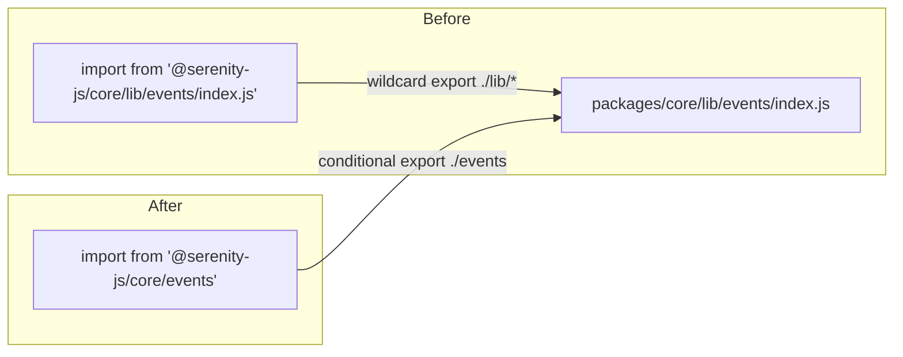

# Design Document: Clean Submodule Imports Migration

## Overview

This design covers the migration of all `integration/`, `examples/`, and `packages/` source files from legacy `/lib/` deep import paths to clean submodule import paths. The conditional exports are already configured in all `@serenity-js/*` package.json files (from the ESM/CJS dual build migration), so this is purely a consumer-side import path rewrite with no API or behavioral changes.

The migration is mechanical: every import path matching `@serenity-js/<package>/lib/<submodule>` (with optional `/index.js` or `/index` suffix) is replaced with `@serenity-js/<package>/<submodule>`. The transformation preserves import style (named imports, namespace imports, type-only imports) and imported symbols. Additionally, dynamic `require()` string arguments containing legacy paths are updated.

### Scope

Files affected fall into six categories:

1. **Testing Tools source** (`integration/testing-tools/src/`): 8 source files with legacy imports from `@serenity-js/core/lib/events`, `@serenity-js/core/lib/model`, and `@serenity-js/core/lib/stage`
2. **Integration test specs** (`integration/*/spec/` and `integration/*/src/`): ~60+ spec files across cucumber-specs, jasmine, playwright-test, mocha, webdriverio-*, and protractor-* modules importing from `@serenity-js/core/lib/events`, `@serenity-js/core/lib/model`, `@serenity-js/core/lib/io`, and `@serenity-js/playwright-test/lib/events`
3. **Web specs integration tests** (`integration/web-specs/spec/`): ~17 spec files importing from `@serenity-js/core/lib/events`, `@serenity-js/core/lib/model`, `@serenity-js/core/lib/io`, and `@serenity-js/core/lib/stage`
4. **Legacy Cucumber registration** (`integration/cucumber-1/src/` and `integration/cucumber-2/src/`): 2 files with `--require` string arguments containing `node_modules/@serenity-js/cucumber/lib/index.js`
5. **Example projects** (`examples/cucumber-domain-level-testing/`): 2 files importing from `@serenity-js/core/lib/model`
6. **Package source and spec files** (`packages/*/src/` and `packages/*/spec/`):
   - `packages/rest/` — 2 source files + 1 spec file importing from `@serenity-js/core/lib/model`, `@serenity-js/core/lib/io`, `@serenity-js/core/lib/events`
   - `packages/serenity-bdd/` — ~20+ source files + ~12 spec files importing from `@serenity-js/core/lib/events`, `@serenity-js/core/lib/io`, `@serenity-js/core/lib/model`
   - `packages/protractor/` — ~8 source files + ~4 spec files importing from `@serenity-js/core/lib/adapter`, `@serenity-js/core/lib/events`, `@serenity-js/core/lib/io`, `@serenity-js/core/lib/model`, `@serenity-js/core/lib/stage`, `@serenity-js/web/lib/scripts`, `@serenity-js/cucumber/lib/adapter`, `@serenity-js/mocha/lib/adapter`

### Out of Scope

- Compiled output directories (`lib/`, `esm/`) which are regenerated on build
- The `node_modules/` directory
- Any changes to the conditional exports configuration in package.json files
- Packages that only use relative imports internally (no cross-package `/lib/` imports)

## Architecture

This migration has no architectural impact. It is a textual transformation of import specifiers. The module resolution behavior is unchanged because the conditional exports already map clean paths to the same underlying files.



The conditional exports in `packages/core/package.json` already define both paths:
- `"./events"` → resolves to `./lib/events/index.js` (CJS) or `./esm/events/index.js` (ESM)
- `"./lib/*"` → wildcard fallback resolving to `./lib/*`

After migration, imports use the `"./events"` conditional export instead of the `"./lib/*"` wildcard fallback.

## Components and Interfaces

No new components or interfaces are introduced. The migration touches only import statements in existing files.

### Import Path Mapping

The complete set of legacy-to-clean path mappings used in this migration:

| Legacy Path Pattern | Clean Path |
|---|---|
| `@serenity-js/core/lib/adapter`, `…/adapter/index.js`, `…/adapter/index` | `@serenity-js/core/adapter` |
| `@serenity-js/core/lib/events`, `…/events/index.js`, `…/events/index` | `@serenity-js/core/events` |
| `@serenity-js/core/lib/io`, `…/io/index.js`, `…/io/index` | `@serenity-js/core/io` |
| `@serenity-js/core/lib/model`, `…/model/index.js`, `…/model/index` | `@serenity-js/core/model` |
| `@serenity-js/core/lib/stage`, `…/stage/index.js`, `…/stage/index` | `@serenity-js/core/stage` |
| `@serenity-js/cucumber/lib/adapter` | `@serenity-js/cucumber/adapter` |
| `@serenity-js/cucumber/lib/adapter/output` | `@serenity-js/cucumber/adapter` (output types re-exported from adapter barrel) |
| `@serenity-js/mocha/lib/adapter` | `@serenity-js/mocha/adapter` |
| `@serenity-js/playwright-test/lib/events`, `…/events/index.js` | `@serenity-js/playwright-test/events` |
| `@serenity-js/web/lib/scripts` | `@serenity-js/web/scripts` |

### Import Styles Preserved

Four import styles exist in the codebase and all must be preserved:

1. **Named imports** (most common):
   ```typescript
   // Before
   import { DomainEvent } from '@serenity-js/core/lib/events/index.js';
   // After
   import { DomainEvent } from '@serenity-js/core/events';
   ```

2. **Type-only imports** (common in packages/):
   ```typescript
   // Before
   import type { TestRunnerAdapter } from '@serenity-js/core/lib/adapter';
   // After
   import type { TestRunnerAdapter } from '@serenity-js/core/adapter';
   ```

3. **Namespace imports** (used in testing-tools for dynamic event class lookup, and in protractor for scripts):
   ```typescript
   // Before
   import * as events from '@serenity-js/core/lib/events/index.js';
   import * as scripts from '@serenity-js/web/lib/scripts';
   // After
   import * as events from '@serenity-js/core/events';
   import * as scripts from '@serenity-js/web/scripts';
   ```

   Namespace imports are critical in `spawner.ts`, `EventStreamEmitter.ts`, `StdOutReporter.ts`, and `TestRunnerTagger.ts` where `events[typeName].fromJSON(data)` is used for dynamic event deserialization. In protractor, `scripts` namespace is used for `scripts.dragAndDrop`, `scripts.rehydrate`, and `scripts.isVisible`.

4. **Dynamic require() string arguments** (used in protractor's TestRunnerLoader):
   ```typescript
   // Before
   this.moduleLoader.require('@serenity-js/mocha/lib/adapter')
   this.moduleLoader.require('@serenity-js/cucumber/lib/adapter')
   // After
   this.moduleLoader.require('@serenity-js/mocha/adapter')
   this.moduleLoader.require('@serenity-js/cucumber/adapter')
   ```

   These are not static import statements but string arguments to a runtime `require()` wrapper. The migration must update these string literals as well.

### Files by Module


**Testing Tools** (`integration/testing-tools/src/`):
- `spawner/SpawnResult.ts` — namespace import from `core/lib/events`
- `spawner/spawner.ts` — namespace import from `core/lib/events/index.js`
- `EventStreamEmitter.ts` — namespace import from `core/lib/events/index.js`
- `PickEvent.ts` — named import from `core/lib/events/index.js`
- `givenFollowingEvents.ts` — named imports from `core/lib/events/index.js` and `core/lib/stage/index.js`
- `child-process-reporter/ChildProcessReporter.ts` — named imports from `core/lib/events/index.js` and `core/lib/stage/index.js`
- `stage/EventRecorder.ts` — named import from `core/lib/events/index.js`
- `stage/StdOutReporter.ts` — namespace import from `core/lib/events/index.js`
- `stage/TestRunnerTagger.ts` — namespace import from `core/lib/events/index.js`, named import from `core/lib/model/index.js`

**Web Specs** (`integration/web-specs/spec/`):
- `stage/crew/photographer/create.ts` — named import from `core/lib/stage`
- `stage/crew/photographer/fixtures.ts` — named imports from `core/lib/io`, `core/lib/model`
- `stage/crew/photographer/Photographer.spec.ts` — named imports from `core/lib/events`, `core/lib/model`
- `stage/crew/photographer/strategies/TakePhotosOfFailures.spec.ts` — named imports from `core/lib/events`, `core/lib/model`, `core/lib/stage`
- `stage/crew/photographer/strategies/TakePhotosOfInteractions.spec.ts` — named imports from `core/lib/events`, `core/lib/model`, `core/lib/stage`
- `stage/crew/photographer/strategies/TakePhotosOfInteractions.errors.spec.ts` — named imports from `core/lib/events`, `core/lib/model`, `core/lib/stage`
- `stage/crew/photographer/strategies/TakePhotosBeforeAndAfterInteractions.spec.ts` — named imports from `core/lib/events`, `core/lib/model`, `core/lib/stage`
- `expectations/isEnabled.spec.ts` — named import from `core/lib/io`
- `expectations/isActive.spec.ts` — named import from `core/lib/io`
- `expectations/isPresent.spec.ts` — named import from `core/lib/io`
- `expectations/isSelected.spec.ts` — named import from `core/lib/io`
- `screenplay/interactions/Wait.spec.ts` — named import from `core/lib/io`
- `screenplay/interactions/TakeScreenshot.spec.ts` — named imports from `core/lib/events`, `core/lib/model`
- `screenplay/interactions/execute-script/ExecuteSynchronousScript.spec.ts` — named imports from `core/lib/events`, `core/lib/model`
- `screenplay/interactions/execute-script/ExecuteAsynchronousScript.spec.ts` — named imports from `core/lib/events`, `core/lib/model`
- `screenplay/models/PageElements.spec.ts` — named import from `core/lib/io`
- `screenplay/models/ModalDialog.spec.ts` — named imports from `core/lib/events`, `core/lib/model`

**Legacy Cucumber Registration** (`integration/cucumber-1/src/` and `integration/cucumber-2/src/`):
- `register-cucumber.ts` — `--require` string argument with `node_modules/@serenity-js/cucumber/lib/index.js`

**Cucumber Specs** (`integration/cucumber-specs/`):
- `src/index.ts` — named import from `core/lib/io`
- `spec/*.spec.ts` (~8 files) — named imports from `core/lib/events`, `core/lib/model`, `core/lib/io`

**Jasmine** (`integration/jasmine/spec/`):
- ~8 spec files — named imports from `core/lib/events`, `core/lib/model`, `core/lib/io`, `core/lib/model/index.js`

**Playwright Test** (`integration/playwright-test/`):
- `spec/*.spec.ts` and `spec/outcomes/*.spec.ts` (~16 files) — named imports from `core/lib/events`, `core/lib/model`, `core/lib/io`, `playwright-test/lib/events`
- `examples/screenplay/native-page.spec.ts` — named import from `core/lib/io`

**Mocha** (`integration/mocha/spec/`):
- Spec files — named imports from `core/lib/events`, `core/lib/model`

**WebdriverIO** (`integration/webdriverio-*/spec/` and `integration/webdriverio-8-*/spec/`):
- Spec files across jasmine, mocha, and cucumber variants — named imports from `core/lib/events`, `core/lib/model`

**Protractor** (`integration/protractor-jasmine/spec/`, `integration/protractor-mocha/spec/`):
- Spec files — named imports from `core/lib/events`, `core/lib/model`, `core/lib/io`

**Examples** (`examples/cucumber-domain-level-testing/features/support/`):
- `screenplay/interactions/EnterOperand.ts` — named import from `core/lib/model`
- `screenplay/interactions/UseOperator.ts` — named import from `core/lib/model`

**packages/rest** (`packages/rest/`):
- `src/screenplay/interactions/Send.ts` — type-only + named imports from `core/lib/model/index.js` (`Artifact`, `RequestAndResponse`, `HTTPRequestResponse`, `Name`)
- `src/screenplay/models/HTTPRequest.ts` — named import from `core/lib/io/index.js` (`d`)
- `spec/screenplay/interactions/Send.spec.ts` — named imports from `core/lib/events/index.js`, `core/lib/io/index.js`, `core/lib/model/index.js`

**packages/serenity-bdd** (`packages/serenity-bdd/`):
- `src/cli/commands/run.ts` — named imports from `core/lib/io` (`FileSystem`, `Path`, `RequirementsHierarchy`)
- `src/cli/commands/update.ts` — named import from `core/lib/io` (`Path`)
- `src/cli/model/GAV.ts` — named import from `core/lib/io` (`Path`)
- `src/cli/model/Notification.ts` — named import from `core/lib/model` (`JSONData`)
- `src/cli/model/Complaint.ts` — named import from `core/lib/model` (`JSONData`)
- `src/cli/model/DownloadProgressReport.ts` — named import from `core/lib/model` (`JSONData`)
- `src/cli/stage/NotificationReporter.ts` — type-only + named imports from `core/lib/events`
- `src/cli/stage/ProgressReporter.ts` — type-only + named imports from `core/lib/events`
- `src/cli/stage/RunCommandActors.ts` — type-only import from `core/lib/io` (`Path`)
- `src/cli/stage/UpdateCommandActors.ts` — type-only import from `core/lib/io` (`Path`)
- `src/cli/screenplay/abilities/UseFileSystem.ts` — type-only + named imports from `core/lib/io`
- `src/cli/screenplay/interactions/Spawn.ts` — type-only + named imports from `core/lib/io`
- `src/cli/screenplay/interactions/StreamResponse.ts` — type-only + named imports from `core/lib/io`
- `src/cli/screenplay/interactions/CreateDirectory.ts` — type-only import from `core/lib/io`
- `src/cli/screenplay/interactions/RenameFile.ts` — type-only import from `core/lib/io`
- `src/cli/screenplay/questions/JavaExecutable.ts` — named import from `core/lib/io`
- `src/cli/screenplay/questions/Checksum.ts` — type-only import from `core/lib/io`
- `src/cli/screenplay/questions/FileExists.ts` — type-only import from `core/lib/io`
- `src/cli/screenplay/tasks/VerifyChecksum.ts` — type-only import from `core/lib/io`
- `src/cli/screenplay/tasks/InvokeSerenityBDD.ts` — type-only import from `core/lib/io`
- `src/cli/screenplay/tasks/DownloadArtifact.ts` — named import from `core/lib/io`
- `src/stage/crew/serenity-bdd-reporter/SerenityBDDReporter.ts` — type-only + named imports from `core/lib/events`, `core/lib/io`, `core/lib/model`
- `src/stage/crew/serenity-bdd-reporter/processors/` (~15 files) — imports from `core/lib/events`, `core/lib/io`, `core/lib/model`
- `spec/index.spec.ts` — named imports from `core/lib/io`
- `spec/cli/model/GAV.spec.ts` — named import from `core/lib/io`
- `spec/stage/crew/samples.ts` — named imports from `core/lib/io`, `core/lib/model`
- `spec/stage/crew/serenity-bdd-reporter/create.ts` — named imports from `core/lib/io`
- `spec/stage/crew/serenity-bdd-reporter/SerenityBDDReporter.spec.ts` — named imports from `core/lib/events`, `core/lib/io`, `core/lib/model`
- `spec/stage/crew/serenity-bdd-reporter/SerenityBDDReporter/*.spec.ts` (~7 files) — named imports from `core/lib/events`, `core/lib/io`, `core/lib/model`, `core/lib/stage`
- `spec/stage/crew/serenity-bdd-reporter/snapshots/*.spec.ts` (~2 files) — named imports from `core/lib/events`, `core/lib/io`, `core/lib/model`
- `spec/stage/crew/serenity-bdd-reporter/processors/mappers/errorReportFrom.spec.ts` — named import from `core/lib/io`

**packages/protractor** (`packages/protractor/`):
- `src/adapter/run.ts` — named import from `core/lib/io` (`Path`)
- `src/adapter/runner/TestRunnerDetector.ts` — type-only import from `core/lib/adapter` (`TestRunnerAdapter`)
- `src/adapter/runner/TestRunnerLoader.ts` — type-only import from `core/lib/adapter` (`TestRunnerAdapter`), named imports from `core/lib/io`, type-only import from `cucumber/lib/adapter` (`CucumberConfig`), dynamic require of `mocha/lib/adapter` and `cucumber/lib/adapter`
- `src/adapter/reporter/ProtractorReporter.ts` — type-only + named imports from `core/lib/events`, `core/lib/model`, type-only import from `core/lib/stage`
- `src/adapter/browser-detector/BrowserDetector.ts` — type-only + named imports from `core/lib/events`, `core/lib/model`, type-only import from `core/lib/stage`
- `src/screenplay/models/ProtractorBrowsingSession.ts` — named import from `core/lib/model` (`CorrelationId`)
- `src/screenplay/models/ProtractorPage.ts` — type-only import from `core/lib/model` (`CorrelationId`), namespace import from `web/lib/scripts`
- `src/screenplay/models/ProtractorPageElement.ts` — namespace import from `web/lib/scripts`
- `spec/adapter/ProtractorFrameworkAdapter.spec.ts` — type-only + named imports from `core/lib/adapter`, `core/lib/events`, `core/lib/io`, `core/lib/model`, `core/lib/stage`
- `spec/adapter/runner/TestRunnerLoader.spec.ts` — named imports from `core/lib/io`, `cucumber/lib/adapter`, `cucumber/lib/adapter/output`, dynamic require strings for `mocha/lib/adapter` and `cucumber/lib/adapter`
- `spec/adapter/runner/TestRunnerDetector.spec.ts` — type-only import from `cucumber/lib/adapter`
- `spec/adapter/reporter/ProtractorReporter.spec.ts` — named imports from `core/lib/events`, `core/lib/io`, `core/lib/model`

## Data Models

No data models are introduced or modified. The migration is a pure import path transformation. The imported types (`DomainEvent`, `Name`, `CorrelationId`, `ModuleLoader`, `TestRunnerAdapter`, etc.) remain identical — only the module specifier string changes.

Note: `packages/serenity-bdd` and `packages/protractor` are CJS-only packages (not migrated to dual ESM/CJS), but their imports should still be migrated to clean paths for consistency. The clean paths resolve via conditional exports which work in CJS too (the `"require"` condition maps to `./lib/<submodule>/index.js`).


## Correctness Properties

*A property is a characteristic or behavior that should hold true across all valid executions of a system — essentially, a formal statement about what the system should do. Properties serve as the bridge between human-readable specifications and machine-verifiable correctness guarantees.*

### Property 1: Import path transformation produces clean paths

*For any* `@serenity-js` package name (from the set: `core`, `cucumber`, `mocha`, `playwright-test`, `web`), any submodule name (from the set: `adapter`, `events`, `io`, `model`, `scripts`, `stage`), and for any legacy path variant (`@serenity-js/<pkg>/lib/<submodule>`, `@serenity-js/<pkg>/lib/<submodule>/index.js`, or `@serenity-js/<pkg>/lib/<submodule>/index`), the migration transformation shall produce the clean path `@serenity-js/<pkg>/<submodule>`.

**Validates: Requirements 1.1, 1.2, 1.3, 1.4, 2.1, 2.2, 2.3, 3.1, 3.2, 3.3, 4.1, 4.2, 4.3, 5.1, 5.2, 5.3, 5.4, 6.1, 6.2, 7.1, 7.2, 7.3, 8.1, 9.1, 11.1, 11.2, 11.3, 12.1, 12.2, 12.3, 12.4, 12.5, 13.1, 13.2, 13.3, 13.4, 13.5, 13.6, 13.7, 14.1, 14.2, 14.3, 14.4, 14.5, 14.6, 14.7, 14.8, 14.9, 14.10, 14.11, 14.12, 14.13, 14.14, 14.16, 15.1, 15.2, 15.4, 15.5**

### Property 2: Clean and legacy paths export identical members

*For any* submodule that has a conditional export configured (events, model, stage, io, adapter, scripts), the set of exported member names from the clean import path shall be identical to the set of exported member names from the legacy `/lib/` import path.

**Validates: Requirements 9.2, 9.3**

### Property 3: No legacy imports remain after migration

*For any* TypeScript source file under `integration/`, `examples/`, or `packages/*/src/` and `packages/*/spec/` (excluding compiled `lib/` and `esm/` output directories and `node_modules/`), the file shall contain zero import specifiers or require string arguments matching the pattern `@serenity-js/*/lib/`.

**Validates: Requirements 11.4, 11.5, 11.6**

## Error Handling

This migration introduces no new error handling. The only errors that can occur are:

1. **Compilation errors** — If a clean import path is misspelled or the conditional export is misconfigured, TypeScript will report an unresolved module error at compile time. This is caught by the existing build process (`tsc`).

2. **Runtime resolution errors** — If a namespace import's clean path doesn't export the expected members, dynamic access like `events[typeName]` or `scripts.dragAndDrop` will return `undefined`, causing a runtime `TypeError`. This is caught by the existing integration and unit test suites.

3. **Dynamic require errors** — If a `moduleLoader.require()` string argument is updated to a clean path that doesn't resolve, the require call will throw at runtime. This is caught by the existing protractor unit tests which stub and verify these require calls.

All error categories are already handled by the existing build and test infrastructure. No new error handling code is needed.

## Testing Strategy

### Verification Approach

Since this is a pure import path migration with no new logic, verification relies on:

1. **Compilation** — TypeScript compilation of all migrated modules confirms that clean import paths resolve correctly.
2. **Existing integration tests** — The full integration test suite exercises the migrated imports at runtime, confirming that the correct modules are loaded and all exported members are accessible.
3. **Existing unit tests** — The unit tests in `packages/rest`, `packages/serenity-bdd`, and `packages/protractor` exercise the migrated imports, confirming that cross-package clean paths resolve correctly.
4. **Post-migration grep** — A grep for `@serenity-js/*/lib/` in source files confirms no legacy imports remain.

### Unit Tests

No new unit tests are needed. The migration changes only import specifiers, not behavior. The existing unit tests in each module validate that the imported types work correctly.

Specific verification examples:
- Compile `integration/testing-tools` and verify `lib/` and `esm/` outputs exist
- Run `make INTEGRATION_SCOPE=cucumber-all integration-test` and verify all Cucumber versions pass
- Run `make INTEGRATION_SCOPE=playwright-test integration-test` and verify all tests pass
- Run `make INTEGRATION_SCOPE=jasmine integration-test` and verify all tests pass
- Compile `examples/cucumber-domain-level-testing` without errors
- Compile `packages/rest` and run `cd packages/rest && pnpm test` — verify all tests pass
- Compile `packages/serenity-bdd` and run `cd packages/serenity-bdd && pnpm test` — verify all tests pass
- Compile `packages/protractor` and run `cd packages/protractor && pnpm test` — verify all tests pass

### Property-Based Tests

Property-based testing library: **fast-check** (already available in the Node.js ecosystem, compatible with Mocha).

Each property test should run a minimum of 100 iterations.

#### Property Test 1: Import path transformation

Tag: **Feature: clean-submodule-imports, Property 1: Import path transformation produces clean paths**

Generate random combinations of:
- Package names from the set: `['core', 'cucumber', 'mocha', 'playwright-test', 'web']`
- Submodule names from the set: `['adapter', 'events', 'io', 'model', 'scripts', 'stage']`
- Legacy suffix variants from the set: `['', '/index.js', '/index']`

For each combination, assert that the transformation function converts `@serenity-js/{pkg}/lib/{submodule}{suffix}` to `@serenity-js/{pkg}/{submodule}`.

#### Property Test 2: Clean and legacy paths export identical members

Tag: **Feature: clean-submodule-imports, Property 2: Clean and legacy paths export identical members**

For each (package, submodule) pair that has a conditional export configured:
- `('core', 'adapter')`, `('core', 'events')`, `('core', 'io')`, `('core', 'model')`, `('core', 'stage')`
- `('cucumber', 'adapter')`, `('mocha', 'adapter')`
- `('web', 'scripts')`

Dynamically import both `@serenity-js/{pkg}/{submodule}` and `@serenity-js/{pkg}/lib/{submodule}`, then assert that `Object.keys()` of both imports produce the same set of member names.

This test validates that namespace imports and named imports will continue to work correctly after migration.

#### Property Test 3: No legacy imports remain

Tag: **Feature: clean-submodule-imports, Property 3: No legacy imports remain after migration**

For any TypeScript source file found by globbing `integration/**/src/**/*.ts`, `examples/**/*.ts`, `packages/*/src/**/*.ts`, and `packages/*/spec/**/*.ts` (excluding `node_modules`, `lib/`, `esm/`):
- Read the file content
- Assert that no line matches the regex `@serenity-js/[^/]+/lib/`

This is a post-migration verification property that confirms completeness across all scopes.
