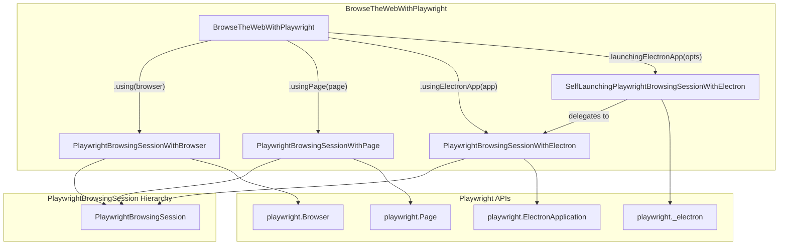
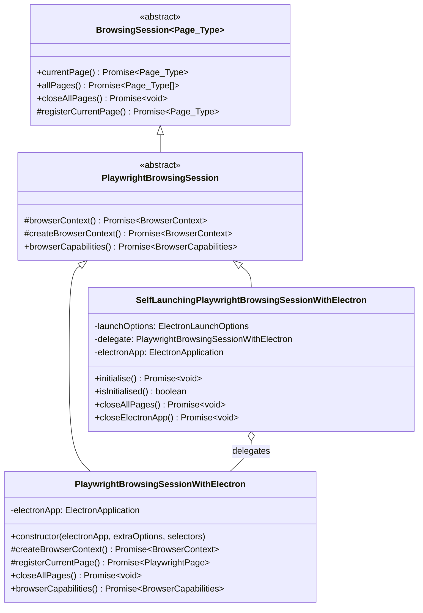

# Design Document: Electron Integration for @serenity-js/playwright

## Overview

This design extends `@serenity-js/playwright` to support testing Electron applications using Playwright's Electron APIs. The integration enables Serenity/JS actors to interact with Electron apps using the same Screenplay Pattern interactions (Click, Enter, Navigate, etc.) that work with web browsers.

### Goals

1. **Seamless Integration**: Electron windows should behave like browser pages from the actor's perspective
2. **Dual Lifecycle Support**: Support both externally-managed (Playwright Test) and self-launching (Mocha/Jasmine) scenarios
3. **Code Reuse**: Maximize reuse of existing `PlaywrightBrowsingSession` infrastructure
4. **Consistent API**: Follow established patterns in `BrowseTheWebWithPlaywright`

### Key Design Decisions

1. **Single Class with Composition**: Rather than two separate classes, use a single `PlaywrightBrowsingSessionWithElectron` class that can operate in two modes based on constructor parameters
2. **Delegate Pattern for Self-Launching**: The self-launching variant wraps the externally-managed variant, adding lifecycle management
3. **Re-export Playwright Types**: `ElectronLaunchOptions` will re-export Playwright's type with JSDoc documentation

## Architecture

### Component Diagram



### Class Hierarchy



## Components and Interfaces

### PlaywrightBrowsingSessionWithElectron

The core implementation for externally-managed Electron applications.

```typescript
import type { BrowserCapabilities } from '@serenity-js/web';
import type * as playwright from 'playwright-core';

import type { ExtraBrowserContextOptions } from '../../ExtraBrowserContextOptions.js';
import { PlaywrightBrowsingSession } from './PlaywrightBrowsingSession.js';
import type { PlaywrightPage } from './PlaywrightPage.js';

/**
 * Playwright-specific implementation of [`BrowsingSession`](https://serenity-js.org/api/web/class/BrowsingSession/)
 * for Electron applications.
 *
 * Use this class when you have an already-launched `ElectronApplication` instance,
 * typically in Playwright Test scenarios where the app is managed per-worker.
 *
 * ## Example
 *
 * ```typescript
 * import { _electron as electron } from 'playwright';
 * import { BrowseTheWebWithPlaywright } from '@serenity-js/playwright';
 *
 * const electronApp = await electron.launch({ args: ['main.js'] });
 * const actor = actorCalled('Tester').whoCan(
 *     BrowseTheWebWithPlaywright.usingElectronApp(electronApp)
 * );
 * ```
 *
 * @group Models
 */
export class PlaywrightBrowsingSessionWithElectron extends PlaywrightBrowsingSession {

    constructor(
        protected readonly electronApp: playwright.ElectronApplication,
        extraBrowserContextOptions: ExtraBrowserContextOptions,
        selectors: playwright.Selectors,
    ) {
        super(extraBrowserContextOptions, selectors);
        this.setupWindowEventHandlers();
    }

    private setupWindowEventHandlers(): void {
        // Register handler for new windows
        this.electronApp.on('window', async (page: playwright.Page) => {
            // Window registration is handled by browserContext() event handler
            // This event fires before the page is added to context
        });
    }

    protected override async createBrowserContext(): Promise<playwright.BrowserContext> {
        return this.electronApp.context();
    }

    protected override async registerCurrentPage(): Promise<PlaywrightPage> {
        const context = await this.browserContext();
        const windows = this.electronApp.windows();

        if (windows.length === 0) {
            // Wait for the first window to open
            const firstWindow = await this.electronApp.firstWindow();
            // The window event handler in browserContext() will register it
            // Return the registered page
            const allPages = await this.allPages();
            return allPages.at(-1) || this.createPlaywrightPage(firstWindow);
        }

        // Use the last opened window
        const lastWindow = windows.at(-1);
        const allPages = await this.allPages();
        
        // Check if this window is already registered
        for (const page of allPages) {
            const nativePage = await page.nativePage();
            if (nativePage === lastWindow) {
                return page;
            }
        }

        return this.createPlaywrightPage(lastWindow);
    }

    private createPlaywrightPage(page: playwright.Page): PlaywrightPage {
        const playwrightPage = new PlaywrightPage(
            this,
            page,
            this.extraBrowserContextOptions,
            CorrelationId.create()
        );
        this.register(playwrightPage);
        return playwrightPage;
    }

    /**
     * Closes all Electron windows but does NOT close the Electron application itself.
     * The application lifecycle is managed externally.
     */
    override async closeAllPages(): Promise<void> {
        for (const page of this.pages.values()) {
            await page.close();
        }
        this.pages.clear();
        this.currentBrowserPage = undefined;
    }

    override async browserCapabilities(): Promise<BrowserCapabilities> {
        return {
            browserName: 'electron',
            platformName: process.platform,
            browserVersion: await this.getElectronVersion(),
        };
    }

    private async getElectronVersion(): Promise<string> {
        try {
            const version = await this.electronApp.evaluate(
                async ({ process }) => process.versions.electron
            );
            return version || 'unknown';
        } catch {
            return 'unknown';
        }
    }
}
```

### SelfLaunchingPlaywrightBrowsingSessionWithElectron

The self-launching variant that manages the Electron application lifecycle.

```typescript
import type { Initialisable } from '@serenity-js/core';
import type { BrowserCapabilities } from '@serenity-js/web';
import * as playwright from 'playwright-core';

import type { ExtraBrowserContextOptions } from '../../ExtraBrowserContextOptions.js';
import type { ElectronLaunchOptions } from './ElectronLaunchOptions.js';
import { PlaywrightBrowsingSession } from './PlaywrightBrowsingSession.js';
import { PlaywrightBrowsingSessionWithElectron } from './PlaywrightBrowsingSessionWithElectron.js';
import type { PlaywrightPage } from './PlaywrightPage.js';

/**
 * Self-launching implementation of [`PlaywrightBrowsingSession`](https://serenity-js.org/api/playwright/class/PlaywrightBrowsingSession/)
 * for Electron applications.
 *
 * This class launches the Electron application on first use and closes it when discarded.
 * Use this for test runners like Mocha or Jasmine that don't manage Electron lifecycle.
 *
 * ## Example
 *
 * ```typescript
 * import { BrowseTheWebWithPlaywright } from '@serenity-js/playwright';
 *
 * const actor = actorCalled('Tester').whoCan(
 *     BrowseTheWebWithPlaywright.launchingElectronApp({
 *         args: ['path/to/main.js'],
 *         cwd: 'path/to/app',
 *     })
 * );
 * ```
 *
 * @group Models
 */
export class SelfLaunchingPlaywrightBrowsingSessionWithElectron
    extends PlaywrightBrowsingSession
    implements Initialisable
{
    private electronApp: playwright.ElectronApplication | undefined;
    private delegate: PlaywrightBrowsingSessionWithElectron | undefined;

    constructor(
        private readonly launchOptions: ElectronLaunchOptions,
        private readonly extraOptions: ExtraBrowserContextOptions,
        private readonly playwrightSelectors: playwright.Selectors,
    ) {
        super(extraOptions, playwrightSelectors);
    }

    async initialise(): Promise<void> {
        if (this.electronApp) {
            return;
        }

        this.electronApp = await playwright._electron.launch(this.launchOptions);
        this.delegate = new PlaywrightBrowsingSessionWithElectron(
            this.electronApp,
            this.extraOptions,
            this.playwrightSelectors,
        );
    }

    isInitialised(): boolean {
        return this.electronApp !== undefined;
    }

    protected override async createBrowserContext(): Promise<playwright.BrowserContext> {
        await this.ensureInitialised();
        return this.delegate!.browserContext();
    }

    protected override async registerCurrentPage(): Promise<PlaywrightPage> {
        await this.ensureInitialised();
        return this.delegate!.currentPage();
    }

    override async currentPage(): Promise<PlaywrightPage> {
        await this.ensureInitialised();
        return this.delegate!.currentPage();
    }

    override async allPages(): Promise<PlaywrightPage[]> {
        await this.ensureInitialised();
        return this.delegate!.allPages();
    }

    override async closeAllPages(): Promise<void> {
        if (this.delegate) {
            await this.delegate.closeAllPages();
        }
    }

    override async browserCapabilities(): Promise<BrowserCapabilities> {
        await this.ensureInitialised();
        return this.delegate!.browserCapabilities();
    }

    /**
     * Closes the Electron application that was launched by this session.
     * Called when the ability is discarded.
     */
    async closeElectronApp(): Promise<void> {
        if (this.electronApp) {
            await this.electronApp.close();
            this.electronApp = undefined;
            this.delegate = undefined;
        }
    }

    private async ensureInitialised(): Promise<void> {
        if (!this.isInitialised()) {
            await this.initialise();
        }
    }
}
```

### ElectronLaunchOptions

Type definition re-exporting Playwright's Electron launch options with documentation.

```typescript
import type * as playwright from 'playwright-core';

/**
 * Options for launching an Electron application via Playwright.
 *
 * This type re-exports Playwright's Electron launch options with additional documentation
 * for commonly used properties.
 *
 * ## Example
 *
 * ```typescript
 * import { BrowseTheWebWithPlaywright, ElectronLaunchOptions } from '@serenity-js/playwright';
 *
 * const options: ElectronLaunchOptions = {
 *     executablePath: '/path/to/electron',
 *     args: ['main.js'],
 *     cwd: '/path/to/app',
 *     env: { NODE_ENV: 'test' },
 *     timeout: 30000,
 * };
 *
 * const actor = actorCalled('Tester').whoCan(
 *     BrowseTheWebWithPlaywright.launchingElectronApp(options)
 * );
 * ```
 *
 * ## Common Options
 *
 * - **executablePath**: Path to the Electron executable. If not specified, uses the default
 *   Electron installed in `node_modules/.bin/electron`.
 * - **args**: Command-line arguments passed to the application. Typically includes the path
 *   to the main script (e.g., `['main.js']`).
 * - **cwd**: Current working directory for the Electron process.
 * - **env**: Environment variables visible to the Electron process. Defaults to `process.env`.
 * - **timeout**: Maximum time in milliseconds to wait for the application to start.
 *   Defaults to 30000 (30 seconds). Pass 0 to disable timeout.
 *
 * ## Learn more
 * - [Playwright Electron API](https://playwright.dev/docs/api/class-electron)
 *
 * @group Configuration
 */
export type ElectronLaunchOptions = Parameters<typeof playwright._electron.launch>[0];
```

### BrowseTheWebWithPlaywright Extensions

New static methods added to the existing ability class.

```typescript
// Added to BrowseTheWebWithPlaywright class

/**
 * Creates an ability to browse the web using an already-launched Electron application.
 *
 * Use this method when the Electron application lifecycle is managed externally,
 * such as in Playwright Test where the app is launched per-worker.
 *
 * ## Example
 *
 * ```typescript
 * import { _electron as electron } from 'playwright';
 * import { actorCalled } from '@serenity-js/core';
 * import { BrowseTheWebWithPlaywright } from '@serenity-js/playwright';
 *
 * const electronApp = await electron.launch({ args: ['main.js'] });
 *
 * const actor = actorCalled('Tester').whoCan(
 *     BrowseTheWebWithPlaywright.usingElectronApp(electronApp)
 * );
 *
 * // After tests, close the app manually
 * await electronApp.close();
 * ```
 *
 * @param electronApp - An already-launched Playwright ElectronApplication instance
 * @param extraBrowserContextOptions - Optional configuration for timeouts and navigation
 */
static usingElectronApp(
    electronApp: playwright.ElectronApplication,
    extraBrowserContextOptions?: ExtraBrowserContextOptions
): BrowseTheWebWithPlaywright {
    return new BrowseTheWebWithPlaywright(
        new PlaywrightBrowsingSessionWithElectron(
            electronApp,
            extraBrowserContextOptions,
            playwright.selectors
        )
    );
}

/**
 * Creates an ability to browse the web by launching and managing an Electron application.
 *
 * Use this method when you want Serenity/JS to manage the Electron application lifecycle.
 * The app is launched on first use and closed when the ability is discarded.
 *
 * ## Example
 *
 * ```typescript
 * import { actorCalled } from '@serenity-js/core';
 * import { BrowseTheWebWithPlaywright } from '@serenity-js/playwright';
 *
 * const actor = actorCalled('Tester').whoCan(
 *     BrowseTheWebWithPlaywright.launchingElectronApp({
 *         args: ['path/to/main.js'],
 *         cwd: 'path/to/app',
 *     })
 * );
 *
 * // The app is automatically closed when the actor is dismissed
 * ```
 *
 * @param launchOptions - Options for launching the Electron application
 * @param extraBrowserContextOptions - Optional configuration for timeouts and navigation
 */
static launchingElectronApp(
    launchOptions: ElectronLaunchOptions,
    extraBrowserContextOptions?: ExtraBrowserContextOptions
): BrowseTheWebWithPlaywright {
    return new BrowseTheWebWithPlaywright(
        new SelfLaunchingPlaywrightBrowsingSessionWithElectron(
            launchOptions,
            extraBrowserContextOptions,
            playwright.selectors
        )
    );
}
```

### Updated discard() Method

The `discard()` method needs to handle the self-launching session's cleanup:

```typescript
/**
 * Automatically closes any open pages when the scene finishes.
 * For self-launching Electron sessions, also closes the Electron application.
 */
async discard(): Promise<void> {
    await this.session.closeAllPages();
    
    // Close the Electron app if this is a self-launching session
    if (this.session instanceof SelfLaunchingPlaywrightBrowsingSessionWithElectron) {
        await this.session.closeElectronApp();
    }
}
```

## Data Models

### BrowserCapabilities for Electron

When `browserCapabilities()` is called on an Electron session, it returns:

```typescript
{
    browserName: 'electron',
    platformName: process.platform,  // 'darwin', 'linux', 'win32'
    browserVersion: '28.0.0'         // Electron version from process.versions.electron
}
```

### Window/Page Mapping

Electron windows map to Playwright `Page` objects, which are wrapped in `PlaywrightPage`:

| Electron Concept | Playwright Concept | Serenity/JS Concept |
|------------------|-------------------|---------------------|
| BrowserWindow | Page | PlaywrightPage |
| ElectronApplication.context() | BrowserContext | (internal) |
| ElectronApplication.windows() | Page[] | allPages() |
| ElectronApplication.firstWindow() | Page | currentPage() |

## Correctness Properties

*A property is a characteristic or behavior that should hold true across all valid executions of a system—essentially, a formal statement about what the system should do. Properties serve as the bridge between human-readable specifications and machine-verifiable correctness guarantees.*

Based on the prework analysis of acceptance criteria, the following properties have been identified as suitable for property-based testing. Note that many acceptance criteria are structural requirements (verified by TypeScript), documentation requirements, or integration tests rather than universal properties.

### Property 1: Window Registration Consistency

*For any* Electron application that opens N windows (where N ≥ 0), `allPages()` SHALL return exactly N `PlaywrightPage` instances, and each instance SHALL correspond to a unique Electron window.

**Validates: Requirements 2.5, 2.6, 6.1**

### Property 2: Window Deregistration on Close

*For any* Electron window that is closed (either programmatically via `page.close()` or by external action), the corresponding `PlaywrightPage` SHALL be automatically removed from the session's page tracking, and `allPages()` SHALL no longer include that page.

**Validates: Requirements 2.7, 6.3**

### Property 3: closeAllPages Preserves Application

*For any* Electron browsing session (externally-managed or self-launching) with N open windows (where N ≥ 0), calling `closeAllPages()` SHALL:
- Close all N windows (verified by `allPages()` returning empty array)
- Leave the `ElectronApplication` instance running (not closed)

**Validates: Requirements 2.9, 3.5, 4.7**

### Property 4: closePagesOtherThan Preserves Selected

*For any* Electron browsing session with N open windows (where N ≥ 1) and any selected page P from those windows, calling `closePagesOtherThan(P)` SHALL result in `allPages()` returning exactly one page, and that page SHALL be P.

**Validates: Requirements 6.4**

### Property 5: Self-Launching Initialisation Idempotence

*For any* self-launching session, calling `initialise()` K times (where K ≥ 1) SHALL result in exactly one Electron application being launched, and `isInitialised()` SHALL return `true` after the first successful call.

**Validates: Requirements 3.2, 3.3**

### Property 6: Self-Launching Cleanup Completeness

*For any* self-launching session that has been initialised, calling `closeElectronApp()` SHALL close the Electron application, and subsequent calls to `isInitialised()` SHALL return `false`.

**Validates: Requirements 3.6, 4.8**

### Property 7: Browser Capabilities Electron Identification

*For any* Electron browsing session (externally-managed or self-launching), `browserCapabilities()` SHALL return an object where `browserName` equals `'electron'`.

**Validates: Requirements 2.8**

### Property 8: Standard Interactions Compatibility

*For any* valid Serenity/JS web interaction (Click, Enter, Text.of, Navigate, etc.) and any visible, interactable element in an Electron window, the interaction SHALL execute successfully using the same API as browser-based interactions.

**Validates: Requirements 4.6, 7.3**

## Error Handling

### Launch Failures

When `electron.launch()` fails (e.g., invalid executable path, timeout):

```typescript
// The error propagates from Playwright with context
try {
    await playwright._electron.launch(options);
} catch (error) {
    // Playwright throws TimeoutError or Error with descriptive message
    // Let it propagate - Serenity/JS will report it in the test results
    throw error;
}
```

### Window Not Found

When `firstWindow()` times out because no window opens:

```typescript
// Playwright's firstWindow() has a configurable timeout
// Default is 30 seconds, configurable via launch options
const window = await electronApp.firstWindow({ timeout: 30000 });
```

### Application Already Closed

When attempting operations on a closed Electron application:

```typescript
// Check if app is still running before operations
if (!this.electronApp) {
    throw new LogicError(
        'The Electron application has been closed. ' +
        'Make sure to perform all interactions before discarding the ability.'
    );
}
```

### Missing Ability

Standard Serenity/JS error handling applies:

```typescript
// When actor doesn't have BrowseTheWebWithPlaywright ability
// ConfigurationError: Alice can't BrowseTheWeb yet. Did you give them the ability to do so?
```

## Testing Strategy

### Unit Tests

Unit tests in `packages/playwright/spec/` will verify:

1. **PlaywrightBrowsingSessionWithElectron**
   - Constructor accepts ElectronApplication and stores it
   - `createBrowserContext()` calls `electronApp.context()`
   - `registerCurrentPage()` handles zero windows (waits for first)
   - `registerCurrentPage()` handles existing windows
   - `closeAllPages()` closes windows but not the app
   - `browserCapabilities()` returns Electron-specific info
   - Window event handlers register/deregister pages correctly

2. **SelfLaunchingPlaywrightBrowsingSessionWithElectron**
   - `initialise()` launches the Electron app
   - `isInitialised()` returns correct state
   - Methods delegate to the wrapped session after initialisation
   - `closeElectronApp()` closes the app and resets state

3. **BrowseTheWebWithPlaywright**
   - `usingElectronApp()` creates externally-managed session
   - `launchingElectronApp()` creates self-launching session
   - `discard()` handles both session types correctly

### Integration Tests

Integration tests in `integration/playwright-web/` will use a shared test suite pattern:

```typescript
// integration/playwright-web/spec/electron/shared-electron-tests.ts
export function describeElectronBehavior(
    sessionFactory: () => Promise<{ 
        session: PlaywrightBrowsingSession; 
        cleanup: () => Promise<void>;
    }>
) {
    describe('Electron browsing session', () => {
        it('allows clicking on elements', async () => { /* ... */ });
        it('allows entering text', async () => { /* ... */ });
        it('supports window switching', async () => { /* ... */ });
        it('tracks window lifecycle', async () => { /* ... */ });
    });
}

// integration/playwright-web/spec/electron/externally-managed.spec.ts
describeElectronBehavior(async () => {
    const electronApp = await electron.launch({ args: ['main.js'] });
    return {
        session: new PlaywrightBrowsingSessionWithElectron(electronApp, {}, selectors),
        cleanup: () => electronApp.close(),
    };
});

// integration/playwright-web/spec/electron/self-launching.spec.ts
describeElectronBehavior(async () => {
    const session = new SelfLaunchingPlaywrightBrowsingSessionWithElectron(
        { args: ['main.js'] }, {}, selectors
    );
    await session.initialise();
    return {
        session,
        cleanup: () => session.closeElectronApp(),
    };
});
```

### Example Electron App

The example app at `integration/electron-app/` will be implemented in TypeScript for consistency with the rest of the project:

```
integration/electron-app/
├── package.json
├── tsconfig.json
├── src/
│   ├── main.ts           # Main process entry point
│   ├── preload.ts        # Preload script (if needed)
│   └── renderer.ts       # Renderer process script
├── lib/                  # Compiled output (gitignored)
│   ├── main.js
│   ├── preload.js
│   └── renderer.js
└── index.html            # Main window content
```

The app will have:
- A button that can be clicked
- An input field for text entry
- A link that opens a second window
- Display elements showing interaction results

The TypeScript configuration will follow the monorepo conventions with ES2023 target and CommonJS modules.

### Property-Based Test Configuration

Property-based tests will use the project's existing Mocha + Chai setup with `mocha-testdata` for parameterised tests:

```typescript
import { given } from 'mocha-testdata';

given([
    { description: 'externally-managed', createSession: createExternallyManaged },
    { description: 'self-launching', createSession: createSelfLaunching },
]).
it('closes all windows without closing the app', async ({ createSession }) => {
    // Property test implementation
});
```

Minimum 100 iterations are not applicable here as these are integration tests with real Electron apps. Instead, the shared test suite ensures both implementations pass identical tests.
