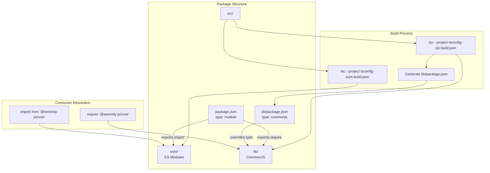
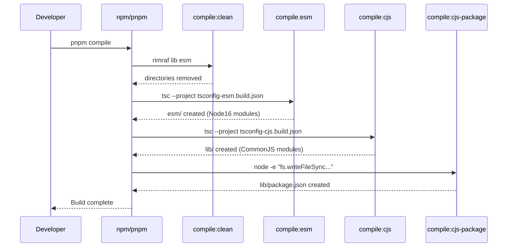
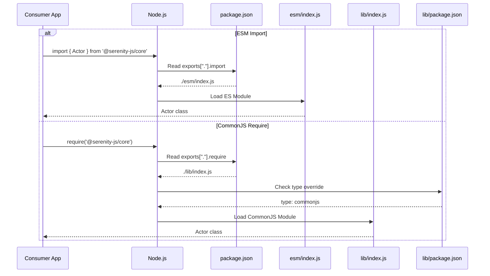
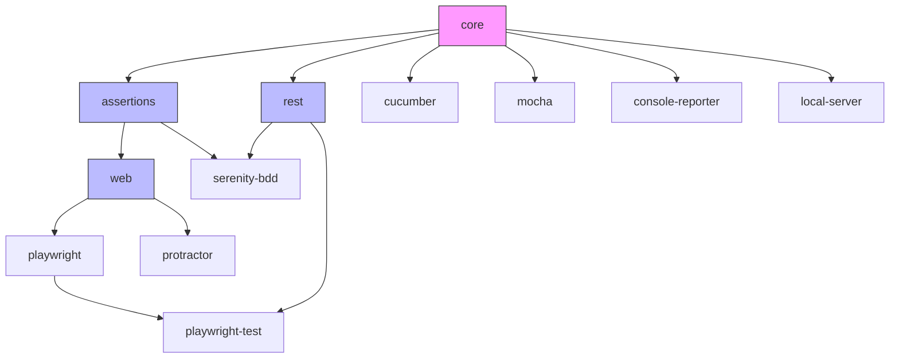

# Design Document: ESM/CJS Dual Build Migration

## Overview

This design describes the migration of all Serenity/JS packages under `packages/` to produce both ESM (ECMAScript Modules) and CommonJS-compatible builds. The migration follows the established pattern already implemented in `@serenity-js/webdriverio`, `@serenity-js/webdriverio-8`, and `@serenity-js/jasmine`.

The goal is to enable modern ESM consumers to import Serenity/JS packages natively while maintaining full backwards compatibility for existing CommonJS consumers. This is achieved through Node.js conditional exports, separate TypeScript compilation targets, and a `lib/package.json` override for CommonJS output.

## Architecture

The dual-build architecture uses Node.js package exports to conditionally resolve the correct module format based on the consumer's import style.



## Sequence Diagrams

### Build Process Flow



### Module Resolution Flow



## Components and Interfaces

### Package.json Configuration

Each migrated package requires these additions:

```json
{
  "type": "module",
  "module": "./esm/index.js",
  "exports": {
    ".": [
      {
        "types": "./esm/index.d.ts",
        "import": "./esm/index.js",
        "require": "./lib/index.js"
      },
      "./lib/index.js"
    ],
    "./events": [
      {
        "types": "./esm/events/index.d.ts",
        "import": "./esm/events/index.js",
        "require": "./lib/events/index.js"
      },
      "./lib/events/index.js"
    ],
    "./lib/*": "./lib/*",
    "./esm/*": "./esm/*",
    "./package.json": "./package.json"
  }
}
```

**Responsibilities:**
- `type: module` - Declares the package as ESM by default
- `module` - Entry point for bundlers that understand the module field
- `exports["."]` - Conditional exports for main entry point
- `exports["./events"]` etc. - Clean submodule paths with conditional resolution
- `exports["./lib/*"]` - Wildcard for legacy CJS deep imports (backwards compatible)
- `exports["./esm/*"]` - Wildcard for explicit ESM deep imports
- Fallback paths for older Node.js versions

### TypeScript Configuration Files

#### tsconfig-esm.build.json

```json
{
  "extends": "../../tsconfig.build.json",
  "compilerOptions": {
    "module": "Node16",
    "moduleResolution": "Node16",
    "outDir": "esm",
    "rootDir": "src",
    "target": "es2022",
    "lib": ["es2022", "dom"],
    "skipLibCheck": true
  },
  "include": ["src/**/*.ts"]
}
```

#### tsconfig-cjs.build.json

```json
{
  "extends": "../../tsconfig.build.json",
  "compilerOptions": {
    "module": "CommonJS",
    "moduleResolution": "Node",
    "outDir": "lib",
    "rootDir": "src",
    "target": "es2022",
    "lib": ["es2022", "dom"],
    "skipLibCheck": true
  },
  "include": ["src/**/*.ts"]
}
```

#### tsconfig.json (IDE Support)

```json
{
  "extends": "../../tsconfig.json",
  "compilerOptions": {
    "module": "Node16",
    "moduleResolution": "Node16",
    "esModuleInterop": true,
    "target": "es2022",
    "lib": ["es2022", "dom"],
    "skipLibCheck": true
  }
}
```

### Build Scripts

```json
{
  "scripts": {
    "compile": "npm run compile:clean && npm run compile:esm && npm run compile:cjs && npm run compile:cjs-package",
    "compile:clean": "rimraf lib esm",
    "compile:esm": "tsc --project tsconfig-esm.build.json",
    "compile:cjs": "tsc --project tsconfig-cjs.build.json",
    "compile:cjs-package": "node -e \"require('fs').writeFileSync('lib/package.json', '{ \\\"type\\\": \\\"commonjs\\\" }')\""
  }
}
```

## Data Models

### Package Categories

| Category | Packages | Special Considerations |
|----------|----------|----------------------|
| Already Migrated | webdriverio, webdriverio-8, jasmine | Reference implementations |
| Foundation | core | Must migrate first; all others depend on it |
| Core Libraries | assertions, web, rest | Depend on core |
| Test Runners | cucumber, mocha | Depend on core |
| Browser Adapters | playwright, playwright-test, protractor | Depend on core, web |
| Reporters | console-reporter, serenity-bdd | serenity-bdd has bin script |
| Utilities | local-server | Depends on core |

### Subpath Exports

#### Clean Subpath Imports (Recommended Approach)

Using conditional exports, we can provide clean import paths that automatically resolve to the correct format:

```typescript
// Clean imports - auto-resolve to ESM or CJS based on consumer's module system
import { Path } from '@serenity-js/core/io';
import { DomainEvent } from '@serenity-js/core/events';
import { CorrelationId } from '@serenity-js/core/model';
import * as scripts from '@serenity-js/web/scripts';
```

This is achieved by defining conditional exports for each submodule:

```json
{
  "exports": {
    ".": [
      {
        "types": "./esm/index.d.ts",
        "import": "./esm/index.js",
        "require": "./lib/index.js"
      },
      "./lib/index.js"
    ],
    "./events": [
      {
        "types": "./esm/events/index.d.ts",
        "import": "./esm/events/index.js",
        "require": "./lib/events/index.js"
      },
      "./lib/events/index.js"
    ],
    "./io": [
      {
        "types": "./esm/io/index.d.ts",
        "import": "./esm/io/index.js",
        "require": "./lib/io/index.js"
      },
      "./lib/io/index.js"
    ],
    "./model": [
      {
        "types": "./esm/model/index.d.ts",
        "import": "./esm/model/index.js",
        "require": "./lib/model/index.js"
      },
      "./lib/model/index.js"
    ],
    "./lib/*": "./lib/*",
    "./esm/*": "./esm/*",
    "./package.json": "./package.json"
  }
}
```

#### Backwards Compatible Deep Imports

Existing deep import patterns continue to work via wildcard exports:

```typescript
// Legacy CJS deep imports (backwards compatible)
import { Path } from '@serenity-js/core/lib/io';
const { DomainEvent } = require('@serenity-js/core/lib/events');

// Explicit ESM deep imports (also supported)
import { Path } from '@serenity-js/core/esm/io';
```

**Key Points:**
- `"./events"`, `"./io"`, `"./model"` etc. - Clean conditional exports for each submodule
- `"./lib/*": "./lib/*"` - Preserves existing CJS deep import paths (backwards compatible)
- `"./esm/*": "./esm/*"` - Enables explicit ESM deep import paths
- Clean paths auto-resolve: ESM consumers get `esm/`, CJS consumers get `lib/`

#### Submodules by Package

Each package exposes different submodules based on its source structure:

| Package | Submodules | Notes |
|---------|------------|-------|
| core | `events`, `io`, `model`, `errors`, `screenplay`, `stage`, `adapter`, `config` | Most submodules |
| web | `scripts` | Browser scripts for element interaction |
| assertions | (none) | Single entry point |
| rest | (none) | Single entry point |
| cucumber | `adapter` | Test runner adapter |
| mocha | `adapter` | Test runner adapter |
| jasmine | `adapter` | Test runner adapter |
| playwright | (none) | Single entry point |
| playwright-test | (none) | Single entry point |
| protractor | `adapter` | Test runner adapter |
| console-reporter | (none) | Single entry point |
| serenity-bdd | (none) | Single entry point |
| local-server | (none) | Single entry point |

#### Example: @serenity-js/core exports

```json
{
  "exports": {
    ".": [...],
    "./adapter": [...],
    "./config": [...],
    "./errors": [...],
    "./events": [...],
    "./io": [...],
    "./model": [...],
    "./screenplay": [...],
    "./stage": [...],
    "./lib/*": "./lib/*",
    "./esm/*": "./esm/*",
    "./package.json": "./package.json"
  }
}
```

### Migration Order (Dependency Graph)



**Migration Waves:**
1. `core` (foundation)
2. `assertions`, `rest`, `cucumber`, `mocha`, `console-reporter`, `local-server`
3. `web`, `serenity-bdd`
4. `playwright`, `protractor`
5. `playwright-test`

## Algorithmic Pseudocode

### Package Migration Algorithm

```pascal
ALGORITHM migratePackage(packageName)
INPUT: packageName - name of package to migrate
OUTPUT: success - boolean indicating migration success

BEGIN
  ASSERT packageExists(packageName)
  ASSERT allDependenciesMigrated(packageName)
  
  // Step 1: Create TypeScript config files
  createFile(packageName + "/tsconfig-esm.build.json", ESM_CONFIG_TEMPLATE)
  createFile(packageName + "/tsconfig-cjs.build.json", CJS_CONFIG_TEMPLATE)
  updateFile(packageName + "/tsconfig.json", IDE_CONFIG_TEMPLATE)
  
  // Step 2: Update package.json
  pkg ← readJSON(packageName + "/package.json")
  pkg.type ← "module"
  pkg.module ← "./esm/index.js"
  pkg.exports ← buildExportsConfig(packageName)
  pkg.scripts.compile ← DUAL_BUILD_SCRIPT
  pkg.scripts["compile:clean"] ← "rimraf lib esm"
  pkg.scripts["compile:esm"] ← "tsc --project tsconfig-esm.build.json"
  pkg.scripts["compile:cjs"] ← "tsc --project tsconfig-cjs.build.json"
  pkg.scripts["compile:cjs-package"] ← CJS_PACKAGE_SCRIPT
  writeJSON(packageName + "/package.json", pkg)
  
  // Step 3: Verify build
  result ← runCommand("pnpm compile", packageName)
  
  ASSERT fileExists(packageName + "/esm/index.js")
  ASSERT fileExists(packageName + "/lib/index.js")
  ASSERT fileExists(packageName + "/lib/package.json")
  
  RETURN result.success
END
```

**Preconditions:**
- Package exists in packages/ directory
- All workspace dependencies have been migrated first
- Node.js and pnpm are available

**Postconditions:**
- Package produces both ESM and CJS output
- Existing CJS consumers continue to work
- New ESM consumers can import the package
- TypeScript declarations are generated for both formats

### Exports Configuration Builder

```pascal
ALGORITHM buildExportsConfig(packageName)
INPUT: packageName - name of package
OUTPUT: exports - conditional exports object

BEGIN
  exports ← {}
  
  // Main entry point
  exports["."] ← [
    {
      types: "./esm/index.d.ts",
      import: "./esm/index.js",
      require: "./lib/index.js"
    },
    "./lib/index.js"
  ]
  
  // Detect submodules from src/ directory structure
  submodules ← detectSubmodules(packageName + "/src")
  
  // Create clean conditional exports for each submodule
  FOR each submodule IN submodules DO
    exports["./" + submodule] ← [
      {
        types: "./esm/" + submodule + "/index.d.ts",
        import: "./esm/" + submodule + "/index.js",
        require: "./lib/" + submodule + "/index.js"
      },
      "./lib/" + submodule + "/index.js"
    ]
  END FOR
  
  // Wildcard exports for backwards compatibility and explicit paths
  exports["./lib/*"] ← "./lib/*"
  exports["./esm/*"] ← "./esm/*"
  
  // Always expose package.json
  exports["./package.json"] ← "./package.json"
  
  RETURN exports
END

ALGORITHM detectSubmodules(srcPath)
INPUT: srcPath - path to package src/ directory
OUTPUT: submodules - list of submodule names

BEGIN
  submodules ← []
  
  FOR each directory IN listDirectories(srcPath) DO
    IF fileExists(directory + "/index.ts") THEN
      submodules.append(directoryName(directory))
    END IF
  END FOR
  
  RETURN submodules
END
```

**Preconditions:**
- Package source structure is known
- Submodule directories contain index.ts barrel files

**Postconditions:**
- Main entry point exposed with conditional exports
- Each submodule (events, io, model, etc.) exposed with clean path and conditional exports
- Wildcard patterns enable legacy deep imports for backwards compatibility
- Type definitions are correctly mapped for all entry points

### Full Migration Orchestration

```pascal
ALGORITHM migrateAllPackages()
INPUT: none
OUTPUT: success - boolean indicating all migrations succeeded

BEGIN
  // Define migration waves based on dependency order
  waves ← [
    ["core"],
    ["assertions", "rest", "cucumber", "mocha", "console-reporter", "local-server"],
    ["web", "serenity-bdd"],
    ["playwright", "protractor"],
    ["playwright-test"]
  ]
  
  FOR each wave IN waves DO
    // Packages in same wave can be migrated in parallel
    FOR each packageName IN wave DO
      success ← migratePackage(packageName)
      IF NOT success THEN
        RETURN false
      END IF
    END FOR
    
    // Verify wave before proceeding
    runCommand("make COMPILE_SCOPE=libs compile")
    runCommand("make test")
    
    ASSERT allTestsPass()
  END FOR
  
  // Final integration verification
  runCommand("make integration-test")
  
  RETURN true
END
```

**Preconditions:**
- webdriverio, webdriverio-8, jasmine already migrated (reference)
- Clean working directory
- All dependencies installed

**Postconditions:**
- All 12 packages migrated to dual build
- All unit tests pass
- All integration tests pass
- Backwards compatibility maintained

**Loop Invariants:**
- All packages in previous waves are successfully migrated
- Build system remains functional after each wave

## Key Functions with Formal Specifications

### createTsconfigEsm()

```typescript
function createTsconfigEsm(packagePath: string): void
```

**Preconditions:**
- `packagePath` is a valid path to a package directory
- `../../tsconfig.build.json` exists and is valid

**Postconditions:**
- `tsconfig-esm.build.json` exists in package directory
- Configuration extends base tsconfig.build.json
- Module is set to "Node16"
- Output directory is "esm"

### createTsconfigCjs()

```typescript
function createTsconfigCjs(packagePath: string): void
```

**Preconditions:**
- `packagePath` is a valid path to a package directory
- `../../tsconfig.build.json` exists and is valid

**Postconditions:**
- `tsconfig-cjs.build.json` exists in package directory
- Configuration extends base tsconfig.build.json
- Module is set to "CommonJS"
- Output directory is "lib"

### updatePackageJson()

```typescript
function updatePackageJson(packagePath: string, hasSubpaths: string[]): void
```

**Preconditions:**
- `packagePath` is a valid path to a package directory
- `package.json` exists and is valid JSON
- `hasSubpaths` contains valid subpath names (or empty array)

**Postconditions:**
- `package.json` contains `"type": "module"`
- `package.json` contains `"module": "./esm/index.js"`
- `package.json.exports` contains conditional exports for all entry points
- `package.json.scripts.compile` uses dual-build process
- Original `main` and `types` fields preserved for backwards compatibility

### generateCjsPackageJson()

```typescript
function generateCjsPackageJson(libPath: string): void
```

**Preconditions:**
- `libPath` is a valid path to the lib/ output directory
- lib/ directory exists (created by tsc)

**Postconditions:**
- `lib/package.json` exists
- Contains exactly `{ "type": "commonjs" }`
- Overrides the root package.json type for CJS resolution

## Example Usage

### Consuming Main Entry Point

```typescript
// ESM consumer
import { Actor, Cast } from '@serenity-js/core';
import { BrowseTheWeb } from '@serenity-js/web';

const actor = Actor.named('Alice');
```

```javascript
// CommonJS consumer
const { Actor, Cast } = require('@serenity-js/core');
const { BrowseTheWeb } = require('@serenity-js/web');

const actor = Actor.named('Alice');
```

### Clean Submodule Imports (Recommended)

```typescript
// Clean paths - auto-resolve to correct format (ESM or CJS)
import { Path, FileSystem } from '@serenity-js/core/io';
import { DomainEvent, SceneStarts } from '@serenity-js/core/events';
import { CorrelationId, Name } from '@serenity-js/core/model';
import * as scripts from '@serenity-js/web/scripts';
import { JasmineAdapter } from '@serenity-js/jasmine/adapter';
```

```javascript
// CommonJS with clean paths
const { Path, FileSystem } = require('@serenity-js/core/io');
const { DomainEvent, SceneStarts } = require('@serenity-js/core/events');
const { JasmineAdapter } = require('@serenity-js/jasmine/adapter');
```

### Legacy Deep Imports (Backwards Compatible)

```typescript
// Existing /lib/ paths continue to work
import { Path } from '@serenity-js/core/lib/io';
const { DomainEvent } = require('@serenity-js/core/lib/events');

// Explicit /esm/ paths also available
import { Path } from '@serenity-js/core/esm/io';
```

## Correctness Properties

*A property is a characteristic or behavior that should hold true across all valid executions of a system—essentially, a formal statement about what the system should do. Properties serve as the bridge between human-readable specifications and machine-verifiable correctness guarantees.*

### Property 1: Dual Build Output

*For any* migrated package, compilation SHALL produce both an `esm/` directory with `index.js` and a `lib/` directory with `index.js`.

**Validates: Requirements 1.1, 2.1, 9.1, 9.2**

### Property 2: Type Declaration Parity

*For any* JavaScript file (`.js`) in the build output (either `esm/` or `lib/`), a corresponding TypeScript declaration file (`.d.ts`) SHALL exist in the same directory.

**Validates: Requirements 1.3, 2.3, 10.1, 10.2**

### Property 3: CJS Package Override

*For any* migrated package, after compilation the file `lib/package.json` SHALL exist and contain `{ "type": "commonjs" }`.

**Validates: Requirements 2.4, 9.3**

### Property 4: ESM Resolution

*For any* migrated package and any entry point (main or submodule), when imported using ESM `import` syntax, the resolved file path SHALL be within the `esm/` directory.

**Validates: Requirements 1.4, 4.2**

### Property 5: CJS Resolution

*For any* migrated package and any entry point (main or submodule), when required using CommonJS `require()` syntax, the resolved file path SHALL be within the `lib/` directory.

**Validates: Requirements 2.5, 4.3, 5.3**

### Property 6: Package Configuration Completeness

*For any* migrated package, the `package.json` SHALL contain: `"type": "module"`, `"module": "./esm/index.js"`, conditional exports with `types`/`import`/`require` conditions, wildcard exports `"./lib/*"` and `"./esm/*"`, and preserved `main`/`types` fields.

**Validates: Requirements 3.1, 3.2, 3.3, 3.4, 3.5, 5.1, 5.2, 5.4**

### Property 7: Submodule Export Completeness

*For any* package with submodules (directories containing `index.ts`), the `exports` field SHALL include a conditional export entry for each submodule with `types`, `import`, `require` conditions and a fallback path.

**Validates: Requirements 4.1, 4.4, 4.5, 10.3, 11.2, 11.3, 11.4, 11.5**

### Property 8: TypeScript Configuration Correctness

*For any* migrated package, `tsconfig-esm.build.json` SHALL configure `module: "Node16"` and `outDir: "esm"`, and `tsconfig-cjs.build.json` SHALL configure `module: "CommonJS"` and `outDir: "lib"`.

**Validates: Requirements 6.1, 6.2, 6.3, 6.4, 6.5**

### Property 9: Build Script Completeness

*For any* migrated package, the `scripts` field SHALL include `compile`, `compile:clean`, `compile:esm`, `compile:cjs`, and `compile:cjs-package` scripts with correct commands.

**Validates: Requirements 7.1, 7.2, 7.3, 7.4, 7.5, 7.6**

### Property 10: Dependency Migration Order

*For any* package P with workspace dependency D, ESM compilation of P SHALL succeed only if D has been migrated to dual-build (i.e., D's ESM exports are available).

**Validates: Requirements 8.2**

## Error Handling

### Build Failure Scenarios

| Scenario | Detection | Recovery |
|----------|-----------|----------|
| Missing dependency migration | Import errors in ESM build | Migrate dependency first |
| Invalid tsconfig extends | TypeScript compilation error | Verify base config path |
| Circular dependency | Build hangs or stack overflow | Refactor to break cycle |
| Missing subpath index.ts | Export resolution failure | Create index.ts barrel |

### Runtime Resolution Errors

| Scenario | Symptom | Solution |
|----------|---------|----------|
| Missing lib/package.json | CJS import fails in type:module package | Ensure compile:cjs-package runs |
| Wrong exports order | Older Node.js uses wrong format | Put fallback path last in array |
| Missing types field | TypeScript can't find declarations | Add types to each export condition |

## Testing Strategy

### Unit Testing Approach

Each migrated package's existing unit tests must pass without modification. Tests run against the compiled output.

```bash
cd packages/core
pnpm compile
pnpm test
```

### Property-Based Testing Approach

**Property Test Library**: mocha-testdata (existing in project)

Key properties to verify:
- ESM import resolves to esm/ directory
- CJS require resolves to lib/ directory
- Both formats export identical public API surface

### Integration Testing Approach

Integration tests in `integration/` exercise the full stack with various test runners. After migration:

```bash
make clean
make COMPILE_SCOPE=libs compile
make INTEGRATION_SCOPE=playwright-test integration-test
make INTEGRATION_SCOPE=cucumber-all integration-test
```

### Verification Script

```bash
# Verify ESM resolution
node --input-type=module -e "import('@serenity-js/core').then(m => console.log('ESM OK:', Object.keys(m).length, 'exports'))"

# Verify CJS resolution  
node -e "console.log('CJS OK:', Object.keys(require('@serenity-js/core')).length, 'exports')"

# Verify types
npx tsc --noEmit --moduleResolution node16 -e "import { Actor } from '@serenity-js/core'"
```

## Performance Considerations

- Build time increases ~2x due to dual compilation (acceptable trade-off)
- Package size increases due to duplicate output (esm/ + lib/)
- Runtime performance unchanged - same JavaScript executes
- Consider adding esm/ and lib/ to .npmignore if not already

## Security Considerations

- No new attack surface introduced
- Same code compiled to two formats
- Package provenance maintained through existing npm publish workflow

## Dependencies

### Existing (No Changes)

- TypeScript 5.x (already in devDependencies)
- rimraf (already used for clean scripts)

### New Dependencies

None required. The migration uses existing tooling.

### Peer Dependencies

No changes to peer dependency requirements.
