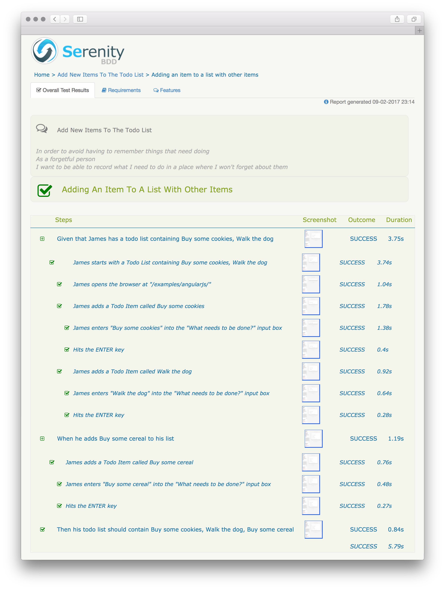

# From Scripts to Serenity: Making the tests speak for themselves

In the [last tutorial](writing-what-you-would-like-to-read.md)
we looked at the basics of writing acceptance tests that are focused, readable and free of
[accidental complexity](https://en.wikipedia.org/wiki/No_Silver_Bullet).
Those characteristics make even the most sophisticated test suites easy to understand, maintain and extend.
We've also introduced the concepts behind the [Screenplay Pattern](../design/screenplay-pattern.md),
an innovative new way of designing automated test systems.

In this article, we'll look at ways of making the results of the tests visible and accessible
to everyone on the team. Including the guys sponsoring our projects.

## Recording the interactions

:bulb: **PRO TIP:** If you like learning by doing, you can continue to work on the code we wrote as part of
the [last tutorial](writing-what-you-would-like-to-read.md)
or grab a fresh copy
from the [`1-first-scenario-implemented`](https://github.com/serenity-js/tutorial-from-scripts-to-serenity/tree/1-first-scenario-implemented)
branch.

```
$> git clone https://github.com/serenity-js/tutorial-from-scripts-to-serenity
$> cd tutorial-from-scripts-to-serenity
$> git checkout 1-first-scenario-implemented
```

To help Serenity/JS produce those narrative, illustrated reports that anyone on the team can read and understand, 
we first need to tell the library a bit more about the life cycle of the scenarios we execute.

To do this, it's enough to [replace the original test framework adapter](../overview/retrofitting.md) 
you can find in the `protractor.conf.json` with `serenity-js`:

```javascript
exports.config = {
    // Framework definition - tells Protractor to use Serenity/JS
    framework: 'custom',
    frameworkPath: require.resolve('serenity-js')
}
```

When you run the tests again:

```
$> npm test
```

you'll notice that a new directory was created and that it contains a `.json`
file in it, together with a couple of `.png` files:

```
$> ls target/site/serenity

704ff39d93ac1503afb0ba8a5ad03c71.json
```

Serenity/JS produces one JSON file per each test scenario executed. 
Those JSON files are then analysed and aggregated by Serenity BDD in a separate step
to produce a HTML report. We'll look into the details of this process next.

But getting the test execution recorded is not the only thing that we managed to accomplish 
by [changing this one, humble line](../overview/retrofitting.md):

```typescript
frameworkPath: require.resolve('serenity-js')
```

To fully appreciate the benefits of this change, we need to talk a bit more about the inner workings of WebDriver JS.

## It's all about... timing!

WebDriver JavaScript API, and therefore Protractor API, is entirely asynchronous. 
This means that whenever we issue a call to click on a button, or enter a value into a field, we trigger an _asynchronous_ operation.
Because those operations are asynchronous, we need some way to ensure that they're executed in a correct order.

This could be achieved using either promises or callbacks, but because WebDriver JS has been around long before Node.js 
could support promises natively with async/await, promise chaining was difficult to embrace for the newcomers,
and the traditional Node.js-style callbacks were not such an attractive option, WebDriver has found a different way.

In the effort to make working with asynchronous operations easier for developers new to JavaScript,
WebDriver implements its own [Promise Manager](https://github.com/SeleniumHQ/selenium/wiki/WebDriverJs#understanding-the-promise-manager),
also known as the [Control Flow](http://seleniumhq.github.io/selenium/docs/api/javascript/module/selenium-webdriver/lib/promise.html),
which takes over the execution of those asynchronous calls from Node.js, 
replacing the [built-in mechanisms](https://developer.mozilla.org/en-US/docs/Web/JavaScript/Reference/Global_Objects/Promise)
and makes them _look like_ if they were synchronous operations:

```typescript
let addTodo = element(by.model('todoList.todoText'));
let addButton = element(by.css('[value="add"]'));

addTodo.sendKeys('write a test');       // schedules an async operation
addButton.click();                      // same here
```

Regretfully, even though on the surface this design makes writing tests seem easier, it comes at a cost of making 
both debugging and integration with other tools much more difficult. This problem has 
been [recently recognised](https://github.com/SeleniumHQ/selenium/issues/2969) by the Selenium 
Team, who are planning to completely deprecate the Promise Manager
by [October 2018](https://github.com/SeleniumHQ/selenium/issues/2969) in favour of using native promises.

Until then, since most tools such as Cucumber.js or [Chai.js](https://github.com/domenic/chai-as-promised/issues/160)
are not WebDriver-aware (nor should they be), those two approaches to dealing with the asynchronous nature of JavaScript
need to be reconciled. 

If this problem is not addressed, different parts of our testing framework would operate on different schedules - 
tools other than WebDriver could think that a given interaction is completed when in fact it's 
only been _scheduled for execution_.
 
If proper care is not taken, this dichotomy leads to inaccurate and often incorrect reports produced by
the Protractor/Cucumber combo, with step duration reported incorrectly and errors reported as occurring in steps 
further down the execution chain than where they actually have happened.
 
Thankfully, one other benefit of using Serenity/JS as a mediator between Protractor and Cucumber (or Mocha) 
is promise synchronisation. This means that you can use box-standard JavaScript promises 
and promise-based libraries without having to worry about the internal WebDriver mechanism.
 
:bulb: **PRO TIP**: You can improve the reporting and correct the synchronisation on an existing project
by [introducing Serenity/JS with just a single-line of code](../overview/retrofitting.md). 
And you can do this even before you start using TypeScript or the Screenplay Pattern! 

## From JSON to HTML

The HTML report is much more than just a sum of its parts.
The aggregate contains of course the detailed results of each test scenario,
but it can also contain information about the capabilities and features of your system that the tests have covered
and more importantly - the capabilities and features that the tests have not covered yet.

Since the HTML report presents a much richer perspective on the test results,
its generation is more demanding computationally.
For this reason, it happens separately from the test execution phase.
However, there are other practical advantages on top the positive performance implications of this design:

1. Since the JSON reports produced by Serenity/JS are compatible with the ones produced
by [Serenity BDD for Java](http://serenity-bdd.info/), you can have Serenity/JS and Serenity BDD produce the intermediate
JSON reports independently and then aggregate them together to have a single report covering several projects
1. Because Serenity/JS produces a JSON file per test scenario, you can shard the execution of tests to multiple
servers, collect the intermediate reports and aggregate them at a later stage
of a [Continuous Delivery pipeline](https://en.wikipedia.org/wiki/Continuous_delivery)

### Managing dependencies

The component responsible for analysing and aggregating the intermediate reports is Serenity BDD itself,
which is a Java library and therefore requires a [Java Runtime Environment](https://java.com/en/download/) 7 or newer.

To verify that you have Java 7 or newer installed, run:

```
$> java -version

java version "1.8.0_25"
Java(TM) SE Runtime Environment (build 1.8.0_25-b17)
Java HotSpot(TM) 64-Bit Server VM (build 25.25-b02, mixed mode)
```

To make invoking a Java program from Node.js easier,
we'll need a new dependency - [`serenity-cli`](https://www.npmjs.com/package/serenity-cli):

```
$> npm install serenity-cli --save-dev
```

:bulb: **PRO TIP:** Even though `serenity-cli` is a command line program, we're installing it in the scope
of the current project rather than globally.
This way we can make the dependency on the package explicit and its version under control,
which wouldn't be possible with a [globally installed module](https://docs.npmjs.com/cli/install).

### Scripting the installation

`serenity-cli` delegates all the analysis and aggregation work to the Serenity BDD `jar`,
which means that it needs to download it first.
The downloading of the `jar` is a one time process as the `jar` gets cached in the `node_modules` directory.
This behaviour is similar to how Protractor
[manages the WebDriver `jar`](https://github.com/angular/webdriver-manager)
as well as other browser-specific driver binaries, such as [`chromedriver`](https://sites.google.com/a/chromium.org/chromedriver/).

To make sure that the `jar` is downloaded when needed, add `"pretest": "serenity update"` to the `scripts`
section of the `package.json`:

``` json
// package.json

// ...

  "scripts": {
    "pretest": "serenity update",

    //...
  },

// ...
```

The `pretest` is an [NPM script](https://docs.npmjs.com/misc/scripts), which will be invoked before the `npm test`
command is executed.

When you call `npm test` with the new script in place, you should see the output similar to the following:

```
$> npm test

info: Looks like you need the latest Serenity BDD CLI jar. Let me download it for you...
info: Downloaded to /Users/jan/tutorial-from-scripts-to-serenity/node_modules/serenity-cli/.cache/serenity-cli-0.0.1-rc.3-all.jar
```

### Scripting the reporting

With the Serenity BDD CLI `jar` in place, we can now use it to produce the aggregated report. To do this, let's add
another NPM script - `"report": "serenity run"`:

``` json
// package.json

// ...

  "scripts": {
    "pretest": "serenity update",
    "report":  "serenity run",

    //...
  },

// ...
```

We can now execute both scripts in a sequence to see the HTML report we've been waiting for:

```
$> npm test
```

```
$> npm run report
```

:bulb: **PRO TIP**: As opposed to `test` and `pretest`, `report` is not a [standard NPM script](https://docs.npmjs.com/misc/scripts).
You can invoke any custom scripts using the `npm run <script name>` syntax, which is what we just did.

The result of executing the `npm run report` is a static HTML page, generated under `target/site/serenity`.
Inside that directory you'll notice the `index.html` file, which opened in a web browser should present a report similar
to the one below:


### Starting fresh each time

In order to avoid having reports from previous test executions lying around, we need to make sure that
the `target` directory is empty before executing the suite.

To create the script that does it for us, install the [`rimraf` module](https://www.npmjs.com/package/rimraf):

```
$> npm install rimraf --save-dev
```

and define a `clean` script:

``` json
// package.json

// ...

  "scripts": {
    "clean":   "rimraf target",
    "pretest": "serenity update",
    "report":  "serenity run",

    //...
  },

// ...
```

Running `npm run clean` removes the `target` directory.

### Scripting the flow

Right now we can:
* execute the test suite and produce the intermediary JSON reports - `npm test`
* analyse the individual reports and produce an aggregated HTML report - `npm run report`
* remove the `target` directory, storing both JSON and HTML files before each test suite run - `npm run clean`

It would be much easier if instead of calling three separate commands we could just call one.
Thankfully, the [`npm-failsafe`](https://www.npmjs.com/package/npm-failsafe) can help us with that:

```
$> npm install npm-failsafe --save-dev
```

:bulb: **PRO TIP**: We're using the `npm-failsafe` module instead of the more traditional `&&` and `||` operators.
Chaining the scripts using `script-1 && script-2` syntax won't execute `script-2` should `script-1`
fail - so we won't get the test report when a test fails, which is exactly when we need it the most.
Using `script-1 || script-2` executes both scripts even if the first one fails,
but returns an [exit code of success](http://tldp.org/LDP/abs/html/exit-status.html) even when the tests fail,
which confuses [Continuous Integration](https://en.wikipedia.org/wiki/Continuous_integration) servers.

With `npm-failsafe` installed we can modify our `scripts` a bit:

``` json
// package.json

// ...

  "scripts": {
    "clean":   "rimraf target",
    "pretest": "serenity update",
    "report":  "serenity run",
    "test":    "failsafe clean protractor report",

    //...
  },

// ...
```

Now running `npm test` will:
* download the Serenity BDD CLI `jar` and cache it if it's needed
* clean the `target` directory
* execute the tests
* generate the HTML report

## Narrative reports

Opening the HTML report and navigating to the details of our test scenario should present a view similar to the one below:


As you can see, each Cucumber step is presented together with all the interactions that have contributed to making it happen.
That's very useful, but the Interactions are pretty low-level and all speak using the vocabulary
of the solution domain ("clicking buttons" and "entering values into fields") rather than the business domain
("adding items to the list", "paying with a default credit card" and so on). Let's improve that now.

Head back to the `Start` Task we have created as part of our last tutorial and add a `@step` annotation,
giving the Task a more descriptive name:

```typescript
// spec/screenplay/tasks/start.ts

import { PerformsTasks, Task } from 'serenity-js/lib/screenplay';
import { Open, step } from 'serenity-js/lib/screenplay-protractor';     // imports the @step

import { AddATodoItem } from './add_a_todo_item';

export class Start implements Task {

    static withATodoListContaining(items: string[]) {
        return new Start(items);
    }

    @step('{0} starts with a Todo List containing #items')      // Gives the Task a more descriptive name
    performAs(actor: PerformsTasks): PromiseLike<void> {
        return actor.attemptsTo(
            Open.browserOn('/examples/angularjs/'),
            ...this.addAll(this.items)
        );
    }

    constructor(private items: string[]) {
    }

    private addAll(items: string[]): Task[] {
        return items.map(item => AddATodoItem.called(item));
    }
}
```

:bulb: **PRO TIP**: `@step` annotation can process tokens, which can be defined as:
* `{0}`, where `0` means the 0-th argument the `performAs` method was invoked with - the `actor` in our case
* `#member`, where `member` means any private or public field or method of the Task object - here it's the `items` field

Now, repeat the process with the `AddATodoItem` task:

``` typescript
// spec/screenplay/tasks/add_a_todo_item.ts

import { PerformsTasks, Task } from 'serenity-js/lib/screenplay';
import { Enter, step } from 'serenity-js/lib/screenplay-protractor';    // imports the @step

import { protractor } from 'protractor';

import { TodoList } from '../components/todo_list';

export class AddATodoItem implements Task {

    static called(itemName: string) {
        return new AddATodoItem(itemName);
    }

    @step('{0} adds a Todo Item called #itemName')              // Gives the Task a more descriptive name
    performAs(actor: PerformsTasks): PromiseLike<void> {
        return actor.attemptsTo(
            Enter.theValue(this.itemName)
                .into(TodoList.What_Needs_To_Be_Done)
                .thenHit(protractor.Key.ENTER)
        );
    }

    constructor(private itemName: string) {
    }
}
```

And run the test suite again to see that the scenario report now also mentions all the business-level tasks:
```
$> npm test
```



## An image is worth a thousand words

In the beginning I promised that the reports will not only be narrative but also illustrated.

The design of the Serenity/JS library uses a [system metaphor](http://www.extremeprogramming.org/rules/metaphor.html)
of a stage performance (the name of the [Screenplay Pattern](../design/screenplay-pattern.md) is a prime example of that).
This means that in order to add pictures to the reports we need to invite a Photographer 
to join the [Stage Crew](../overview/configuration.md#stage-crew-members).

Since taking screenshots is such a common requirement however, the Photographer is assigned to a stage crew by default,
this means that the following configuration:

```javascript
exports.config = {
   
    framework: 'custom',
    frameworkPath: require.resolve('serenity-js')
    
    cucumberOpts: {
        // ..
    }
}
```

could be also written as:

```javascript
const crew = require('serenity-js/lib/stage_crew');

exports.config = {
    
    framework: 'custom',
    frameworkPath: require.resolve('serenity-js')
        
    serenity: {
        crew:    [
            crew.serenityBDDReporter(),
            crew.photographer()
        ]
    },
    
    cucumberOpts: {
        // ..
    }
}
```

:bulb: **PRO TIP**: You can learn more about the configuration options from [the further chapters](../overview/configuration.md).


A Photographer will take a photo of whichever actor is in the spotlight, as soon as the Actor performs an activity
of interest to the Photographer.

So where's this whole spotlight I'm talking about? It doesn't seem like we have it yet, and if we don't, how come can we
capture the screenshots?

The same mechanism that helps to [introduce Serenity/JS to an existing project](../overview/retrofitting.md)
is at play here. If a project does not make use of actors, Serenity/JS associates the global `protractor.browser` with 
a generic, "stand-in actor" so that you can get the screenshots even before you have the actors, 
the stage, or anything even remotely related to those concepts.

Because of this, and the fact that the actor we defined also happens to be using the very same, default protractor browser,
one can be associated with the other automatically.

Let's introduce the stage and this association a bit more obvious though.

## Shining the spotlight

In order to have the Actor in a Spotlight, we need to have the [Stage](../design/stage.md) first,
so let's make the following changes to the `todo_user.steps.ts`:

``` typescript
// features/step_definitions/todo_user.steps.ts

import { Actor } from 'serenity-js/lib/screenplay';
import { BrowseTheWeb } from 'serenity-js/lib/screenplay-protractor';
import { protractor } from 'protractor';
import { serenity } from 'serenity-js';

import { Start, AddATodoItem } from '../../spec/screenplay/tasks';
import { listOf } from '../../spec/text';
import { expect } from '../../spec/expect';
import { TodoList } from '../../spec/screenplay/components/todo_list';

export = function todoUserSteps() {

    let stage = Serenity.callToStageFor({
        actor: (name) => Actor.named(name).whoCan(BrowseTheWeb.using(protractor.browser))
    });

    this.Given(/^.*that (.*) has a todo list containing (.*)$/, function (name: string, items: string) {
        return stage.theActorCalled(name).attemptsTo(
            Start.withATodoListContaining(listOf(items))
        );
    });

    this.When(/^s?he adds (.*?) to (?:his|her) list$/, function (itemName: string) {
        return stage.theActorInTheSpotlight().attemptsTo(
            AddATodoItem.called(itemName)
        )
    });

    this.Then(/^.* todo list should contain (.*?)$/, function (items: string) {
        return expect(stage.theActorInTheSpotlight().toSee(TodoListItems.Displayed))
            .eventually.deep.equal(listOf(items))
    });
};
```

As you can see above, instead of instantiating the `Actor` directly, we delegate this job to the `Stage` class:
* `stage.theActorCalled(name)` creates a new `Actor` via the
`(name) => Actor.named(name)...` function and remembers it
as the "Actor in the Spotlight"
* `stage.theActorInTheSpotlight()` retrieves the last active `Actor`

We'll look in detail into how the [Stage](../design/stage.md) works in the future tutorials when we talk about multi-actor testing.

For now, since we have both the Stage and the Stage Crew assigned to it, we can again run the tests:

```
$> npm test
```

:bulb: **PRO TIP**: Defining the stage as a local variable is sufficient when the project has only one 
step definition library (the "steps file") that cucumber needs to load. 
In more complex scenarios you might want to
[make the stage available on the cucumber context](../cucumber/automation.md#all-the-worlds-a-stage)
to avoid duplication.

## Summary

By organising the code of our automated acceptance testing system
to follow the [Screenplay Pattern](../design/screenplay-pattern.md)
and adding `@step` annotations to the business-level tasks, we managed to generate meaningful, narrative and illustrated
reports that can form part of the [living documentation](https://en.wikipedia.org/wiki/Specification_by_example)
of our application and help facilitate better communication between the members of the project team.

Would you like to [learn more about working with Cucumber](../cucumber/readme.md)?


