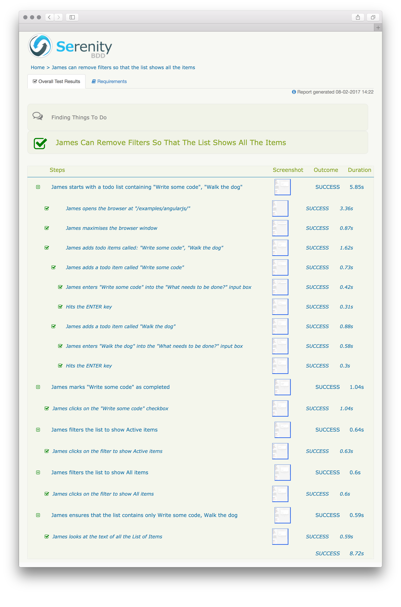

# Reporting

Building on the shoulders of [Serenity BDD](http://serenity-bdd.info/#/) and years of research into
patterns of scalable acceptance testing and effective communication, Serenity/JS provides
the most comprehensive reporting capabilities of all the functional testing libraries based on the Node.js
platform.

Test scenarios implementing the [Screenplay Pattern](../design/screenplay-pattern.md) can be quickly 
assembled from highly-reusable building blocks by team members with varied technical background:

```typescript
describe('Finding things to do', () => {
    describe('James can', () => {
        describe('remove filters so that the list', () => {
            it('shows all the items', () => Actor.named('James').attemptsTo(
                Start.withATodoListContaining([ 'Write some code', 'Walk the dog' ]),
                CompleteATodoItem.called('Write some code'),
                FilterItems.toShowOnly('Active'),
                FilterItems.toShowOnly('All'),
                Ensure.theListOnlyContains('Write some code', 'Walk the dog'),
            ));
        });
        
        describe('apply filters so that the list', () => {
            it('shows active items only');
            
            it('shows completed items only');
        });
    });
});
```

Serenity/JS presents the results of test execution in a form of illustrated, narrative reports that describe what your
application does and how it works, using a language that's easy to understand to both the technical and non-technical audience.



What's more important, however, is that Serenity/JS gives you visibility of the **release readiness** of your application.
It can tell you not only what scenarios have been executed, but also what features and what requirements have been
tested, and to what extent.


 
When a test fails, Serenity/JS will also show you the failure in the context of the capability and feature affected,
so that failure analysis becomes much more efficient.


Many of those reporting capabilities are [**available even to existing test suites**](./retrofitting.md), 
and all that's required is **just a single, [one-line code change](./retrofitting.md)**.
 
To learn more about Serenity BDD reports, please [consult the documentation](http://serenity-bdd.info/docs/serenity/).

Configuration is covered in the [third part of the Serenity/JS tutorial](../from-scripts-to-serenity/making-the-tests-speak-for-themselves.md)
 
