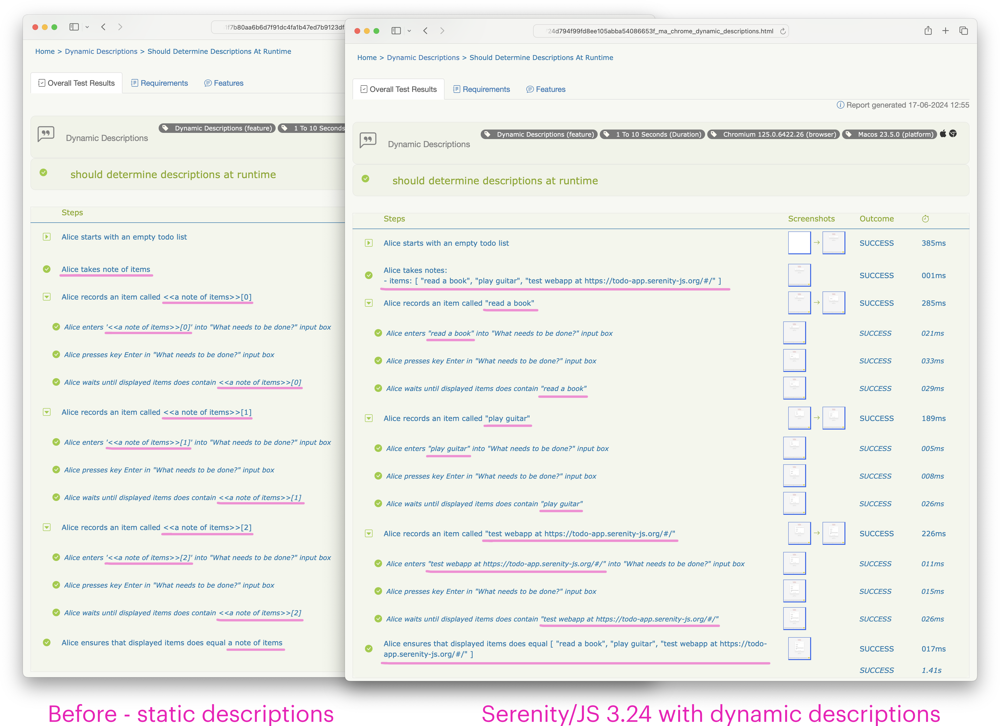

📣 Serenity/JS Tasks, Interactions and Questions now support dynamic descriptions 🎉

With the new release of [**Serenity/JS 3.24**](/changelog/3.24.0), descriptions of [Tasks](/api/core/class/Task/),
[Interactions](/api/core/class/Interaction/), and [Questions](/api/core/class/Question/), including [assertions](/handbook/design/assertions/)
and [synchronisation statements](/handbook/design/waiting-and-synchronisation/),
can be **determined dynamically at runtime** and incorporate the actual values of static and dynamic parameters you passed in.

The new dynamic descriptions feature is particularly useful when designing custom Serenity/JS tasks that
accept [notes](/api/core/function/notes/) or other dynamic data structures like [questions](/api/core/class/Question/),
[question adapters](/api/core/#QuestionAdapter), or [answerables](/api/core/#Answerable).

Long story short: to use dynamic descriptions, upgrade to Serenity/JS 3.24 and replace [`d`](/api/core/function/format/)
with [`the`](/api/core/function/the/) in your custom Task and Interaction definitions:

```diff
- import { Task, d } from '@serenity-js/core';
+ import { Task, the } from '@serenity-js/core';

export const recordItem = (name: Answerable<string>): Task =>
- Task.where(d`#actor records an item called ${ name }`,
+ Task.where(the`#actor records an item called ${ name }`,
    Enter.theValue(name).into(newTodoInput()),
    Press.the(Key.Enter).in(newTodoInput()),
    Wait.until(itemNames(), contain(name)),
  )
```

This tiny change to your code will enable your Serenity reports to show the actual values of your task and interaction parameters.



Want to learn more? [Read on](/blog/introducing-dynamic-descriptions/#the-old-world-of-static-descriptions)!

<!--truncate-->

## The old world of static descriptions

Before Serenity/JS 3.24, descriptions of custom [Tasks](/api/core/class/Task/), [Interactions](/api/core/class/Interaction/)
and [Questions](/api/core/class/Question/) had to be defined using a static `string` value.
This meant they had to be known when the class was instantiated and couldn't change at runtime.

A typical implementation of a custom task would look similar to this:

```ts
import { contain } from '@serenity-js/assertions';
import { d, Task, Wait } from '@serenity-js/core';
import { Enter, Key, Press } from '@serenity-js/web';

import { newTodoInput } from '../TodoApp';
import { itemNames } from '../TodoList';

export const recordItem = (name: Answerable<string>): Task => // factory function
  Task.where(d`#actor records an item called ${ name }`,      // static description
    Enter.theValue(name).into(newTodoInput()),
    Press.the(Key.Enter).in(newTodoInput()),
    Wait.until(itemNames(), contain(name)),
  )
```

Here, the `recordItem(name)` factory function producing the `Task` accepts
a parameter of type [`Answerable<string>`](/api/core/#Answerable). This design  offers the most freedom to the person
using such factory function in their test scenarios as it allows for the parameter to be either a static `string`,
or any dynamic Serenity/JS data structure that resolves to a `string`.
Serenity/JS uses this flexible API design extensively, too.

However, even though the task parameter itself can be determined dynamically at runtime,
the description of the task is a static `string`
that's defined when the task is created.

To make creating such static descriptions easier,
Serenity/JS offers a [formatting function - `d`](/api/core/function/format/).
This [tag function](https://developer.mozilla.org/en-US/docs/Web/JavaScript/Reference/Template_literals#tagged_templates)
inspects the parameters injected into the template literal, and for primitive data types like `string` or `number` leaves their value as is,
and for the complex types tries to generate a sensible description.

Unfortunately, it tends to fall short when producing descriptions of chained [question adapters](/api/core/#QuestionAdapter).

For example, the following scenario:

```ts
await actor.attemptsTo(

  startWithAnEmptyList(),

  notes<MyNotes>().set('items', [ 'read a book' ]),

  recordItem(notes<MyNotes>().get('items')[0]),

  Ensure.that(
    itemNames(),
    contain(notes().get('items')[0])
  ),
);
```

would produce a report with the dynamic note parameter described as `<<a note of items>>[0]`:

```
Alice starts with an empty list
Alice takes note of items
Alice records an item called <<a note of items>>[0]
    Alice enters '<<a note of items>>[0]' into "What needs to be done?" input box
    Alice presses key Enter in "What needs to be done?" input box
    Alice waits until displayed items contain <<a note of items>>[0]
Alice ensures that displayed items contain <<a note of items>>[0]
```

While this description is accurate and correct, it could be more developer-friendly.

## Using dynamic descriptions

Starting with Serenity/JS 3.24, descriptions provided to [`Task.where`](/api/core/class/Task/#where),
[`Interaction.where`](/api/core/class/Interaction/#where) and [`Question.about`](/api/core/class/Question/#about)
can be a dynamic `Answerable<string>` instead of just a static `string`.
Descriptions defined this way get resolved when the activity is performed, rather than when it's instantiated.

It's very easy to modify your existing custom tasks and interaction as all you need to do is to use the new tag function
[`the`](/api/core/function/the/) - a far more powerful successor of `d`:

```ts
import { contain } from '@serenity-js/assertions';
import { Task, the, Wait } from '@serenity-js/core';    // use `the`, not `d`
import { Enter, Key, Press } from '@serenity-js/web';

import { newTodoInput } from '../TodoApp';
import { itemNames } from '../TodoList';

export const recordItem = (name: Answerable<string>): Task => // factory function
  Task.where(the`#actor records an item called ${ name }`,    // dynamic description
    Enter.theValue(name).into(newTodoInput()),
    Press.the(Key.Enter).in(newTodoInput()),
    Wait.until(itemNames(), contain(name)),
  )
```

Replacing `d` with `the` in your custom tasks and interactions will make your Serenity reports more developer-friendly,
especially if you're using [`notes`](/api/core/function/notes/) or other dynamic data structures in your test scenarios:

```
Alice starts with an empty list
Alice takes notes:
- items: [ 'read a book' ]
Alice records an item called "read a book"
    Alice enters "read a book" into "What needs to be done?" input box
    Alice presses key Enter in "What needs to be done?" input box
    Alice waits until displayed items contain "read a book"
Alice ensures that displayed items contain "read a book"
```

`the` works in a similar way to `d`, with two significant differences:
- it gives you more flexibility over how the output is formatted
- it queries the parameters to determine their description instead of inspecting them

### Formatting the output

`the` allows you to [configure the formatting](/api/core/interface/DescriptionFormattingOptions/),
so you can trim the descriptions of long input parameters:

```ts
the({ maxLength: 16 })`#actor records an item called ${ name }`,
// ^ trims any template parameter to 16 characters, so that calling:
//
// actor.attemptsto(
//   recordItem('Really long string')
// )
//
// gets reported as:
//   `Alice records an item called "Really long s..."`
```

By default, descriptions are not trimmed.

### Querying the description

Starting with Serenity/JS 3.24, `Task`, `Interaction` and `Question` are now [`Describable`](/api/core/class/Describable/)
and offer a new public method [`describedBy(actor)`](/api/core/class/Describable/#describedBy), expected to return
the description of the object, in the context of the given actor, at the current point in time.

If a parameter injected into the template literal is a `Describable`, `the` will call its `describedBy(actor)`
method to determine its description.

To ensure backwards compatibility, all questions created via [`Question.about`](/api/core/class/Question/#about) are still described using their static description by default.
And so, executing the below scenario:

```ts
import { Ensure, isAfter } from '@serenity-js/assertions';
import { Question, isAfter, the, Timestamp } from '@serenity-js/core';

const now = () =>
  Question.about('current time', actor => Timestamp.now());

const setClockTo = (time: Answerable<Timestamp>) =>
  Task.where(the`#actor sets the clock to ${ time }`,
    // log the parameter and pretend we're setting some clock
    Log.the(time)
  )

await actor.attemptsTo(
  setClockTo(now()),
);
```

will result in a test report similar to the below:

```
Alice sets the clock to current time
```

### Overriding the default description

You can now override the default description of a question and make it dynamic, for example to have some of your custom questions reported using their actual value.

To do that, override their default description by calling:
- `Question#describedAs(Question.formattedValue())`,
- or `Question#describedAs(Question.formattedValue({ maxLength: number }))`:

Below, the factory function `now()` returns a custom question designed to be reported using its formatted returned value:

```ts
import { Ensure, isAfter } from '@serenity-js/assertions';
import { Question, isAfter, the, Timestamp } from '@serenity-js/core';

const now = () =>
  Question.about('current time', actor => Timestamp.now())
    .describedAs(Question.formattedValue());

const setClockTo = (time: Answerable<Timestamp>) =>
  Task.where(the`#actor sets the clock to ${ time }`,
    // log the parameter and pretend we're setting some clock
    Log.the(time)
  )

await actor.attemptsTo(
  setClockTo(now()),
);
```

The modified implementation will now produce report output similar to the below:

```
Alice sets the clock to 2024-06-17T19:29:16.704Z
```

### Dynamic descriptions for notes

Starting with Serenity/JS 3.24, question adapter returned by calling `notes<T>.get('noteName')` is described using the formatted value of the note.
If you'd rather have it use a static description instead, you can override it by calling [`Question#describedAs(description)`](/api/core/class/Question/#describedAs):


```ts
await actor.attemptsTo(

  startWithAnEmptyList(),

  notes<MyNotes>().set('items', [ 'read a book' ]),

  recordItem(
    notes<MyNotes>().get('items')[0].describedAs('first item')
  ),

  Ensure.that(
    itemNames(),
    contain(notes().get('items')[0])
  ),
);
```

## Your feedback matters!

I hope this latest release of Serenity/JS will make it even easier for you and your team to create high-quality test automation.

Let me know what you think of the new features in the comments below 👇👇👇

### 📣 Stay up to date

New features, tutorials, and demos are coming soon!
Follow [Serenity/JS on LinkedIn](https://www.linkedin.com/company/serenity-js),
subscribe to [Serenity/JS channel on YouTube](https://www.youtube.com/@serenity-js) and join the [Serenity/JS Community Chat](https://matrix.to/#/#serenity-js:gitter.im) to stay up to date!
Please also make sure to star ⭐️ [Serenity/JS on GitHub](https://github.com/serenity-js/serenity-js) to help others discover the framework!

[](https://www.linkedin.com/company/serenity-js)
[](https://www.youtube.com/@serenity-js)
[](https://matrix.to/#/#serenity-js:gitter.im)
[](https://github.com/serenity-js/serenity-js)

### 💛 Support Serenity/JS

If you appreciate all the effort that goes into making sophisticated tools easy to work with, please support our work and become a Serenity/JS GitHub Sponsor today!

[](https://github.com/sponsors/serenity-js)
