# Architecture

Serenity/JS is a **modular**, **full-stack acceptance testing framework** based on Node.js.
The official Serenity/JS Node modules are distributed via [NPM](https://www.npmjs.com/)
under the [`@serenity-js/*` namespace](https://www.npmjs.com/search?q=%40serenity-js), and you can use as many or as few of them as you need to
to improve the reporting capabilities of your test suite,
integrate with the various interfaces of your system under test,
and introduce advanced code reuse patterns in your organisation.

At the high level, Serenity/JS framework is a [**collection of modules**](/api) where each module provides at least one of the following:
- [**Screenplay Pattern**](/handbook/design/screenplay-pattern)-based **integration library** for the given interface of your system under test
- [**Test Runner Adapter**](/handbook/test-runners/) that translates your test runner events into [Serenity/JS domain events](/handbook/reporting/domain-events) used for [reporting](/handbook/reporting/)
- [**Reporting Services**](/handbook/reporting/) that translate Serenity/JS domain events into test reports

To build a Serenity/JS-based test automation framework, you pick those Serenity/JS modules that provide the capabilities
supporting the type of testing and reporting you want to do.
If you wish, you can also extend Serenity/JS and create your own modules that [wrap another low-level integration library](/api/core/class/Ability),
or interact with an interface that the framework itself doesn't support yet.

## Serenity/JS Test Runner Adapters

Serenity/JS **Test Runner Adapters** are tiny reporting libraries that you attach to your test runner of choice.
The task of an adapter is to listen to the actions performed by the test runner and translate them to [Serenity/JS Domain Events](/handbook/reporting/domain-events),
which are then used for [test reporting purposes](/handbook/reporting/).

:::tip First steps with Serenity/JS
Setting up a Serenity/JS test adapter and reporting services is the first thing most developers do when introducing Serenity/JS to an existing code base.
:::

Out of the box, Serenity/JS offers test runner adapters for the following test runners:
- [Cucumber](/api/cucumber)
- [Jasmine](/api/jasmine)
- [Mocha](/api/mocha)
- [Playwright Test](/api/playwright-test)
- [Protractor](/api/protractor)
- [WebdriverIO](/api/webdriverio)

Attaching a Serenity/JS adapter to a test runner makes it emit [Serenity/JS Domain Events](/handbook/reporting/domain-events)
compatible with [Serenity/JS reporting services](/handbook/reporting/) (a.k.a. [`StageCrewMembers`](/api/core/interface/StageCrewMember)) attached to a [`Stage`](/api/core/class/Stage), via [`configure`](/api/core/function/configure).

```mermaid
flowchart TB
    Developer["💻 You"]
    TestCode["Your Test Code"]
    Stage

    subgraph TestRunner["Test Runner"]
        direction TB
        TestRunnerAdapter["Serenity/JS Test Runner Adapter"]
    end

    subgraph ReportingServices["Serenity/JS Reporting Services"]
        direction TB
        StageCrewMember["StageCrewMember"]
    end

    Developer -- invoke --> TestRunner
    TestRunner -- executes --> TestCode
    TestRunnerAdapter --> |emits DomainEvents| Stage
    Stage --> |forwards DomainEvents| ReportingServices
```

<figure>

<figcaption>Serenity/JS Test Runner Adapter integration diagram</figcaption>
</figure>

## Serenity/JS Reporting Services

Just like the [core design patterns](/handbook/design/) in your Serenity/JS scenarios revolve around the [system metaphor](http://www.extremeprogramming.org/rules/metaphor.html)
of a [stage performance](/handbook/design/screenplay-pattern), Serenity/JS reporting services follow the metaphor of a [_stage crew_](https://en.wikipedia.org/wiki/Running_crew).

:::tip What if I don't follow the Screenplay Pattern yet?
Serenity/JS Reporting Services rely on [domain events](/handbook/reporting/domain-events) emitted by [actors](/api/core/class/Actor) _**and**_ Test Runner Adapters.
If your test scenarios don't follow the Screenplay Pattern and have no actors yet, don't worry! Serenity/JS reports will present information gathered by the adapter
and will start to include information provided by actors whenever you're ready to introduce them.
:::

The [`StageCrewMembers`](/api/core/interface/StageCrewMember) observe the [actors](/api/core/class/Actor) on [`Stage`](/api/core/class/Stage),
watch the [`Activities`](/api/core/class/Activity) they perform, and listen to the [domain events](/handbook/reporting/domain-events) emitted by their environment.
They use the information they gather to [generate artifacts](/api/core-events/class/ArtifactGenerated), such as test reports,
produce more events to prompt other crew members to action, or perform side effects like printing to the terminal, writing files to disk, or performing network or database calls.

```mermaid
flowchart TB
    Developer["💻 You"]
    TestCode["Your Test Code"]
    SerenityModules["Serenity/JS Modules"]
    TestReports["Test Execution Reports"]
    Stage

    subgraph TestRunner["Test Runner"]
        direction TB
        TestRunnerAdapter["Serenity/JS Test Runner Adapter"]
    end

    subgraph ReportingServices["Serenity/JS Reporting Services"]
        direction TB
        StageCrewMember["StageCrewMember"]
    end

    Developer -- invoke --> TestRunner

    TestCode -- uses --> SerenityModules
    TestRunner -- executes --> TestCode
    TestRunnerAdapter --> |emits DomainEvents| Stage
    SerenityModules --> |emit DomainEvents| Stage
    Stage --> |forwards DomainEvents| ReportingServices
    ReportingServices --> |produce| TestReports
```

<figure>

<figcaption>Serenity/JS Reporting Services integration diagram</figcaption>
</figure>

Several of the Serenity/JS modules provide [`StageCrewMembers`](/api/core/interface/StageCrewMember) you can use for test reporting purposes:
- [Console Reporter](/handbook/reporting/console-reporter) - writes text-based test reports to your computer terminal,
- [Serenity BDD Reporter](/handbook/reporting/serenity-bdd-reporter) - emits [Serenity BDD](https://serenity-bdd.github.io/)-compatible JSON reports, to be archived via [`ArtifactArchiver`](/handbook/reporting/artifact-archiver) and consumed by the [Serenity BDD CLI](/api/serenity-bdd/#serenity-bdd-living-documentation) to produce HTML reports and living documentation,
- [Photographer](/handbook/reporting/photographer) - automatically captures screenshots of the web browser window used by the active actor, to be archived via [`ArtifactArchiver`](/handbook/reporting/artifact-archiver) and attached to [Serenity BDD reports](/handbook/reporting/serenity-bdd-reporter)
- [Artifact Archiver](/handbook/reporting/artifact-archiver) - stores report artifacts on disk,
- [Stream Reporter](/handbook/reporting/stream-reporter) - logs any events it receives to help you with debugging.

:::tip Creating custom reporting services
Studying existing Serenity/JS reporting services will help you create your own [`StageCrewMembers`](/api/core/interface/StageCrewMember) that produce custom reports or send the results to external reporting or storage systems.
:::

## Serenity/JS Screenplay Pattern APIs

Most Serenity/JS modules offer low-level [Screenplay Pattern](/handbook/design/screenplay-pattern) APIs:
[Abilities](/api/core/class/Ability), [Questions](/api/core/class/Question) and [Activities](/api/core/class/Activity),
dedicated to helping you integrate your test scenarios with the interfaces of your system under test and create elegant, business-focused test [DSLs](https://en.wikipedia.org/wiki/Domain-specific_language).

Out of the box, Serenity/JS enables integration with [web-](/handbook/web-testing/), [mobile-](/handbook/mobile-testing/), and [HTTP API-based](/handbook/api-testing/)
interfaces and provides wrappers around battle-tested integration libraries to take care of the low-level interactions with your system.

In particular:
- [**Serenity/JS Web module**](/api/web) provides test library-agnostic Screenplay Pattern APIs dedicated to web UI testing
- [**Serenity/JS Playwright module**](/api/playwright) provides wrappers around [Microsoft Playwright](https://playwright.dev/), to be used with the Serenity/JS Web module
- [**Serenity/JS Protractor module**](/api/protractor) provides wrappers around [Angular Protractor](https://www.protractortest.org/#/), to be used with the Serenity/JS Web module
- [**Serenity/JS WebdriverIO module**](/api/webdriverio) provides wrappers around [WebdriverIO](https://webdriver.io/), to be used with the Serenity/JS Web module
- [**Serenity/JS REST module**](/api/rest) provides Screenplay Pattern APIs dedicated to HTTP and REST API testing, as well as wrappers around [Axios](https://github.com/axios/axios) HTTP client
- [**Serenity/JS Local Server**](/api/local-server) provides Screenplay Pattern APIs dedicated to interacting with local HTTP servers, as well as wrappers supporting servers built with [Express](https://expressjs.com/),
[Hapi](https://hapijs.com/), [Koa](https://koajs.com/), [Restify](http://restify.com/), and raw [Node.js](https://nodejs.org/en/docs/guides/anatomy-of-an-http-transaction/).

Apart from the integration modules, the framework also offers [**Serenity/JS Assertions**](/api/assertions) - a dedicated and interface-agnostic assertions library based on the Screenplay Pattern.

<figure>

<figcaption>Serenity/JS full integration diagram</figcaption>
</figure>

## What Serenity/JS modules do I need?

What Serenity/JS modules you need depends on the type of tests you want to write and the lower-level integration libraries
you want to use.

For example, if you wanted to create a test suite that exercised a **REST API** and didn't need to touch the UI, you'd use:
- [`@serenity-js/core`](/api/core)
- [`@serenity-js/assertions`](/api/assertions)
- [`@serenity-js/rest`](/api/rest)
- plus a [test runner adapter](/handbook/test-runners/) and a [reporting module](/handbook/reporting/)

If you wanted to create a test suite that exercised a **web interface**, you'd need:
- [`@serenity-js/core`](/api/core)
- [`@serenity-js/assertions`](/api/assertions)
- [`@serenity-js/web`](/api/web), plus a module providing wrappers for your integration library of choice, so [`@serenity-js/playwright`](/api/playwright), [`@serenity-js/protractor`](/api/protractor), or [`@serenity-js/webdriverio`](/api/webdriverio)
- as well as a [test runner adapter](/handbook/test-runners/) and a [reporting module](/handbook/reporting/)

:::info Getting started with Serenity/JS
With Serenity/JS, you don't need to start from scratch!
**Serenity/JS GitPods** and **Serenity/JS Project Templates** come with appropriate Serenity/JS modules and lower-level integration and test tools already configured.

Learn more about faster ways of [getting started with Serenity/JS](/handbook/getting-started).
:::
