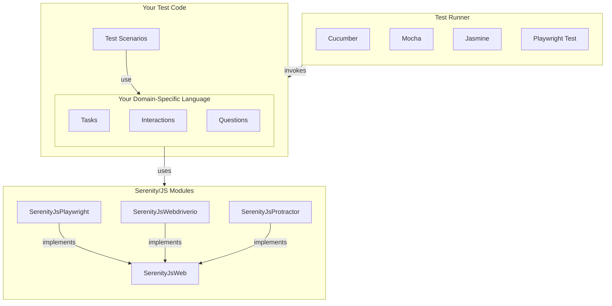

# Modular architecture

```mdx-code-block
import ArticleComingSoon from '@site/src/components/ArticleComingSoon'
```

<ArticleComingSoon />



```mermaid
flowchart TB
    subgraph TestRunner["Test Runner"]
        direction TB
        Cucumber
        Mocha
        Jasmine
        PlaywrightTest["Playwright Test"]
    end

    subgraph CustomCode["Your Test Code"]

        TestScenarios["Test Scenarios"]

        subgraph CustomDSL["Your Domain-Specific Language"]
            direction TB

            Tasks
            Interactions
            Questions
        end

        TestScenarios -- use --> CustomDSL
    end

    subgraph SerenityJS["Serenity/JS Modules"]
        direction TB

        SerenityJsWeb
        SerenityJsPlaywright
        SerenityJsWebdriverio
        SerenityJsProtractor

        SerenityJsPlaywright -- implements --> SerenityJsWeb
        SerenityJsWebdriverio -- implements --> SerenityJsWeb
        SerenityJsProtractor -- implements --> SerenityJsWeb
    end

    TestRunner -- invokes --> CustomCode

    CustomDSL -- uses --> SerenityJS

```
