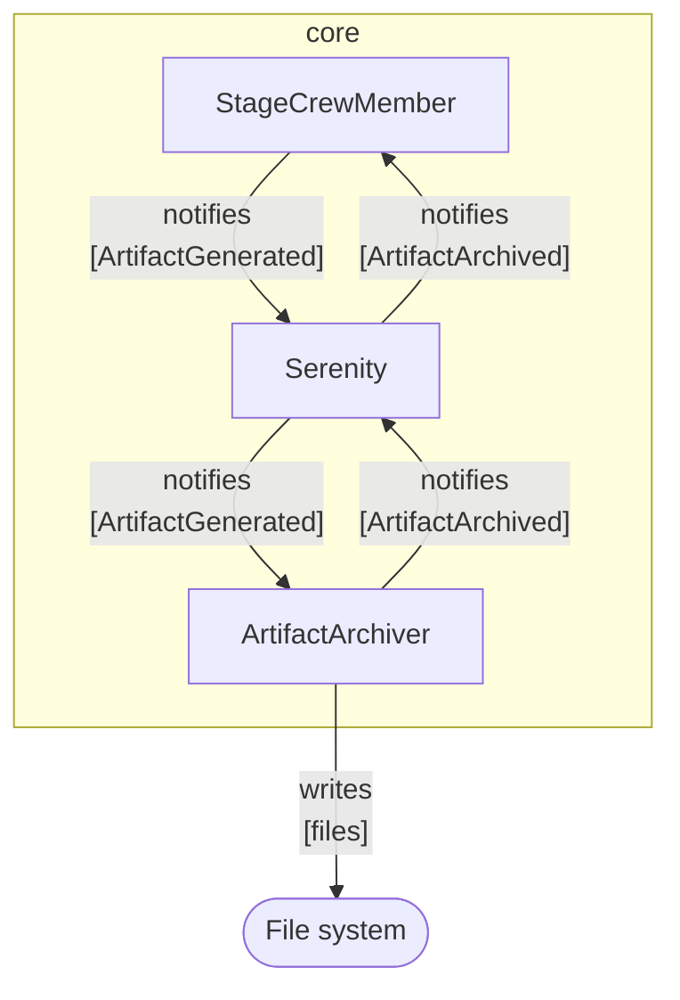

# Artifact Archiver

[`ArtifactArchiver`](/api/core/class/ArtifactArchiver), available as part of the [`@serenity-js/core`](/api/core) module,
listens to [`ArtifactGenerated`](/api/core-events/class/ArtifactGenerated) events generated by other [`StageCrewMembers`](/api/core/interface/StageCrewMember)
and saves the artifacts they contain to disk. For example, `ArtifactArchiver` is responsible for persisting screenshots generated by the [`Photographer`](/api/web/class/Photographer), as well as Serenity BDD `json` reports
generated by the [`SerenityBDDReporter`](/api/serenity-bdd/class/SerenityBDDReporter).

## Installation and usage

To learn more about the `ArtifactArchiver`, please consult:
- installation instructions in [`@serenity-js/core` documentation](/api/core),
- configuration examples in [`ArtifactArchiver`](/api/core/class/ArtifactArchiver).

You might also want to explore [Serenity/JS example projects on GitHub](https://github.com/serenity-js/serenity-js/tree/main/examples).

## Integration

[`ArtifactArchiver`](/api/core/class/ArtifactArchiver) listens to [`ArtifactGenerated`](/api/core-events/class/ArtifactGenerated) [domain events](/handbook/reporting/domain-events)
and emits [`ArtifactArchived`](/api/core-events/class/ArtifactArchived) events when the generated artifact is successfully saved to disk.

