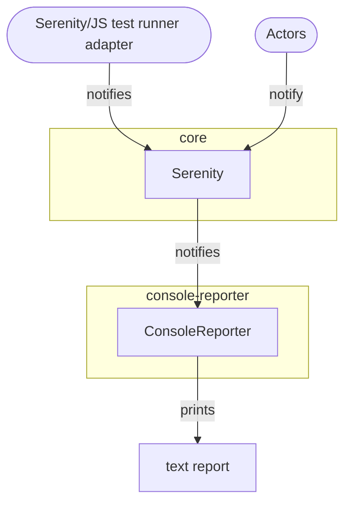

# Console Reporter

```mdx-code-block
import Figure from '@site/src/components/Figure'
```

[`ConsoleReporter`](/api/console-reporter/class/ConsoleReporter), available as part of the [`@serenity-js/console-reporter`](/api/console-reporter) module,
writes text-based reports to your computer terminal.

The reporter supports colour schemes for both light and dark terminals, as well as a monochromatic one.

<Figure
    caption='Example console output produced by ConsoleReporter'
    img={require('@site/static/images/reporting/console-reporter.png')}
/>

## Installation and usage

To learn about installing and configuring the module, please consult the [`@serenity-js/console-reporter` documentation](/api/console-reporter).

You might also want to explore [Serenity/JS examples on GitHub](https://github.com/serenity-js/serenity-js/tree/main/examples).

## Integration

[`ConsoleReporter`](/api/console-reporter/class/ConsoleReporter) listens to [`DomainEvents`](/handbook/reporting/domain-events) emitted by [`Actors`](/api/core/class/Actor) and [Serenity/JS test runner adapters](/handbook/test-runners/).


