# Domain Events

Serenity/JS [domain events](/api/core-events/class/DomainEvent) represent all the important things that happen during the execution of your test suite.
They are a critical part of the Serenity/JS messaging infrastructure
that enables the [loosely coupled, modular architecture](/handbook/getting-started/architecture/)
of the framework, and ensure that all the registered [reporting services](/handbook/reporting/)
have the same, consistent picture of your test scenarios.

Serenity/JS domain events are produced when [actors](/api/core/class/Actor) perform their [activities](/api/core/class/Activity)
and when [test runner adapters](/handbook/test-runners/) translate information about your test runner lifecycle events.
Domain events are then propagated via the [stage](/api/core/class/Stage) and consumed by all
the registered [stage crew members](/api/core/interface/StageCrewMember) for reporting purposes.

```mermaid
flowchart TB
    Developer["💻 You"]
    TestCode["Your Test Code"]
    SerenityModules["Serenity/JS Modules"]
    TestReports["Test Execution Reports"]
    Stage

    subgraph TestRunner["Test Runner"]
    direction TB
    TestRunnerAdapter["Serenity/JS Test Runner Adapter"]
    end

    subgraph ReportingServices["Serenity/JS Reporting Services"]
    direction TB
    StageCrewMember["StageCrewMember"]
    end

    Developer -- invoke --> TestRunner

    TestCode -- uses --> SerenityModules
    TestRunner -- executes --> TestCode
    TestRunnerAdapter --> |emits DomainEvents| Stage
    SerenityModules --> |emit DomainEvents| Stage
    Stage --> |forwards DomainEvents| ReportingServices
    ReportingServices --> |produce| TestReports
```

<figure>

<figcaption>Serenity/JS Reporting Services integration diagram</figcaption>
</figure>

You'll typically only need to learn about Serenity/JS domain events when implementing custom reporting services. In this case, you should study:
- the [`@serenity-js/core/lib/events`](/api/core-events/class/DomainEvent) package, to see what domain events are available,
- built-in implementations of the [`StageCrewMember`](/api/core/interface/StageCrewMember) interface, to see examples of how to work with events.
