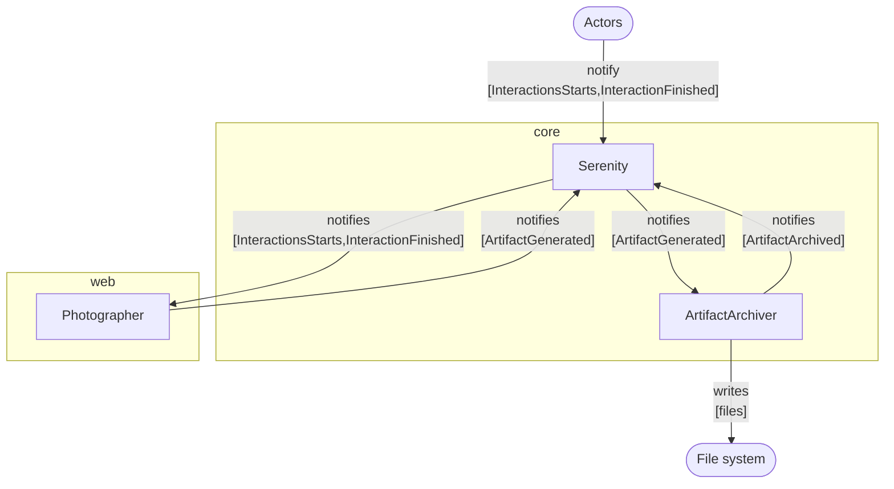

# Photographer

[`Photographer`](/api/web/class/Photographer), available as part of the [`@serenity-js/web`](/api/web) module,
watches as [actors](/api/core/class/Actor) perform their [interactions](/api/core/class/Interaction) and automatically takes screenshots
when the desired conditions are met.

`Photographer` can be configured to take screenshots when:
- an interaction [results in a failure](/api/web/class/TakePhotosOfFailures),
- after [any interaction takes place](/api/web/class/TakePhotosOfInteractions),
- or [before and after any interaction](/api/web/class/TakePhotosBeforeAndAfterInteractions).

## Installation and usage

To learn more about the `Photographer`, please consult:
- installation instructions in [`@serenity-js/web` documentation](/api/web),
- configuration examples in [`Photographer` API docs](/api/web/class/Photographer).

You might also want to explore [Serenity/JS example projects on GitHub](https://github.com/serenity-js/serenity-js/tree/main/examples).

## Integration

[`Photographer`](/api/web/class/Photographer) listens to
[`InteractionStarts`](/api/core-events/class/InteractionStarts) and [`InteractionFinished`](/api/core-events/class/InteractionFinished) [domain events](/handbook/reporting/domain-events)
and reacts to them based on the configured [`PhototakingStrategy`](/api/web/class/PhotoTakingStrategy).

`Photographer` takes a screenshot of the browser window used by the [actor in the spotlight](/api/core/function/actorInTheSpotlight) and emits [`ArtifactGenerated`](/api/core-events/class/ArtifactGenerated) events containing the screenshot,
which can be persisted to disk by [`ArtifactArchiver`](/handbook/reporting/artifact-archiver) and included in Serenity BDD reports by [`SerenityBDDReporter`](/handbook/reporting/serenity-bdd-reporter).

