# Serenity BDD Reporter

```mdx-code-block
import Figure from '@site/src/components/Figure'
```

[`SerenityBDDReporter`](/api/serenity-bdd/class/SerenityBDDReporter) is available as part of the [`@serenity-js/serenity-bdd`](/api/serenity-bdd) module.

`SerenityBDDReporter` listens to [domain events](/handbook/reporting/domain-events) emitted by [actors](/api/core/class/Actor), [test runner adapters](/handbook/test-runners/), and other [stage crew members](/api/core/interface/StageCrewMember),
to produce Serenity BDD-compatible JSON reports, which can be then stored as files to disk  by [`ArtifactArchiver`](/handbook/reporting/artifact-archiver).

Resulting JSON files can be processed by [Serenity BDD CLI](https://serenity-bdd.github.io/) to produce a HTML report and rich living documentation containing screenshots, details of HTTP traffic for any [REST API](/api/rest) interactions,
details of any activities performed by Serenity/JS [actors](/api/core/class/Actor) and more.

<Figure
    caption='Example reports produced by Serenity BDD'
    img={require('@site/static/images/reporting/serenity-bdd-reporter.png')}
/>

## Installation and usage

To learn more about the `SerenityBDDReporter`, please consult:
- installation instructions in [`@serenity-js/serenity-bdd` documentation](/api/serenity-bdd),
- configuration examples in [`SerenityBDDReporter`](/api/serenity-bdd/class/SerenityBDDReporter).

You might also want to explore [Serenity/JS example projects on GitHub](https://github.com/serenity-js/serenity-js/tree/main/examples).

## Integration

`SerenityBDDReporter` emits [`ArtifactGenerated`](/api/core-events/class/ArtifactGenerated) containing Serenity BDD-standard JSON reports,
which can be stored to disk by [`ArtifactArchiver`](/handbook/reporting/artifact-archiver),
and then turned into Serenity BDD HTML reports by [Serenity BDD Reporting CLI](https://github.com/serenity-bdd/serenity-cli).

```mermaid
graph TB
    A(["Actors"])
    TRA(["Serenity/JS test runner adapter"])
    DEV(["👩‍💻 Developer"])
    S["Serenity"]
    AA["ArtifactArchiver"]
    SBDDR["SerenityBDDReporter"]
    SBDDW["serenity-bdd run"]
    TA["📂 json, png, etc."]
    SBDDCLI(["serenity-bdd-cli.jar"])
    HTML["🖥️ Serenity BDD HTML reports"]

    A -- notify --> S
    TRA -- notifies --> S
    DEV -- invokes -----> SBDDW
    S -- notifies ---> SBDDR
    S -- "notifies<br>[ArtifactGenerated]" ---> AA
    AA -- "stores<br>[Artifact]" ----> TA
    SBDDR -- "notifies<br>[ArtifactGenerated]" --> S
    SBDDW -- manages --> SBDDCLI
    SBDDCLI -- reads --> TA
    SBDDCLI -- produces --> HTML

    subgraph "serenity-bdd"
        SBDDR
        SBDDCLI
        SBDDW
    end

    subgraph "core"
        S
        AA
    end

    subgraph "file system"
        TA
        HTML
    end

    class A socket
    class TRA socket
    class R socket

    click A "/api/core/class/Actor"
    click TRA "/handbook/test-runners/"
    click S "/api/core/class/Serenity"
    click AA "/api/core/class/ArtifactArchiver"
    click SBDDR "/api/serenity-bdd/class/SerenityBDDReporter"
    click SBDDW "/api/serenity-bdd"
```


