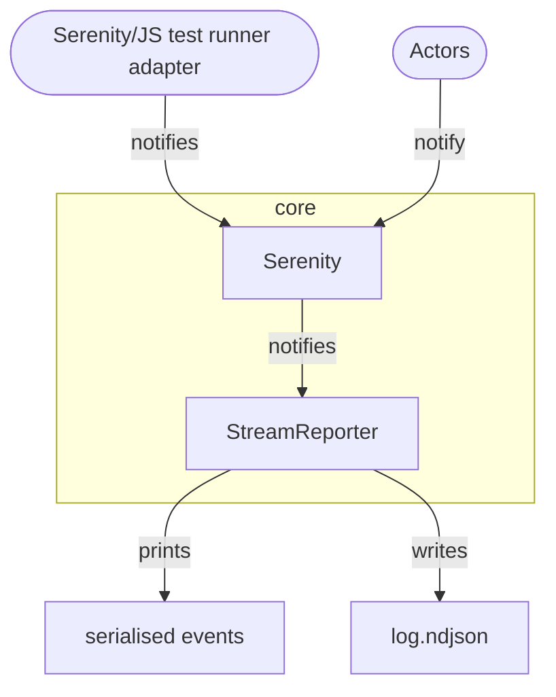

# Stream Reporter

[`StreamReporter`](/api/core/class/StreamReporter), available as part of the [`@serenity-js/core`](/api/core) module,
serialises [domain events](/handbook/reporting/domain-events) it receives to JSON and sends them
to a [`Writable`](https://nodejs.org/docs/latest/api/stream.html#stream_writable_streams) stream of your choice.

This service is useful for debugging any custom extensions you create for Serenity/JS, or debugging the framework itself.

## Installation and usage

To learn more about the `StreamReporter`, please consult:
- installation instructions in [`@serenity-js/core` documentation](/api/core),
- configuration examples in [`StreamReporter` API documentation](/api/core/class/StreamReporter).

You might also want to explore [Serenity/JS example projects on GitHub](https://github.com/serenity-js/serenity-js/tree/main/examples).

## Integration

[`StreamReporter`](/api/core/class/StreamReporter) listens to all the [domain events](/handbook/reporting/domain-events) emitted by [actors](/api/core/class/Actor)
and [Serenity/JS test runner adapters](/handbook/test-runners/).

Next, it streams them to a [`Writable`](https://nodejs.org/docs/latest-v14.x/api/stream.html#stream_writable_streams) stream,
such as [`process.stdout`](https://nodejs.org/docs/latest-v14.x/api/process.html#process_process_stdout),
or one created via [`fs.createWriteStream(filename)`](https://nodejs.org/docs/latest-v14.x/api/fs.html#fs_fs_createwritestream_path_options).

