# Cucumber

```mdx-code-block
import Tabs from '@theme/Tabs';
import TabItem from '@theme/TabItem';
```

[Cucumber](https://github.com/cucumber/cucumber-js) is a popular
[collaboration tool](https://cucumber.io/blog/collaboration/the-worlds-most-misunderstood-collaboration-tool/)
and a test runner capable of executing test scenarios
written in [plain language](https://cucumber.io/docs/guides/overview/).

**You will learn:**
- How to use [Serenity/JS reporting services](/handbook/reporting/), including the [Serenity BDD reporter](/handbook/reporting/serenity-bdd-reporter), even if your test scenarios don't follow the Screenplay Pattern yet
- How to implement Cucumber [step definitions](https://cucumber.io/docs/cucumber/step-definitions/?lang=javascript) using reusable [Serenity/JS Screenplay Pattern](/handbook/design/screenplay-pattern) APIs

## Examples and Project Templates

If you'd like to dive straight into the code,
[Serenity/JS GitHub repository](https://github.com/serenity-js) provides:
- [Serenity/JS + Cucumber project templates](https://github.com/serenity-js?q=cucumber+template&type=all&language=&sort=), which are the easiest way to start with the framework
- [Examples and reference implementations](https://github.com/serenity-js/serenity-js/tree/main/examples), demonstrating using Serenity/JS with Cucumber to write both REST API- and web-based acceptance tests

## Using Serenity/JS reporting services

To use [Serenity/JS reporting services](/handbook/reporting/) in a Cucumber project, you need to:
- attach the [`@serenity-js/cucumber`](/api/cucumber) test runner adapter to Cucumber
- [configure Serenity/JS](/api/core/function/configure) to use the reporting services you want to use,
such as the [`ConsoleReporter`](/handbook/reporting/console-reporter)
or [`SerenityBDDReporter`](/handbook/reporting/serenity-bdd-reporter)

:::tip Serenity/JS test runner adapters
Serenity/JS test runner adapters turn internal, test runner-specific events
into [Serenity/JS domain events](/handbook/reporting/domain-events) that can contribute to test execution reports produced
by [Serenity/JS reporting services](/handbook/reporting/).
:::

[`@serenity-js/cucumber` module](/api/cucumber) provides a set of [**test runner adapters**](/handbook/about/architecture)
you can attach to _**any version**_ of Cucumber test runner.
The module detects the version of Cucumber you're using and picks the most appropriate adapter automatically.

Integration architecture depicted below applies to invoking `cucumber-js` command line interface directly,
for example for **domain-level**, [**REST/HTTP API-level**](/handbook/api-testing/),
or [**web-based testing**](/handbook/web-testing/) using [Playwright](/api/playwright).

If you want your Cucumber scenarios to interact with **web interfaces** using [Selenium Webdriver protocol](https://www.selenium.dev/documentation/webdriver/),
or connect them to a [Selenium Grid](https://www.selenium.dev/documentation/grid/),
you should use Cucumber via [Protractor](/handbook/test-runners/protractor)
or [WebdriverIO](/handbook/test-runners/webdriverio) instead.

```mermaid
graph TB
    DEV(["💻 Developer"])
    TR(["@cucumber/cucumber"])
    SC(["@serenity-js/core"])
    TRA(["@serenity-js/cucumber"])
    CF["serenity.config.ts"]
    R(["Serenity/JS reporting services"])
    DEV -- invokes --> TR
    TR -- loads --> CF
    TR -- notifies --> TRA
    TRA -- notifies --> SC
    CF -- configures --> SC
    SC -- notifies --> R

    click R "/handbook/reporting"
    click SC "/api/core"
    click TRA "/api/cucumber"
```

<figure>


<figcaption>Serenity/JS + Cucumber integration architecture</figcaption>
</figure>

### Installing Serenity/JS test runner adapter

Assuming you already have a [Node.js project](/handbook/about/installation#creating-a-nodejs-project)
and [Serenity/JS runtime dependencies](/handbook/about/installation) set up,
add the following Node modules:
- [`@serenity-js/core`](/api/core)
- [`@serenity-js/cucumber`](/api/cucumber)
- [`@cucumber/cucumber`](https://www.npmjs.com/package/@cucumber/cucumber)

To do that, run the following command in your terminal:
```shell
npm install --save-dev @serenity-js/{core,cucumber} @cucumber/cucumber
```

If you'd like to implement your test suite in TypeScript, also run:
```shell
npm install --save-dev typescript ts-node @types/node
```

### Configuring Serenity/JS

If you intend to run your Cucumber scenarios using the [Cucumber CLI](https://github.com/cucumber/cucumber-js/blob/main/docs/cli.md),
the best way to configure Serenity/JS is to invoke the Serenity/JS [`configure`](/api/core/function/configure) function
in the Cucumber [`BeforeAll` hook](https://github.com/cucumber/cucumber-js/blob/main/docs/support_files/hooks.md#beforeall--afterall):

<Tabs>
<TabItem value="typescript" label="TypeScript project" default>

```typescript title="features/support/serenity.config.ts"
import { BeforeAll } from '@cucumber/cucumber'
import { configure } from '@serenity-js/core'

BeforeAll(() => {

    // Configure Serenity/JS
    configure({
        crew: [
            '@serenity-js/console-reporter',
            '@serenity-js/serenity-bdd',
            [ '@serenity-js/core:ArtifactArchiver', { outputDirectory: 'target/site/serenity' } ],
            // ... any other reporting services
        ],
    })
})
```

</TabItem>
<TabItem value="javascript" label="JavaScript project">

```javascript title="features/support/serenity.config.js"
const { BeforeAll } = require('@cucumber/cucumber')
const { configure } = require('@serenity-js/core')

BeforeAll(() => {

    // Configure Serenity/JS
    configure({
        crew: [
            '@serenity-js/console-reporter',
            '@serenity-js/serenity-bdd',
            [ '@serenity-js/core:ArtifactArchiver', { outputDirectory: 'target/site/serenity' } ],
            // ... any other reporting services
        ],
    })
})
```

</TabItem>
</Tabs>

To learn more about installing and configuring Serenity/JS reporting services appropriate for your project,
follow the [Serenity/JS reporting guide](/handbook/reporting/).

:::tip Serenity understands Cucumber
Serenity understands the structure of your Cucumber `.feature` files and will augment your test execution reports
with feature and scenario descriptions, detailed information about Cucumber steps, and [much more](https://serenity-bdd.github.io/docs/reporting/the_serenity_reports)!
:::

### Configuring Cucumber profile

To make sure Cucumber loads your Serenity/JS configuration file and correctly interprets TypeScript (if you're using it),
create a [`cucumber.js` profile](https://github.com/cucumber/cucumber-js/blob/main/docs/profiles.md):

<Tabs>
<TabItem value="typescript" label="TypeScript project" default>

```javascript title="cucumber.js"
/**
 * This is a Cucumber.js profile
 * @see https://github.com/cucumber/cucumber-js/blob/main/docs/profiles.md
 *
 * @type {{default: string}}
 */
module.exports = {
    default: [
        `--publish-quiet`,
        `--require-module 'ts-node/register'`,      // use TypeScript in-memory transpiler, ts-node
        `--format '@serenity-js/cucumber'`,         // attach Serenity/JS Cucumber adapter
        `--require './features/**/*.steps.ts'`,     // load step definition libraries
        `--require './features/**/*.config.ts'`     // load configuration files
    ].join(' ')
}
```

</TabItem>
<TabItem value="javascript" label="JavaScript project">

```javascript title="cucumber.js"
/**
 * This is a Cucumber.js profile
 * @see https://github.com/cucumber/cucumber-js/blob/main/docs/profiles.md
 *
 * @type {{default: string}}
 */
module.exports = {
    default: [
        `--publish-quiet`,
        `--format '@serenity-js/cucumber'`,         // attach Serenity/JS Cucumber adapter
        `--require './features/**/*.steps.js'`,     // load step definition libraries
        `--require './features/**/*.config.js'`     // load configuration files
    ].join(' ')
}
```

</TabItem>
</Tabs>

The above configuration works with the latest version of the `cucumber.Cli` available as part of
the [`@cucumber/cucumber`](https://www.npmjs.com/package/@cucumber/cucumber) module.
Consult the [`@serenity-js/cucumber` documentation](/api/cucumber) to learn how to configure
the adapter with older versions of the runner.

## Using Serenity/JS Screenplay Pattern APIs

[Serenity/JS actor model](/api/core/class/Actor) is a natural fit for Cucumber scenarios
and [Serenity/JS Screenplay Pattern](/handbook/design/screenplay-pattern) APIs can help your team implement
Cucumber step definitions that are as easy to read and understand as your `.feature` files.

The fastest way to get started with Serenity/JS and Cucumber is to use one of
the [Serenity/JS + Cucumber project templates](https://github.com/serenity-js?q=cucumber+template&type=all&language=&sort=).
However, if you're adding Serenity/JS to an existing project or simply want to understand how the integration works,
this guide is for you.

### Configuring a cast of actors

[Serenity/JS Screenplay Pattern](/handbook/design/screenplay-pattern) is an actor-centred model, so the first thing you
need to do is to tell Serenity/JS what [cast of actors](/api/core/class/Cast) you want to use.

If you're planning to run Cucumber scenarios using the [Cucumber CLI](https://github.com/cucumber/cucumber-js/blob/main/docs/cli.md) **_directly_**,
you can configure the actors in a [`BeforeAll`](https://cucumber.io/docs/cucumber/api/?lang=javascript#beforeall) hook, for example:

```typescript title="features/support/serenity.config.ts"
import { BeforeAll, AfterAll } from '@cucumber/cucumber'
import { configure, Cast } from '@serenity-js/core'
import { BrowseTheWebWithPlaywright } from '@serenity-js/playwright'

import * as playwright from 'playwright'

let browser: playwright.Browser;

BeforeAll(async () => {

    // Launch the browser once before all the tests
    // Serenity/JS will take care of managing Playwright browser context and browser tabs.
    browser = await playwright.chromium.launch({
        headless: true,
    });

    // Configure Serenity/JS
    configure({
        actors: Cast.where(actor =>
            actor.whoCan(BrowseTheWebWithPlaywright.using(browser, {
                baseURL: 'https://todo-app.serenity-js.org/',
            }))
        ),
        crew: [
            '@serenity-js/console-reporter',
            '@serenity-js/serenity-bdd',
            [ '@serenity-js/core:ArtifactArchiver', { outputDirectory: 'target/site/serenity' } ],
            // ... any other reporting services
        ],
    })
})

AfterAll(async () => {
    // Close the browser after all the tests are finished
    await browser?.close()
})
```

Consult the respective test runner instructions if you're invoking Cucumber _**indirectly**_,
so via [Protractor](/handbook/test-runners/protractor) or [WebdriverIO](/handbook/test-runners/webdriverio).

### Referring to actors in test scenarios

When using [Serenity/JS actors](/api/core/class/Actor) to represent user personas or important external systems
interacting with the system under test, a common strategy is to refer to them in your Cucumber scenarios using their name and pronouns :

```gherkin title="features/todo_list.feature"
Feature: Todo list

  Scenario: Starting fresh

    When Alice opens the todo app for the first time
    Then her todo list should be empty
```

To make Cucumber understand that `Alice` is a name of an actor, and that `her` means the most recent actor we accessed,
you need to define custom [parameter types](https://github.com/cucumber/cucumber-expressions).

All the [Serenity/JS + Cucumber Project Templates](https://github.com/serenity-js?q=cucumber+template&type=all&language=&sort=)
use the below definitions, which use [`actorCalled`](/api/core/function/actorCalled) and [`actorInTheSpotlight`](/api/core/function/actorInTheSpotlight):

```typescript title="features/step_definitions/parameter.steps.ts"
import { defineParameterType } from '@cucumber/cucumber'
import { actorCalled, actorInTheSpotlight } from '@serenity-js/core'

defineParameterType({
    regexp: /[A-Z][a-z]+/,
    transformer(name: string) {
        return actorCalled(name)
    },
    name: 'actor',
})

defineParameterType({
    regexp: /he|she|they|his|her|their/,
    transformer() {
        return actorInTheSpotlight()
    },
    name: 'pronoun',
})
```

With `actor` and `pronoun` parameter types defined,
you can refer to them in [Cucumber expressions](https://github.com/serenity-js?q=cucumber&type=all&language=&sort=)
describing your [Cucumber steps definitions](https://github.com/cucumber/cucumber-js/blob/main/docs/support_files/step_definitions.md):

```typescript title="features/step_definitions/todo-list.steps.ts"
import { When, Then } from '@cucumber/cucumber'
import { Ensure, equals } from '@serenity-js/assertions'
import { Actor } from '@serenity-js/core'
import { Navigate, PageElements, By } from '@serenity-js/web'

When('{actor} opens the todo app for the first time', async (actor: Actor) => {
    await actor.attemptsTo(
        Navigate.to('https://todo-app.serenity-js.org/')
    )
})

Then('{pronoun} todo list should be empty', async (actor: Actor) => {
    const displayedItems = () =>
        PageElements.located(By.css('.todo-list li'))
            .describedAs('displayed items')

    await actor.attemptsTo(
        Ensure.that(displayedItems().count(), equals(0))
    )
})
```
