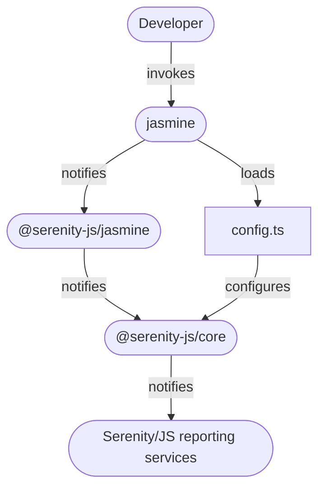

# Jasmine

[Jasmine](https://jasmine.github.io/) is a universal test runner,
particularly popular with projects based on [Angular](https://angular.io/) framework.
If your project already uses Jasmine to run its unit tests,
you can use the same runner for your acceptance tests too.

Integrating Serenity/JS with Jasmine enables you to use [Serenity/JS reporting services](/handbook/reporting/),
even if your test scenarios don't follow the [Screenplay Pattern](/handbook/design/screenplay-pattern) (yet)!

If you prefer to dive straight into the code,
[Serenity/JS GitHub repository](https://github.com/serenity-js) provides
- [Serenity/JS + Jasmine project templates](https://github.com/serenity-js?q=jasmine&type=all&language=&sort=), which are the easiest way to start with the framework,
- several [reference implementations](https://github.com/serenity-js/serenity-js/tree/main/examples), demonstrating using Serenity/JS with Jasmine to write both REST API- and web-based acceptance tests

## Integration architecture

[`@serenity-js/jasmine`](/api/jasmine) module provides a **test runner adapter** that can be attached to Jasmine test runner,
just like any other standard Jasmine reporter.

Serenity/JS test runner adapters turn internal, test runner-specific events
into [Serenity/JS domain events](/handbook/reporting/domain-events) that can contribute to test execution reports produced
by [Serenity/JS reporting services](/handbook/reporting/).

<figure>


<figcaption>Serenity/JS + Jasmine integration architecture</figcaption>
</figure>

:::info
Integration architecture described in this section applies to invoking
`jasmine` command line interface directly, for example for **domain-level**,
[**REST/HTTP API-level**](/handbook/api-testing/), or [**web-based testing**](/handbook/web-testing/)
using [Playwright](/api/playwright).

If you want your Jasmine scenarios to interact with **web interfaces** using [Selenium Webdriver protocol](https://www.selenium.dev/documentation/webdriver/),
or connect them to a [Selenium Grid](https://www.selenium.dev/documentation/grid/),
you should do so via [Protractor](/handbook/test-runners/protractor)
or [WebdriverIO](/handbook/test-runners/webdriverio) instead.
:::

## Installation

Assuming you already have a [Node.js project and runtime dependencies](/handbook/about/installation) set up, add the following Node modules to your project:
- [`@serenity-js/core`](/api/core)
- [`@serenity-js/jasmine`](/api/jasmine)
- [`jasmine`](https://www.npmjs.com/package/jasmine)

To do that, run the following command in your terminal:
```bash
npm install --save-dev @serenity-js/{core,jasmine} jasmine
```

If you'd like to implement your test suite in TypeScript, also run:
```bash
npm install --save-dev typescript ts-node @types/{jasmine,node}
```

If you haven't done so already, initialise Jasmine configuration file at `spec/support/jasmine.json` by running the following command:

```bash
npx jasmine init
```

The resulting configuration file should look as follows:
```json title="spec/support/jasmine.json"
{
  "spec_dir": "spec",
  "spec_files": [
    "**/*[sS]pec.js"
  ],
  "helpers": [
    "helpers/**/*.js"
  ],
  "stopSpecOnExpectationFailure": false,
  "random": true
}
```

## Configuration for a JavaScript project

In a JavaScript project, create a configuration file at `spec/helpers/config.js` with the following contents:

```javascript title="spec/helpers/config.js"
const { configure } = require('@serenity-js/core');

configure({
    crew: [
        // ... reporting services
    ],
});
```

Make sure to add any [Serenity/JS reporting services](/handbook/reporting/) you wish to use.

## Configuration for a TypeScript project

To make Jasmine understand test scenarios and configuration written in TypeScript,
modify the `spec/support/jasmine.json` file as follows:

```json title="spec/support/jasmine.json"
{
  "spec_dir": "spec",
  "spec_files": [
    "**/*[sS]pec.ts"
  ],
  "helpers": [
    "helpers/**/*.ts"
  ],
  "requires": [
    "ts-node/register"
  ],
  "stopSpecOnExpectationFailure": false,
  "random": true
}
```

Next, create a configuration file at `spec/helpers/config.ts` adding any [Serenity/JS reporting services](/handbook/reporting/)
you wish to use:

```typescript title="spec/helpers/config.ts"
import { configure } from '@serenity-js/core'

configure({
    crew: [
        // ... reporting services
    ],
});
```

## Reporting

To register `@serenity-js/jasmine` test runner adapter with Jasmine,
use the [`--reporter`](https://jasmine.github.io/setup/nodejs.html#--reporter) option when invoking the runner:

```bash
npx jasmine --reporter='@serenity-js/jasmine'
```

To install and configure Serenity/JS reporting services appropriate for your project
follow the [Serenity/JS reporting guide](/handbook/reporting/).
