# Jasmine

```mdx-code-block
import Tabs from '@theme/Tabs';
import TabItem from '@theme/TabItem';
```

[Jasmine](https://jasmine.github.io/) is a universal test runner,
particularly popular with projects based on [Angular](https://angular.io/) framework.
If your project already uses Jasmine to run its unit tests,
you can use the same runner for your acceptance tests too.

**You will learn:**
- How to use [Serenity/JS reporting services](/handbook/reporting/), including the [Serenity BDD reporter](/handbook/reporting/serenity-bdd-reporter), even if your test scenarios don't follow the Screenplay Pattern yet
- How to implement Jasmine test scenarios using reusable [Serenity/JS Screenplay Pattern](/handbook/design/screenplay-pattern) APIs

## Examples and Project Templates

If you'd like to dive straight into the code, [Serenity/JS GitHub repository](https://github.com/serenity-js) provides:
- [Serenity/JS + Jasmine project templates](https://github.com/serenity-js?q=jasmine+template&type=all&language=&sort=), which are the easiest way to start with the framework,
- several [reference implementations](https://github.com/serenity-js/serenity-js/tree/main/examples), demonstrating using Serenity/JS with Jasmine to write both REST API- and web-based acceptance tests

## Using Serenity/JS reporting services

To use [Serenity/JS reporting services](/handbook/reporting/) in a Jasmine project, you need to:
- attach the [`@serenity-js/jasmine`](/api/jasmine) test runner adapter to Jasmine
- [configure Serenity/JS](/api/core/function/configure) to use the reporting services you want to use,
such as the [`ConsoleReporter`](/handbook/reporting/console-reporter)
or [`SerenityBDDReporter`](/handbook/reporting/serenity-bdd-reporter)

:::tip Serenity/JS test runner adapters
Serenity/JS test runner adapters turn internal, test runner-specific events
into [Serenity/JS domain events](/handbook/reporting/domain-events) that can contribute to test execution reports produced
by [Serenity/JS reporting services](/handbook/reporting/).
:::

[`@serenity-js/jasmine` module](/api/jasmine) provides a [**test runner adapter**](/handbook/about/architecture)
you can attach to your Jasmine test runner.

Integration architecture described in this section applies to invoking
`jasmine` command line interface directly, for example for **domain-level**,
[**REST/HTTP API-level**](/handbook/api-testing/), or [**web-based testing**](/handbook/web-testing/)
using [Playwright](/api/playwright).

If you want your Jasmine scenarios to interact with **web interfaces** using [Selenium Webdriver protocol](https://www.selenium.dev/documentation/webdriver/),
or connect them to a [Selenium Grid](https://www.selenium.dev/documentation/grid/),
you should do so via [Protractor](/handbook/test-runners/protractor)
or [WebdriverIO](/handbook/test-runners/webdriverio) instead.

```mermaid
graph TB
    DEV(["💻 Developer"])
    TR(["jasmine"])
    SC(["@serenity-js/core"])
    TRA(["@serenity-js/jasmine"])
    CF["config.ts"]
    R(["Serenity/JS reporting services"])
    DEV -- invokes --> TR
    TR -- loads --> CF
    TR -- notifies --> TRA
    TRA -- notifies --> SC
    CF -- configures --> SC
    SC -- notifies --> R

    click R "/handbook/reporting"
    click SC "/api/core"
    click TRA "/api/jasmine"
```

<figure>


<figcaption>Serenity/JS + Jasmine integration architecture</figcaption>
</figure>

### Installing Serenity/JS test runner adapter

Assuming you already have a [Node.js project](/handbook/about/installation#creating-a-nodejs-project)
and [Serenity/JS runtime dependencies](/handbook/about/installation) set up,
add the following Node modules:
- [`@serenity-js/core`](/api/core)
- [`@serenity-js/jasmine`](/api/jasmine)
- [`jasmine`](https://www.npmjs.com/package/jasmine)

To do that, run the following command in your terminal:
```shell
npm install --save-dev @serenity-js/{core,jasmine} jasmine
```

If you'd like to implement your test suite in TypeScript, also run:
```shell
npm install --save-dev typescript ts-node @types/{jasmine,node}
```

### Configuring Serenity/JS

If you intend to run your Jasmine scenarios using the [Jasmine CLI](https://github.com/jasmine/jasmine-npm),
the best way to configure Serenity/JS is to invoke the Serenity/JS [`configure`](/api/core/function/configure) function
in a [`beforeAll` hook](https://jasmine.github.io/api/edge/global.html#beforeAll),
defined in a Jasmine helper file:

<Tabs>
<TabItem value="typescript" label="TypeScript project" default>

```typescript title="spec/helpers/serenity.config.ts"
import 'jasmine'

import { ArtifactArchiver, configure } from '@serenity-js/core'
import { ConsoleReporter } from '@serenity-js/console-reporter'
import { SerenityBDDReporter } from '@serenity-js/serenity-bdd'

beforeAll(async () => {
    // Configure Serenity/JS
    configure({
        crew: [
            '@serenity-js/console-reporter',
            '@serenity-js/serenity-bdd',
            [ '@serenity-js/core:ArtifactArchiver', { outputDirectory: 'target/site/serenity' } ],
            // ... any other reporting services
        ],
    })
})
```

</TabItem>
<TabItem value="javascript" label="JavaScript project">

```javascript title="spec/helpers/serenity.config.js"
const { configure } = require('@serenity-js/core')

beforeAll(async () => {
    // Configure Serenity/JS
    configure({
        crew: [
            '@serenity-js/console-reporter',
            '@serenity-js/serenity-bdd',
            [ '@serenity-js/core:ArtifactArchiver', { outputDirectory: 'target/site/serenity' } ],
            // ... any other reporting services
        ],
    })
})
```

</TabItem>
</Tabs>

To learn more about installing and configuring Serenity/JS reporting services appropriate for your project,
follow the [Serenity/JS reporting guide](/handbook/reporting/).

### Configuring Jasmine

You can initialise Jasmine configuration file at `spec/support/jasmine.json` by running the following command:

```shell
npx jasmine init
```

The resulting configuration file should look similar to the following:
```json title="spec/support/jasmine.json"
{
  "spec_dir": "spec",
  "spec_files": [
    "**/*[sS]pec.js"
  ],
  "helpers": [
    "helpers/**/*.js"
  ],
  "stopSpecOnExpectationFailure": false,
  "random": true
}
```

For TypeScript projects, modify `spec/support/jasmine.json` as follows:

```json title="spec/support/jasmine.json"
{
  "spec_dir": "spec",
  "spec_files": [
    "**/*[sS]pec.ts"
  ],
  "helpers": [
    "helpers/**/*.ts"
  ],
  "requires": [
    "ts-node/register"
  ],
  "stopSpecOnExpectationFailure": false,
  "random": true
}
```

### Defining Jasmine test scenarios

When Serenity/JS reports on Jasmine test scenarios, it assumes you're following a common convention
where the outermost [`describe` block](https://jasmine.github.io/api/edge/global.html#describe) describes the name of the feature or component under test,
and any nested `describe` blocks contribute to the name of the test scenario.

For example, Serenity/JS will report the below scenario as:
- feature: `Todo List App`
- scenario: `when the user is a guest their list is empty`

```typescript title="spec/todo-list.spec.ts"
import 'jasmine'

describe('Todo List App', () => {               // - feature or component name

    describe('when the user is', () => {        // - one or more nested `describe` blocks
        describe('a guest', () => {             //   to group scenarios
            describe('their list', () => {      //   by context in which they apply

                it('is empty', async () => {    // - expected behaviour of the feature or component

                })
            })
        })
    })
})
```

:::tip Feature coverage
Using the same name for the outermost `describe` block in several different spec files makes
Serenity BDD associate the different test scenarios with the same logical "feature" or "component"
and produce [feature coverage metrics](https://serenity-bdd.github.io/docs/reporting/the_serenity_reports).
:::

### Attaching Serenity/JS test runner adapter

To attach [`@serenity-js/jasmine`](/api/jasmine) test runner adapter to Jasmine,
use the [`--reporter`](https://jasmine.github.io/setup/nodejs.html#--reporter) option when invoking the test runner:

```shell
npx jasmine --reporter='@serenity-js/jasmine'
```

:::note
At the time of writing, Jasmine doesn't allow for reporters to be registered via the `jasmine.json` configuration file.
:::

## Using Serenity/JS Screenplay Pattern APIs

[Serenity/JS actor model](/api/core/class/Actor) works great with Jasmine
and [Serenity/JS Screenplay Pattern](/handbook/design/screenplay-pattern) APIs can help your team implement
Jasmine test scenarios that are easy to read and understand.

The fastest way to get started with Serenity/JS and Jasmine is to use one of
the [Serenity/JS + Jasmine project templates](https://github.com/serenity-js?q=jasmine+template&type=all&language=&sort=).
However, if you're adding Serenity/JS to an existing project or simply want to understand how the integration works,
this guide is for you.

### Configuring a cast of actors

[Serenity/JS Screenplay Pattern](/handbook/design/screenplay-pattern) is an actor-centred model, so the first thing you
need to do is to tell Serenity/JS what [cast of actors](/api/core/class/Cast) you want to use.

If you're planning to run Jasmine scenarios using the [Jasmine CLI](https://github.com/jasmine/jasmine-npm) **_directly_**,
you can configure the actors in a [`beforeAll`](https://jasmine.github.io/api/edge/global.html#beforeAll) hook, for example:

```typescript title="spec/helpers/serenity.config.ts"
import 'jasmine'

import { configure, Cast } from '@serenity-js/core'
import { BrowseTheWebWithPlaywright } from '@serenity-js/playwright'

import * as playwright from 'playwright'

let browser: playwright.Browser;

beforeAll(async () => {

    // Launch the browser once before all the tests
    // Serenity/JS will take care of managing Playwright browser context and browser tabs.
    browser = await playwright.chromium.launch({
        headless: true,
    });

    // Configure Serenity/JS
    configure({
        actors: Cast.where(actor =>
            actor.whoCan(BrowseTheWebWithPlaywright.using(browser, {
                baseURL: 'https://todo-app.serenity-js.org/',
            }))
        ),
        crew: [
            '@serenity-js/console-reporter',
            '@serenity-js/serenity-bdd',
            [ '@serenity-js/core:ArtifactArchiver', { outputDirectory: 'target/site/serenity' } ],
            // ... any other reporting services
        ],
    })
})

afterAll(async () => {
    // Close the browser after all the tests are finished
    await browser?.close()
})
```

Consult the respective test runner instructions if you're invoking Jasmine _**indirectly**_,
so via [Protractor](/handbook/test-runners/protractor) or [WebdriverIO](/handbook/test-runners/webdriverio).

### Referring to actors in test scenarios

[Serenity/JS actors](/api/core/class/Actor) are often used to represent user personas or important external systems
interacting with the system under test. In those scenarios, a common strategy is to give actors names indicating their persona,
and refer to them in your test scenarios using functions [`actorCalled`](/api/core/function/actorCalled)
and [`actorInTheSpotlight`](/api/core/function/actorInTheSpotlight):

```typescript title="spec/todo-list.spec.ts"
import 'jasmine'

import { Ensure, equals } from '@serenity-js/assertions'
import { actorCalled } from '@serenity-js/core'
import { Navigate, PageElements, By } from '@serenity-js/web'

describe('Todo List App', () => {

    const displayedItems = () =>
        PageElements.located(By.css('.todo-list li'))
            .describedAs('displayed items')

    describe('when the user is', () => {
        describe('a guest', () => {
            describe('their list', () => {

                it('is empty', async () => {
                    await actorCalled('Alice').attemptsTo(
                        Navigate.to('https://todo-app.serenity-js.org/'),
                        Ensure.that(displayedItems().count(), equals(0))
                    )
                })
            })
        })
    })
})
```
