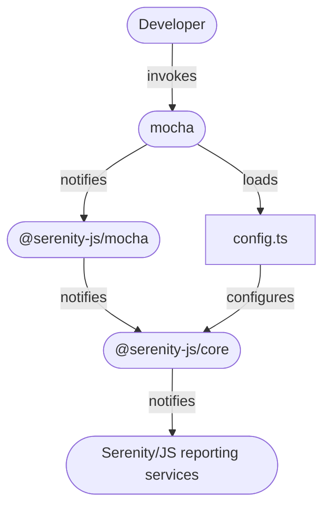

# Mocha

[Mocha.js](https://mochajs.org/) is a universal test runner providing a number of useful features,
such as [automatic retry of failed tests](/api/mocha-adapter/interface/MochaConfig).
If your project already uses Mocha to run its unit tests, you can use the same runner for your acceptance tests too.

Integrating Serenity/JS with Mocha enables you to use [Serenity/JS reporting services](/handbook/reporting/),
even if your test scenarios don't follow the [Screenplay Pattern](/handbook/design/screenplay-pattern) (yet)!

If you prefer to dive straight into the code,
[Serenity/JS GitHub repository](https://github.com/serenity-js) provides
- [Serenity/JS + Mocha project templates](https://github.com/serenity-js?q=mocha&type=all&language=&sort=), which are the easiest way to start with the framework,
- several [reference implementations](https://github.com/serenity-js/serenity-js/tree/main/examples), demonstrating using Serenity/JS with Mocha to write both REST API- and web-based acceptance tests

## Integration architecture

[`@serenity-js/mocha`](/api/mocha) module provides a **test runner adapter** that can be attached to Mocha test runner,
just like any other standard Mocha reporter.

Serenity/JS test runner adapters turn internal, test runner-specific events
into [Serenity/JS domain events](/handbook/reporting/domain-events) that can contribute to test execution reports produced
by [Serenity/JS reporting services](/handbook/reporting/).

<figure>


<figcaption>Serenity/JS + Mocha integration architecture</figcaption>
</figure>

:::info
Integration architecture described in this section applies when you want to invoke
`mocha` command line interface directly, for example for **domain-level** or [**REST/HTTP API-level**](handbook/api-testing/)
testing.

If you want your Mocha scenarios to interact with **web interfaces**, however,
you should do so via [Protractor](/handbook/test-runners/protractor)
or [WebdriverIO](/handbook/test-runners/webdriverio).
:::

## Installation

Assuming you already have a [Node.js project and runtime dependencies](/handbook/installation) set up, add the following dev Node modules to your project:
- [`@serenity-js/core`](/api/core)
- [`@serenity-js/mocha`](/api/mocha)
- [`mocha`](https://www.npmjs.com/package/mocha)

To do that, run the following command in your terminal:
```bash
npm install --save-dev @serenity-js/{core,mocha} mocha
```

If you'd like to implement your test suite in TypeScript, also run:
```bash
npm install --save-dev typescript ts-node @types/{mocha,node}
```

## Configuration for a JavaScript project

In a JavaScript project, create a configuration file at `spec/config.js` with the following contents:

```javascript title="spec/config.js"
const { configure } = require('@serenity-js/core')

configure({
    crew: [
        // ... reporting services
    ],
});
```

## Configuration for a TypeScript project

In a JavaScript project, create a configuration file at `spec/config.ts` with the following contents:

```typescript title="spec/config.ts"
import { configure } from '@serenity-js/core'

configure({
    crew: [
        // ... reporting services
    ],
});
```

## Reporting

To register `@serenity-js/mocha` test runner adapter with Mocha, use the [`--reporter`](https://mochajs.org/#command-line-usage) option when invoking the runner.

For example, when running Mocha in a JavaScript project:

```bash
npx mocha --reporter '@serenity-js/mocha' \
    --require 'spec/config.js' \
    [... any other options]
```

To make Mocha support test scenarios and configuration written in TypeScript, you'll need to add a dev dependency on [`ts-node`](https://www.npmjs.com/package/ts-node) and register it via [`--require`](https://mochajs.org/#command-line-usage):

```bash
npx mocha --reporter '@serenity-js/mocha' \
    --require 'ts-node/register' \
    --require 'spec/config.ts' \
    [... any other options]
```

To install and configure Serenity/JS reporting services appropriate for your project follow the [Serenity/JS reporting guide](/handbook/reporting/).
