# Playwright Test

```mdx-code-block
import Figure from '@site/src/components/Figure'
import Tabs from '@theme/Tabs';
import TabItem from '@theme/TabItem';
```

[Playwright Test](https://playwright.dev/docs/intro) is a test runner designed specifically to accommodate the needs
of browser-based end-to-end test automation using [Playwright](https://playwright.dev/) integration library.

Playwright supports all modern rendering engines including Chromium, WebKit, and Firefox.
It also lets you execute test scenarios on Windows, Linux, and macOS, locally or on CI, headless or headed with native mobile emulation of Google Chrome for Android and Mobile Safari.

**You will learn:**
- How to use [Serenity/JS reporting services](/handbook/reporting/), including the [Serenity BDD reporter](/handbook/reporting/serenity-bdd-reporter), even if your test scenarios don't follow the Screenplay Pattern yet
- How to implement Playwright Test scenarios using reusable [Serenity/JS Screenplay Pattern](/handbook/design/screenplay-pattern) APIs and the [Serenity/JS Playwright module](/api/playwright)
- How to augment native Playwright Test HTML reports with information gathered by your [Serenity/JS actors](/api/core/class/Actor)

<Figure
    caption='Native Playwright Test HTML report, augmented with information from Serenity/JS Screenplay Pattern APIs, as well as automated screenshots captured by the Photographer'
    img={require('@site/static/images/test-runners/playwright-test/serenity-js-playwright-test-report.png')}
/>

## Examples and Project Templates

If you'd like to dive straight into the code, [Serenity/JS GitHub repository](https://github.com/serenity-js) provides:
- [Serenity/JS + Playwright project templates](https://github.com/serenity-js?q=playwright+template&type=all&language=&sort=), which are the easiest way to start with the framework,
- several [reference implementations](https://github.com/serenity-js/serenity-js/tree/main/examples), demonstrating using Serenity/JS with Playwright and Playwright Test to write web-based acceptance tests

## Using Serenity/JS reporting services

To use [Serenity/JS reporting services](/handbook/reporting/) in a Playwright Test project, you need to:
- use `playwright.config.ts` to [configure Serenity/JS](/api/playwright-test/interface/SerenityOptions) to use the reporting services you want to use,
such as the [`ConsoleReporter`](/handbook/reporting/console-reporter)
or [`SerenityBDDReporter`](/handbook/reporting/serenity-bdd-reporter)
- optionally, use Serenity/JS Playwright Test [`describe`](/api/playwright-test/function/describe) and [`it`](/api/playwright-test/function/it) functions
to define your test scenarios and inject [Serenity/JS actors](/api/core/class/Actor)

:::tip Serenity/JS test runner adapters
Serenity/JS test runner adapters turn internal, test runner-specific events
into [Serenity/JS domain events](/handbook/reporting/domain-events) that can contribute to test execution reports produced
by [Serenity/JS reporting services](/handbook/reporting/).
:::

[`@serenity-js/playwright-test` module](/api/playwright-test) provides a [**test runner adapter**](/handbook/about/architecture)
you can attach to your Playwright Test runner just like any other standard [Playwright Test reporter](https://playwright.dev/docs/test-reporters).

```mermaid
graph TB
    DEV(["💻 Developer"])
    TR(["playwright test"])
    TS(["Playwright Test scenarios"])
    SC(["@serenity-js/core"])
    PTAPI(["@serenity-js/playwright-test"])
    CF["playwright.config.ts"]
    R(["Serenity/JS reporting services"])

    DEV -- invokes --> TR
    TR -- runs --> TS
    TS -- use --> PTAPI
    TR -- loads --> CF
    PTAPI -- notifies --> SC
    CF -- configures --> SC
    SC -- notifies --> R

    click R "/handbook/reporting"
    click SC "/api/core"
    click TRA "/api/mocha"
```

<figure>


<figcaption>Serenity/JS + Playwright Test integration architecture</figcaption>
</figure>

### Installing Serenity/JS Playwright and Playwright Test modules

Follow [Playwright Test installation instructions](https://playwright.dev/docs/intro#installing-playwright)
to create a new Playwright Test project:

```shell
npm init playwright@latest

Getting started with writing end-to-end tests with Playwright:
Initializing project in '.'
✔ Do you want to use TypeScript or JavaScript? · TypeScript
✔ Where to put your end-to-end tests? · tests
✔ Add a GitHub Actions workflow? (y/N) · false
✔ Install Playwright browsers (can be done manually via 'npx playwright install')? (Y/n) · true
```

:::tip Use TypeScript to get the most out of your development tools
Playwright Test installation wizard will ask you whether you want to use TypeScript or JavaScript
to implement your test scenarios.
Choosing TypeScript offers improved tooling support in IDEs such
as [JetBrains](/handbook/integration/jetbrains-idea) and [Visual Studio Code](/handbook/integration/visual-studio-code).
:::

Next, add Serenity/JS Playwright and web integration modules:
- [`@serenity-js/core`](/api/core)
- [`@serenity-js/playwright`](/api/playwright)
- [`@serenity-js/playwright-test`](/api/playwright-test)
- [`@serenity-js/web`](/api/web)

You might also want to install Serenity/JS reporting services, to accompany your native Playwright Test reports:
- [`@serenity-js/console-reporter`](/api/console-reporter)
- [`@serenity-js/serenity-bdd`](/api/serenity-bdd)

To do the above, run the following command in your terminal:
```shell
npm install --save-dev @serenity-js/{core,console-reporter,playwright,playwright-test,web,serenity-bdd}
```

### Configuring Serenity/JS

To use [Serenity/JS reporting services](/handbook/reporting/), list them under `crew` in
your `playwright.config.ts`, alongside any other native Playwright Test reporters you might want to use:

```typescript title="playwright.config.ts"
import type { PlaywrightTestConfig } from '@playwright/test'

const config: PlaywrightTestConfig = {
    reporter: [
        [ '@serenity-js/playwright-test', {
            crew: [
                '@serenity-js/console-reporter',
                '@serenity-js/serenity-bdd',
                [ '@serenity-js/core:ArtifactArchiver', { outputDirectory: 'target/site/serenity' } ],
            ]
        }],

        // other native Playwright Test reporters
        [ 'html', { open: 'never' } ],          // built-in Playwright HTML reporter
    ],

    // Other configuration omitted for brevity
    // For details, see https://playwright.dev/docs/test-configuration
}

export default config
```

Learn more about configuring [Serenity/JS Playwright Test reporter](/api/playwright-test) and [Serenity/JS reporting services](/handbook/reporting/).

### Defining Playwright Test scenarios

When Serenity/JS reports on Playwright Test scenarios, it assumes you're following a common convention
where the outermost [`describe` block](/api/playwright-test/function/describe) describes the name of the feature or component under test,
and any nested `describe` blocks contribute to the name of the test scenario.

For example, Serenity/JS will report the below scenario as:
- feature: `Todo List App`
- scenario: `when the user is a guest their list is empty`

```typescript
import { describe, it } from '@playwright/test'

describe('Todo List App', () => {                     // - feature or component name

    describe('when the user is', () => {              // - one or more nested `describe` blocks
        describe('a guest', () => {                   //   to group scenarios
            describe('their list', () => {            //   by context in which they apply

                it('is empty', async ({ actor }) => { // - expected behaviour of the feature or component

                })
            })
        })
    })
})
```

:::tip Feature coverage
Using the same name for the outermost `describe` block in several different spec files makes
Serenity BDD associate the different test scenarios with the same logical "feature" or "component"
and produce [feature coverage metrics](https://serenity-bdd.github.io/docs/reporting/the_serenity_reports).
:::

## Using Serenity/JS Screenplay Pattern APIs

[Serenity/JS actor model](/api/core/class/Actor) works great with Playwright Test
and [Serenity/JS Screenplay Pattern](/handbook/design/screenplay-pattern) APIs can help your team implement
Playwright Test scenarios that are easy to read and understand.

The fastest way to get started with Serenity/JS and Playwright Test is to use one of
the [Serenity/JS + Playwright Test project templates](https://github.com/serenity-js?q=playwright+test+template&type=all&language=&sort=).
However, if you're adding Serenity/JS to an existing project or simply want to understand how the integration works,
this guide is for you.

### Referring to actors in test scenarios

To start using [Serenity/JS Screenplay Pattern](/handbook/design/screenplay-pattern) APIs in your Playwright Test scenarios,
define your test scenarios using the [`describe`](/api/playwright-test/function/describe) and [`it`](/api/playwright-test/function/it) functions
 from `@serenity-js/playwright-test` instead of `@playwright/test`:

```diff
- import { describe, it, test } from '@playwright/test'
+ import { describe, it, test } from '@serenity-js/playwright-test'
```

That's it!

[Serenity/JS Playwright Test](/api/playwright-test) module provides [Playwright fixtures](https://playwright.dev/docs/test-fixtures)
that automatically configure all the actors injected
via [`actor`](/api/playwright-test/interface/SerenityFixtures#actor) and
[`actorCalled`](/api/playwright-test/interface/SerenityFixtures#actorCalled)
with abilities to [`BrowseTheWebWithPlaywright`](/api/playwright/class/BrowseTheWebWithPlaywright)
and [`TakeNotes`](/api/core/class/TakeNotes).

```typescript
import { describe, it } from '@serenity-js/playwright-test'
import { Navigate, PageElements, By } from '@serenity-js/web'
import { Ensure, equals } from '@serenity-js/assertions'

describe('Todo List', () => {                                   // - feature or component name

    const displayedItems = () =>
        PageElements.located(By.css('.todo-list li'))
            .describedAs('displayed items')

    describe('when the user is', () => {                        // - one or more nested `describe` blocks
        describe('a guest', () => {                             //   to group scenarios
            describe('their list', () => {                      //   by context in which they apply


                it('is empty', async ({ actor }) => {           // - verify expected behaviour
                    await actor.attemptsTo(                     //   using a default `actor`
                        Navigate.to('https://todo-app.serenity-js.org/'),
                        Ensure.that(displayedItems().count(), equals(0))
                    )
                })
            })
        })
    })
})
```

### Configuring a custom cast of actors

If you'd like to change the default settings, you can override the [relevant configuration options](/api/playwright-test/interface/SerenityOptions)
either in `playwright.config.ts`, or in your test file, depending on the type of override you want to make.

For example, you can change the name given to the default actor and register a [`Photographer`](/api/web/class/Photographer) service
in `playwright.config.ts` (note the [`PlaywrightTestConfig`](/api/playwright-test#PlaywrightTestConfig) import from `@serenity-js/playwright-test` instead of the default `@playwright/test`):

```typescript title="playwright.config.ts"
import type { PlaywrightTestConfig } from '@serenity-js/playwright-test'

const config: PlaywrightTestConfig = {
    use: {
        defaultActorName: 'Tess',
        crew: [
            // [ '@serenity-js/web:Photographer', { strategy: 'TakePhotosOfFailures' } ]
            [ '@serenity-js/web:Photographer', { strategy: 'TakePhotosOfInteractions' } ]
        ],
    },

    reporter: [
        [ '@serenity-js/playwright-test', {
            crew: [
                '@serenity-js/console-reporter',
                '@serenity-js/serenity-bdd',
                [ '@serenity-js/core:ArtifactArchiver', { outputDirectory: 'target/site/serenity' } ],
            ]
        }],
    ],
}

export default config
```

If you'd like to use a custom [`Cast`](/api/core/class/Cast) of actors instead of the default one,
you'll need to do that in a spec file as the ability to [`BrowseTheWebWithPlaywright`](/api/playwright/class/BrowseTheWebWithPlaywright) requires access
to Playwright `browser` object, which the config file doesn't offer.

For example, you could define a custom `Cast` where each actor gets their own browser,
but they share their [notes](/api/core/function/notes):

```typescript
import { describe, it, test } from '@serenity-js/playwright-test'
import { Cast, Notepad, TakeNotes, notes } from '@serenity-js/core'
import { BrowseTheWebWithPlaywright } from '@serenity-js/playwright'
import { Navigate, PageElements, By } from '@serenity-js/web'
import { Ensure, equals } from '@serenity-js/assertions'

interface SharedNotes {
    numberOfItemsThatAliceSaw: number
}

test.use({
    actors: async ({ browser, contextOptions }, use) => {
        const sharedNotepad = Notepad.empty<SharedNotes>();

        const cast = Cast.where(actor => actor.whoCan(
            BrowseTheWebWithPlaywright.using(browser, {
                ...contextOptions,
                userAgent: `${ actor.name }`
            }),
            TakeNotes.using(sharedNotepad),
        ))

        await use(cast)
    },
})

describe('Todo List App', () => {

    const displayedItems = () =>
        PageElements.located(By.css('.todo-list li'))
            .describedAs('displayed items')

    it('support multiple users', async ({ actorCalled }) => {
        // Alice and Bob use separate browser windows
        await actorCalled('Alice').attemptsTo(
            Navigate.to('https://todo-app.serenity-js.org/'),
            notes<SharedNotes>().set('numberOfItemsThatAliceSaw', displayedItems().count())
        )

        // Bob doesn't have access to the browser that Alice uses,
        // but he can access their shared notepad
        await actorCalled('Bob').attemptsTo(
            Ensure.that(notes<SharedNotes>().get('numberOfItemsThatAliceSaw'), equals(0)),
        )
    })
})
```
