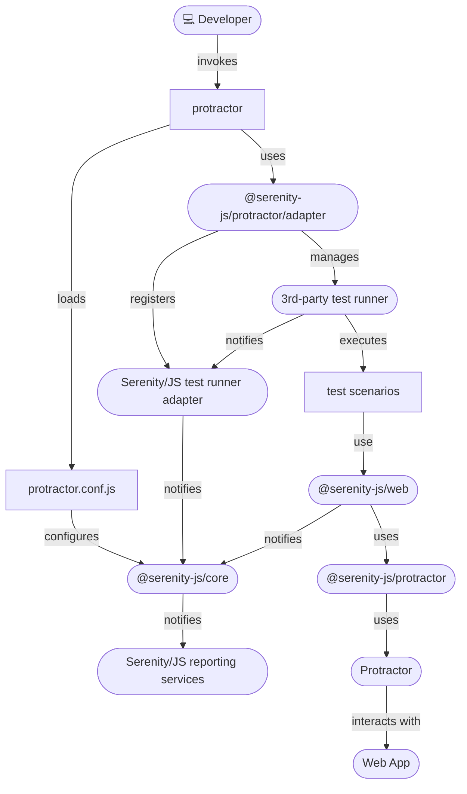

# Protractor

```mdx-code-block
import Figure from '@site/src/components/Figure'
import Tabs from '@theme/Tabs';
import TabItem from '@theme/TabItem';
```

[Protractor](https://www.protractortest.org/) is an end-to-end test framework for Angular and AngularJS applications, based on Selenium 3.
Protractor runs tests against your application running in a real browser, interacting with it as a user would.

:::warning Protractor is deprecated
Protractor is now [officially deprecated](https://blog.angular.io/the-state-of-end-to-end-testing-with-angular-d175f751cb9c)
and has not received any updates since [April 2020](https://github.com/angular/protractor/commits/master).
You **should not** rely on Protractor for any new test automation projects, and instead use Serenity/JS with more modern
and developer-friendly integration tools like [WebdriverIO](/handbook/test-runners/webdriverio)
or [Playwright Test](/handbook/test-runners/playwright-test).
:::

:::info Should I use Serenity/JS with my existing Protractor project?
**Yes**. The most common reason why you **should** introduce Serenity/JS
to an **existing** Protractor project is that it can help you to **reliably migrate** your codebase
to a more modern integration tool like [WebdriverIO](/api/webdriverio)
or [Playwright](/api/playwright) in the next step.

Using Serenity/JS [Screenplay Pattern APIs](/handbook/design/screenplay-pattern)
will also help you **future-proof your codebase** and make it **agnostic** of the underlying integration tools.
:::

**You will learn:**
- How to use [Serenity/JS reporting services](/handbook/reporting/), including the [Serenity BDD reporter](/handbook/reporting/serenity-bdd-reporter), even if your test scenarios don't follow the Screenplay Pattern yet
- How to implement Protractor test scenarios using reusable [Serenity/JS Screenplay Pattern](/handbook/design/screenplay-pattern) APIs and the [Serenity/JS Protractor module](/api/webdriverio)
- How [Serenity/JS Web APIs](/api/web) will help you **reliably migrate** your tests from Protractor to WebdriverIO (the most compatible tool)

## Examples and Project Templates

If you'd like to dive straight into the code, [Serenity/JS GitHub repository](https://github.com/serenity-js) provides:
- [Serenity/JS + Protractor project templates](https://github.com/serenity-js?q=protractor+template&type=all&language=&sort=), which are the easiest way to start with the framework,
- several [reference implementations](https://github.com/serenity-js/serenity-js/tree/main/examples), demonstrating using Serenity/JS with Protractor to write web-based acceptance tests

## Using Serenity/JS reporting services

[`@serenity-js/protractor` module](/api/protractor) provides a [**test runner adapter**](/handbook/about/architecture)
you can attach to your [Protractor test runner](https://www.protractortest.org/#/infrastructure) just like any other standard [Protractor `framework`](https://github.com/angular/protractor/blob/master/lib/config.ts#L612).

:::tip Serenity/JS test runner adapters
Serenity/JS test runner adapters turn internal, test runner-specific events
into [Serenity/JS domain events](/handbook/reporting/domain-events) that can contribute to test execution reports produced
by [Serenity/JS reporting services](/handbook/reporting/).
:::

To use [Serenity/JS reporting services](/handbook/reporting/) in a Protractor project, you need to:
- attach the [`@serenity-js/protractor`](/api/protractor) test runner adapter to the Protractor test runner
- use `protractor.conf.js` to [configure Serenity/JS](/api/protractor-adapter/interface/Config) to use the reporting services you want to use,
such as the [`ConsoleReporter`](/handbook/reporting/console-reporter)
or [`SerenityBDDReporter`](/handbook/reporting/serenity-bdd-reporter)

<figure>


<figcaption>Serenity/JS + Protractor integration architecture</figcaption>
</figure>

### Installing Serenity/JS test runner adapter

Assuming you already have a Protractor project, add Serenity/JS Protractor and web integration modules:
- [`@serenity-js/core`](/api/core)
- [`@serenity-js/protractor`](/api/protractor)
- [`@serenity-js/web`](/api/web)

You might also want to install Serenity/JS reporting services:
- [`@serenity-js/console-reporter`](/api/console-reporter)
- [`@serenity-js/serenity-bdd`](/api/serenity-bdd)

To do the above, run the following command in your terminal:
```shell
npm install --save-dev @serenity-js/{core,console-reporter,protractor,web,serenity-bdd}
```

Protractor offers a test runner that uses Jasmine, Mocha, or Cucumber to run your test scenarios.
Since the task of running the scenarios is delegated to another tool,
you'll need to follow the installation instructions to add a Serenity/JS test runner adapter for the runner you've decided to use.

See Serenity/JS test runner adapter installation instructions for:
- [Cucumber](/handbook/test-runners/cucumber#installing-serenityjs-test-runner-adapter)
- [Jasmine](/handbook/test-runners/jasmine#installing-serenityjs-test-runner-adapter)
- [Mocha](/handbook/test-runners/mocha#installing-serenityjs-test-runner-adapter)

### Configuring Serenity/JS

To use [Serenity/JS reporting services](/handbook/reporting/) in a Protractor project,
modify your [`protractor.conf.js` configuration file](https://github.com/angular/protractor/blob/master/lib/config.ts)
to register [Serenity/JS Protractor adapter](/api/protractor) as a `custom` Protractor `framework`
and list any [Serenity/JS reporting services](/handbook/reporting) under `crew`:

```javascript title="protractor.conf.js"
exports.config = {

    framework:      'custom',
    frameworkPath:  require.resolve('@serenity-js/protractor/adapter'),

    serenity: {
        crew: [
            '@serenity-js/console-reporter',
            '@serenity-js/serenity-bdd',
            [ '@serenity-js/core:ArtifactArchiver', { outputDirectory: 'target/site/serenity' } ],
            [ '@serenity-js/web:Photographer', { strategy: 'TakePhotosOfFailures' } ],
        ]
    },

    // other Protractor config
}
```

Learn more about configuring [Serenity/JS Protractor adapter](/api/protractor) and [Serenity/JS reporting services](/handbook/reporting/).

### Configuring Protractor

Protractor relies on Cucumber, Jasmine, or Mocha to execute your test scenarios.
However, it is responsible for configuring the test runners themselves.
To learn about the test runner configuration options, follow the [Serenity/JS Protractor configuration guide](/api/protractor#configuring-protractor).

To find out how to define test scenarios, check out the respective guide on using Serenity/JS with:
- [Cucumber](/handbook/test-runners/cucumber)
- [Jasmine](/handbook/test-runners/jasmine)
- [Mocha](/handbook/test-runners/mocha)

To learn about other Protractor configuration options, consult the [Serenity/JS Protractor API docs](/api/protractor-adapter/interface/Config).

## Using Serenity/JS Screenplay Pattern APIs

[Serenity/JS actor model](/api/core/class/Actor) works great with Protractor
and [Serenity/JS Screenplay Pattern](/handbook/design/screenplay-pattern) APIs can help your team implement
Protractor test scenarios that are easy to read and understand.

The fastest way to get started with Serenity/JS and Protractor is to use one of
the [Serenity/JS + Protractor project templates](https://github.com/serenity-js?q=protractor+template&type=all&language=&sort=).
However, if you're adding Serenity/JS to an existing project or simply want to understand how the integration works,
this guide is for you.

### Referring to actors in test scenarios

When you configure [Serenity/JS Protractor](/api/protractor)
as the [Protractor `framework`](/handbook/test-runners/protractor#configuring-serenityjs),
Serenity/JS automatically creates and makes available a default [cast of actors](/api/core/class/Cast)
where every actor has the abilities to:
- [`BrowseTheWebWithProtractor`](/api/protractor/class/BrowseTheWebWithProtractor) using the global `browser`
- [`TakeNotes.usingAnEmptyNotepad()`](/api/core/class/TakeNotes)

This means that any actors you refer to in your test scenarios using
[`actorCalled`](/api/core/function/actorCalled)
and [`actorInTheSpotlight`](/api/core/function/actorInTheSpotlight) functions are configured using
this default cast, and already have access to the Protractor-managed browser instance.

Since Protractor uses Jasmine, Mocha, or Cucumber to run your test scenarios, please refer to their
dedicated guides to learn more about using Serenity/JS actors with:
- [Cucumber](/handbook/test-runners/cucumber#referring-to-actors-in-test-scenarios)
- [Jasmine](/handbook/test-runners/jasmine#referring-to-actors-in-test-scenarios)
- [Mocha](/handbook/test-runners/mocha#referring-to-actors-in-test-scenarios)

### Configuring a custom cast of actors

You can replace the default [cast of actors](/api/core/class/Cast)
by providing a custom implementation via [`serenity.actors`](/api/protractor-adapter/interface/Config#serenity)
configuration option in your `protractor.conf.js`.

For example, to implement a cast where every actor can [`BrowseTheWebWithProtractor`](/api/protractor/class/BrowseTheWebWithProtractor),
[`TakeNotes`](/api/core/class/TakeNotes) and [`CallAnApi`](/api/rest/class/CallAnApi), you could create a `MyActors` class like this:

```javascript title="test/MyActors.js"
const { TakeNotes } = require('@serenity-js/core')
const { CallAnApi } = require('@serenity-js/rest')
const { BrowseTheWebWithProtractor } = require('@serenity-js/protractor')

exports.Actors = class Actors {
    constructor(apiUrl) {
        this.apiUrl = apiUrl
    }

    prepare(actor) {
        return actor.whoCan(
            BrowseTheWebWithProtractor.using(require('protractor').browser),
            TakeNotes.usingAnEmptyNotepad(),
            CallAnApi.at(this.apiUrl),
        );
    }
}
```

:::info No browser in the configuration file
Protractor doesn't allow you to use the `browser` global variable in `protractor.conf.js`.
That's why you need to create a custom implementation of [`Cast`](/api/core/class/Cast)
and only refer to `browser` in [`Cast.prepare`](/api/core/class/Cast#prepare) method.
:::

:::info No TypeScript in the configuration file
Protractor doesn't allow you to use TypeScript in `protractor.conf.js`.
That's why `MyActors` needs to be implemented in plain-old JavaScript.
:::


Next, modify your Protractor configuration file to provide your custom `MyActors` implementation:

```javascript title="protractor.conf.js"
// highlight-next-line
const { MyActors } = require('./test/MyActors');

exports.config = {

    framework:      'custom',
    frameworkPath:  require.resolve('@serenity-js/protractor/adapter'),

    serenity: {
        // highlight-next-line
        actors: new MyActors(),
        crew: [
            '@serenity-js/console-reporter',
            '@serenity-js/serenity-bdd',
            [ '@serenity-js/core:ArtifactArchiver', { outputDirectory: 'target/site/serenity' } ],
            [ '@serenity-js/web:Photographer', { strategy: 'TakePhotosOfFailures' } ],
        ]
    },

    // other Protractor config
}
```

## Migrating from Protractor to WebdriverIO

Introducing Serenity/JS Screenplay Pattern APIs in your test scenarios
can help your code become and stay integration tool-agnostic.
It can also help you migrate from Protractor to a more modern tool like [WebdriverIO](/handbook/test-runners/webdriverio).

:::info Your feedback matters!
Are you planning to migrate your tests from Protractor to another integration tool?

I'm considering writing a **tutorial**, recording a **video**, or maybe even a **course** on how to
migrate your tests from Protractor to WebdriverIO or Playwright in a safe and reliable way that minimises the risk to your organisation.

If you're interested in that, let me know in the comments! 👇👇👇

Also make sure to follow Serenity/JS to get notified 🔔 when new content is available! 🎉

[](https://www.linkedin.com/company/serenity-js)
[](https://www.youtube.com/@serenity-js)
[](https://github.com/sponsors/serenity-js)
:::
