# WebdriverIO

```mdx-code-block
import Figure from '@site/src/components/Figure'
import Tabs from '@theme/Tabs';
import TabItem from '@theme/TabItem';
```

[WebdriverIO](https://webdriver.io/) is a progressive automation framework built to automate modern web and mobile applications.
WebdriverIO leverages the power of the [WebDriver](https://w3c.github.io/webdriver/) and [WebDriver-BiDi](https://github.com/w3c/webdriver-bidi) protocols that are developed and supported
by all browser vendors and guarantees a true cross-browser testing experience.
Furthermore, WebdriverIO also supports alternative, proprietary automation protocols like [Chrome DevTools](https://chromedevtools.github.io/devtools-protocol/) via [Puppeteer](https://www.npmjs.com/package/puppeteer).

**You will learn:**
- How to use [Serenity/JS reporting services](/handbook/reporting/), including the [Serenity BDD reporter](/handbook/reporting/serenity-bdd-reporter), even if your test scenarios don't follow the Screenplay Pattern yet
- How to implement WebdriverIO test scenarios using reusable [Serenity/JS Screenplay Pattern](/handbook/design/screenplay-pattern) APIs and the [Serenity/JS WebdriverIO module](/api/webdriverio)

## Examples and Project Templates

If you'd like to dive straight into the code, [Serenity/JS GitHub repository](https://github.com/serenity-js) provides:
- [Serenity/JS + WebdriverIO project templates](https://github.com/serenity-js?q=webdriverio+template&type=all&language=&sort=), which are the easiest way to start with the framework,
- several [reference implementations](https://github.com/serenity-js/serenity-js/tree/main/examples), demonstrating using Serenity/JS with WebdriverIO to write web-based acceptance tests

## Using Serenity/JS reporting services

[`@serenity-js/webdriverio` module](/api/webdriverio) provides a [**test runner adapter**](/handbook/about/architecture)
you can attach to your [WebdriverIO test runner](https://webdriver.io/docs/testrunner)
just like any other standard [WebdriverIO `framework`](https://webdriver.io/docs/configurationfile).

:::tip Serenity/JS test runner adapters
Serenity/JS test runner adapters turn internal, test runner-specific events
into [Serenity/JS domain events](/handbook/reporting/domain-events) that can contribute to test execution reports produced
by [Serenity/JS reporting services](/handbook/reporting/).
:::

To use [Serenity/JS reporting services](/handbook/reporting/) in a WebdriverIO Test project, you need to:
- attach the [`@serenity-js/webdriverio`](/api/webdriverio) test runner adapter to the WebdriverIO test runner
- use `wdio.conf.ts` to [configure Serenity/JS](/api/webdriverio/interface/WebdriverIOConfig) to use the reporting services you want to use,
such as the [`ConsoleReporter`](/handbook/reporting/console-reporter)
or [`SerenityBDDReporter`](/handbook/reporting/serenity-bdd-reporter)

```mermaid
graph TB
    SUT(["Web App"])
    DEV(["💻 Developer"])
    WdioCli["wdio"]
    Wdio(["WebdriverIO"])
    ConfigFile["wdio.conf.ts"]
    SWdioAdapter(["@serenity-js/webdriverio/adapter"])
    SWeb(["@serenity-js/web"])
    SWdio(["@serenity-js/webdriverio"])
    SCore(["@serenity-js/core"])
    TR(["3rd-party test runner"])
    TRA(["Serenity/JS test runner adapter"])
    Specs["test scenarios"]
    R(["Serenity/JS reporting services"])

    DEV -- invokes --> WdioCli
    WdioCli -- loads --> ConfigFile
    WdioCli -- uses --> SWdioAdapter
    ConfigFile -- configures --> SCore
    SWdioAdapter -- registers --> TRA
    SWdioAdapter -- manages --> TR
    TR -- notifies --> TRA
    TR -- executes --> Specs
    Specs -- use --> SWeb
    SWeb -- notifies --> SCore

    SWeb -- uses --> SWdio

    SWdio -- uses --> Wdio

    Wdio -- interacts with --> SUT

    TRA -- notifies --> SCore
    SCore -- notifies --> R

    click SWdio "/api/webdriverio"
    click SWeb "/api/web"
    click SCore "/api/core"
    click R "/handbook/reporting"
```

<figure>


<figcaption>Serenity/JS + WebdriverIO integration architecture</figcaption>
</figure>

### Installing Serenity/JS test runner adapter

Follow [WebdriverIO installation instructions](https://webdriver.io/docs/gettingstarted)
to create a new WebdriverIO project.

:::tip Use TypeScript to get the most out of your development tools
WebdriverIO installation wizard will ask you whether you want to use TypeScript or JavaScript
to implement your test scenarios.
Choosing TypeScript offers improved tooling support in IDEs such
as [JetBrains](/handbook/integration/jetbrains-idea) and [Visual Studio Code](/handbook/integration/visual-studio-code).
:::

Next, add Serenity/JS WebdriverIO and web integration modules:
- [`@serenity-js/core`](/api/core)
- [`@serenity-js/webdriverio`](/api/webdriverio)
- [`@serenity-js/web`](/api/web)

You might also want to install Serenity/JS reporting services:
- [`@serenity-js/console-reporter`](/api/console-reporter)
- [`@serenity-js/serenity-bdd`](/api/serenity-bdd)

To do the above, run the following command in your terminal:
```shell
npm install --save-dev @serenity-js/{core,console-reporter,webdriverio,web,serenity-bdd}
```

WebdriverIO offers a [local runner](https://webdriver.io/docs/runner#local-runner) that
uses Jasmine, Mocha, or Cucumber to run your test scenarios.
Since the task of running the scenarios is delegated to another tool,
you'll need to follow the installation instructions to add a Serenity/JS test runner adapter for the runner you've decided to use.

See Serenity/JS test runner adapter installation instructions for:
- [Cucumber](/handbook/test-runners/cucumber#installing-serenityjs-test-runner-adapter)
- [Jasmine](/handbook/test-runners/jasmine#installing-serenityjs-test-runner-adapter)
- [Mocha](/handbook/test-runners/mocha#installing-serenityjs-test-runner-adapter)

### Configuring Serenity/JS

To use [Serenity/JS reporting services](/handbook/reporting/) in a WebdriverIO project,
modify your [`wdio.conf.ts` configuration file](https://webdriver.io/docs/configurationfile/)
to register [Serenity/JS WebdriverIO adapter](/api/webdriverio) as a [WebdriverIO `framework`](https://webdriver.io/docs/frameworks)
and list any [Serenity/JS reporting services](/handbook/reporting) under `crew`:

```typescript title="wdio.conf.ts"
import { WebdriverIOConfig } from '@serenity-js/webdriverio';

export const config: WebdriverIOConfig = {
    framework: '@serenity-js/webdriverio',
    serenity: {
        crew: [
            '@serenity-js/console-reporter',
            '@serenity-js/serenity-bdd',
            [ '@serenity-js/core:ArtifactArchiver', { outputDirectory: 'target/site/serenity' } ],
        ],
    },
}
```

Learn more about configuring [Serenity/JS WebdriverIO adapter](/api/webdriverio) and [Serenity/JS reporting services](/handbook/reporting/).

### Configuring WebdriverIO

WebdriverIO relies on Cucumber, Jasmine, or Mocha to execute your test scenarios.
However, it is responsible for configuring the test runners themselves.
To learn about the test runner configuration options, follow the [Serenity/JS WebdriverIO configuration guide](/api/webdriverio#configuring-webdriverio).

To find out how to define test scenarios, check out the respective guide on using Serenity/JS with:
- [Cucumber](/handbook/test-runners/cucumber)
- [Jasmine](/handbook/test-runners/jasmine)
- [Mocha](/handbook/test-runners/mocha)

To learn about other WebdriverIO configuration options, consult the [WebdriverIO documentation](https://webdriver.io/docs/configuration).

## Using Serenity/JS Screenplay Pattern APIs

[Serenity/JS actor model](/api/core/class/Actor) works great with WebdriverIO
and [Serenity/JS Screenplay Pattern](/handbook/design/screenplay-pattern) APIs can help your team implement
WebdriverIO test scenarios that are easy to read and understand.

The fastest way to get started with Serenity/JS and WebdriverIO is to use one of
the [Serenity/JS + WebdriverIO project templates](https://github.com/serenity-js?q=webdriverio+template&type=all&language=&sort=).
However, if you're adding Serenity/JS to an existing project or simply want to understand how the integration works,
this guide is for you.

### Referring to actors in test scenarios

When you configure [Serenity/JS WebdriverIO](/api/webdriverio)
as the [WebdriverIO `framework`](/handbook/test-runners/webdriverio#configuring-serenityjs),
Serenity/JS automatically creates and makes available a default [cast of actors](/api/core/class/Cast)
where every actor has the abilities to:
- [`BrowseTheWebWithWebdriverIO`](/api/webdriverio/class/BrowseTheWebWithWebdriverIO) using the global `browser`
- [`TakeNotes.usingAnEmptyNotepad()`](/api/core/class/TakeNotes)

This means that any actors you refer to in your test scenarios using
[`actorCalled`](/api/core/function/actorCalled)
and [`actorInTheSpotlight`](/api/core/function/actorInTheSpotlight) functions are configured using
this default cast, and already have access to the WebdriverIO-managed browser instance.

Since WebdriverIO uses Jasmine, Mocha, or Cucumber to run your test scenarios, please refer to their
dedicated guides to learn more about using Serenity/JS actors with:
- [Cucumber](/handbook/test-runners/cucumber#referring-to-actors-in-test-scenarios)
- [Jasmine](/handbook/test-runners/jasmine#referring-to-actors-in-test-scenarios)
- [Mocha](/handbook/test-runners/mocha#referring-to-actors-in-test-scenarios)

### Configuring a custom cast of actors

You can replace the default [cast of actors](/api/core/class/Cast)
by providing a custom implementation via [`serenity.actors`](/api/webdriverio/interface/WebdriverIOConfig#serenity)
configuration option in your `wdio.conf.ts`.

For example, to implement a cast where every actor can [`BrowseTheWebWithWebdriverIO`](/api/webdriverio/class/BrowseTheWebWithWebdriverIO),
[`TakeNotes`](/api/core/class/TakeNotes) and [`CallAnApi`](/api/rest/class/CallAnApi), you could create a `MyActors` class like this:

```typescript title="test/MyActors.ts"
import { Actor, Cast, TakeNotes } from '@serenity-js/core'
import { CallAnApi } from '@serenity-js/rest'
import { BrowseTheWebWithWebdriverIO } from '@serenity-js/webdriverio'

export class MyActors implements Cast {
    // use constructor parameters to pass properties from the configuration file
    constructor(private readonly apiUrl: string) {
    }

    prepare(actor: Actor): Actor {
        return actor.whoCan(
            BrowseTheWebWithWebdriverIO.using(browser), // use global browser object
            TakeNotes.usingAnEmptyNotepad(),
            CallAnApi.at(this.apiUrl),
        );
    }
}
```

:::info No browser in the configuration file
WebdriverIO doesn't allow you to use the `browser` global variable in `wdio.conf.ts`.
That's why you need to create a custom implementation of [`Cast`](/api/core/class/Cast)
and only refer to `browser` in [`Cast.prepare`](/api/core/class/Cast#prepare) method.
:::

Next, modify your WebdriverIO configuration file to provide your custom `MyActors` implementation:

```typescript title="wdio.conf.ts"
import { WebdriverIOConfig } from '@serenity-js/webdriverio'
// highlight-next-line
import { MyActors } from './test/MyActors'

export const config: WebdriverIOConfig = {
    framework: '@serenity-js/webdriverio',
    serenity: {
        // highlight-next-line
        actors: new MyActors('https://api.example.org'),
        crew: [
            '@serenity-js/console-reporter',
            '@serenity-js/serenity-bdd',
            [ '@serenity-js/core:ArtifactArchiver', { outputDirectory: 'target/site/serenity' } ],
        ],
    },
}
```
